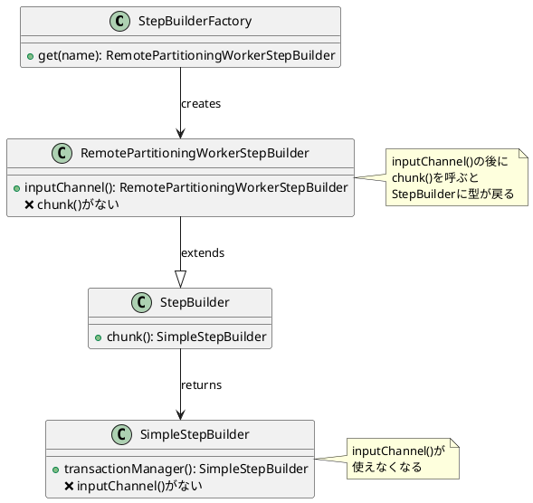
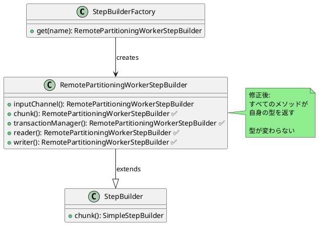

# Issue #5150: RemotePartitioningWorkerStepBuilderのメソッド不足

**Issue URL**: https://github.com/spring-projects/spring-batch/issues/5150

**関連コミット**:
- [37a39e2](https://github.com/spring-projects/spring-batch/commit/37a39e2d5d02f02ee4e73400a4ff5a9cf6f850be)
- [f04f663](https://github.com/spring-projects/spring-batch/commit/f04f6636362fad92c0a741b0785af699535a5d99)
- [5e3df33](https://github.com/spring-projects/spring-batch/commit/5e3df332ab1831ac90d4e8234b52d3ce05601244)

---

## 課題概要

### 問題の説明

`RemotePartitioningWorkerStepBuilder`が親クラス`StepBuilder`のすべての設定メソッドをオーバーライドしていないため、一部のメソッドを呼び出すと型が`StepBuilder`に戻ってしまい、リモートパーティション固有のメソッド（`inputChannel()`など）が使用できなくなります。

この問題により、移行後に`MessageDispatchingException: Dispatcher has no subscribers`エラーが発生します。

### 背景知識の補足

**Builderパターンの型問題**:
```java
// 正しい型の連鎖
RemotePartitioningWorkerStepBuilder builder = 
    stepBuilderFactory.get("step")
        .inputChannel(inputChannel)  // RemotePartitioningWorkerStepBuilder
        .chunk(10)                   // ← StepBuilderに戻る!
        .transactionManager(tm);     // StepBuilder
```

**期待される動作**:
```java
RemotePartitioningWorkerStepBuilder builder = 
    stepBuilderFactory.get("step")
        .inputChannel(inputChannel)  // RemotePartitioningWorkerStepBuilder
        .chunk(10)                   // RemotePartitioningWorkerStepBuilder
        .transactionManager(tm);     // RemotePartitioningWorkerStepBuilder
```

### 影響範囲

| 項目 | 内容 |
|------|------|
| **影響するバージョン** | Spring Batch 6.0.0 |
| **影響する機能** | リモートパーティションワーカー |
| **重大度** | 高（ビルダーAPIが使用不可） |
| **関連** | spring-batch-integration |

---

## 原因

### 根本原因の詳細

**問題のコード**:
```java
public class RemotePartitioningWorkerStepBuilder 
        extends StepBuilder {
    
    // inputChannel()はオーバーライドされている
    public RemotePartitioningWorkerStepBuilder inputChannel(
            MessageChannel inputChannel) {
        this.inputChannel = inputChannel;
        return this;
    }
    
    // 問題: chunk()がオーバーライドされていない
    // 親クラスのchunk()が呼ばれ、StepBuilderが返される
}
```

**親クラス（StepBuilder）**:
```java
public class StepBuilder {
    
    public <I, O> SimpleStepBuilder<I, O> chunk(int chunkSize) {
        return new SimpleStepBuilder<>(this)
                .chunk(chunkSize);
    }
    
    public <I, O> SimpleStepBuilder<I, O> chunk(
            int chunkSize, 
            PlatformTransactionManager transactionManager) {
        return new SimpleStepBuilder<>(this)
                .chunk(chunkSize)
                .transactionManager(transactionManager);
    }
}
```

### 型の遷移問題



### 実際のエラー例

**移行前（Spring Batch 5.x）**:
```java
@Bean
public Step workerStep() {
    return stepBuilderFactory.get("workerStep")
        .inputChannel(inputChannel)
        .chunk(CHUNK_SIZE, transactionManager)  // ← OK
        .reader(reader())
        .writer(writer())
        .build();
}
```

**移行後（Spring Batch 6.0.0 - 問題）**:
```java
@Bean
public Step workerStep() {
    return stepBuilderFactory.get("workerStep")
        .inputChannel(inputChannel)
        .chunk(CHUNK_SIZE)  // ← SimpleStepBuilderに型が変わる
        .transactionManager(transactionManager)  // SimpleStepBuilder
        .reader(reader())
        .writer(writer())
        .build();  // inputChannelが設定されていない!
}
```

**エラー**:
```
org.springframework.integration.MessageDispatchingException: 
    Dispatcher has no subscribers, 
    failedMessage=GenericMessage [
        payload=StepExecutionRequest: [stepExecutionId=14, stepName=importCustomerWorkerStep]
    ]
```

---

## 対応方針

### 修正内容

`RemotePartitioningWorkerStepBuilder`に不足しているメソッドをオーバーライドし、自身の型を返すように修正しました。

**修正後のコード**:
```java
public class RemotePartitioningWorkerStepBuilder 
        extends StepBuilder {
    
    // inputChannel()は既存
    public RemotePartitioningWorkerStepBuilder inputChannel(
            MessageChannel inputChannel) {
        this.inputChannel = inputChannel;
        return this;
    }
    
    // 修正: chunk()をオーバーライド
    public RemotePartitioningWorkerStepBuilder chunk(int chunkSize) {
        super.chunk(chunkSize);
        return this;
    }
    
    // 修正: transactionManager()をオーバーライド
    public RemotePartitioningWorkerStepBuilder transactionManager(
            PlatformTransactionManager transactionManager) {
        super.transactionManager(transactionManager);
        return this;
    }
    
    // 修正: その他の主要メソッドもオーバーライド
    public <I, O> RemotePartitioningWorkerStepBuilder reader(
            ItemReader<? extends I> reader) {
        super.reader(reader);
        return this;
    }
    
    public <I, O> RemotePartitioningWorkerStepBuilder writer(
            ItemWriter<? super O> writer) {
        super.writer(writer);
        return this;
    }
    
    public <I, O> RemotePartitioningWorkerStepBuilder processor(
            ItemProcessor<? super I, ? extends O> processor) {
        super.processor(processor);
        return this;
    }
}
```

### 修正後の型の遷移



### 修正後の動作

```java
@Bean
public Step workerStep() {
    // 修正後: すべてのメソッドがRemotePartitioningWorkerStepBuilder型
    return stepBuilderFactory.get("workerStep")
        .inputChannel(inputChannel)              // RemotePartitioningWorkerStepBuilder
        .chunk(CHUNK_SIZE)                       // RemotePartitioningWorkerStepBuilder ✅
        .transactionManager(transactionManager)  // RemotePartitioningWorkerStepBuilder ✅
        .reader(reader())                        // RemotePartitioningWorkerStepBuilder ✅
        .writer(writer())                        // RemotePartitioningWorkerStepBuilder ✅
        .build();
}
```

### オーバーライドされたメソッド一覧

| メソッド | 修正前 | 修正後 |
|---------|-------|-------|
| `inputChannel()` | ✅ オーバーライド済み | ✅ |
| `chunk()` | ❌ なし | ✅ 追加 |
| `transactionManager()` | ❌ なし | ✅ 追加 |
| `reader()` | ❌ なし | ✅ 追加 |
| `writer()` | ❌ なし | ✅ 追加 |
| `processor()` | ❌ なし | ✅ 追加 |
| `faultTolerant()` | ❌ なし | ✅ 追加 |

### 変更の影響

| 項目 | 内容 |
|------|------|
| **互換性** | 後方互換性あり |
| **パフォーマンス** | 影響なし |
| **ビルダーAPI** | 正常に連鎖可能 |
| **リリース** | Spring Batch 6.0.1 |

### 使用例

修正後は以下のコードが正常に動作します:

```java
@Configuration
public class RemotePartitionWorkerConfig {
    
    @Autowired
    private StepBuilderFactory stepBuilderFactory;
    
    @Bean
    public Step workerStep(
            MessageChannel inputChannel,
            ItemReader<Customer> reader,
            ItemWriter<Customer> writer,
            PlatformTransactionManager transactionManager) {
        
        return stepBuilderFactory.get("workerStep")
            // リモートパーティション設定
            .inputChannel(inputChannel)
            
            // チャンク設定
            .chunk(100)
            .transactionManager(transactionManager)
            
            // Reader/Writer設定
            .reader(reader)
            .processor(processor())
            .writer(writer)
            
            // フォールトトレラント設定
            .faultTolerant()
            .skip(Exception.class)
            .skipLimit(10)
            
            .build();
    }
    
    @Bean
    public ItemProcessor<Customer, Customer> processor() {
        return item -> {
            // 処理ロジック
            return item;
        };
    }
}
```

**統合テスト**:
```java
@SpringBootTest
@ExtendWith(SpringExtension.class)
class RemotePartitioningIntegrationTest {
    
    @Autowired
    private MessageChannel inputChannel;
    
    @Autowired
    private Step workerStep;
    
    @Test
    void testWorkerStepConfiguration() {
        // 修正後: Stepが正しく構成される
        assertThat(workerStep).isNotNull();
        assertThat(workerStep.getName()).isEqualTo("workerStep");
    }
}
```
