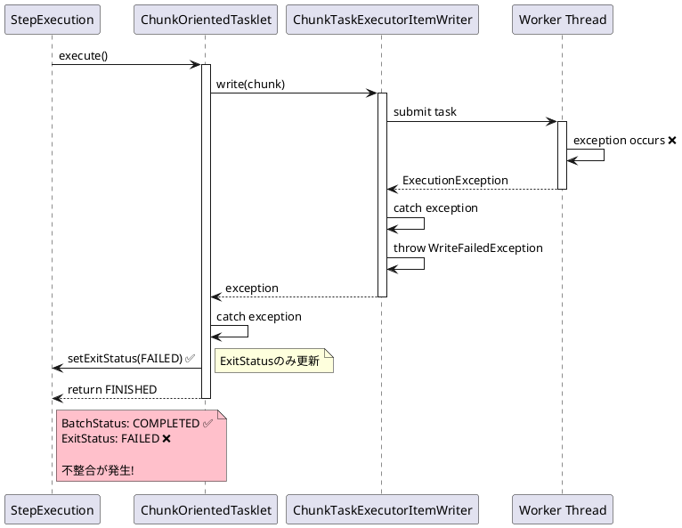
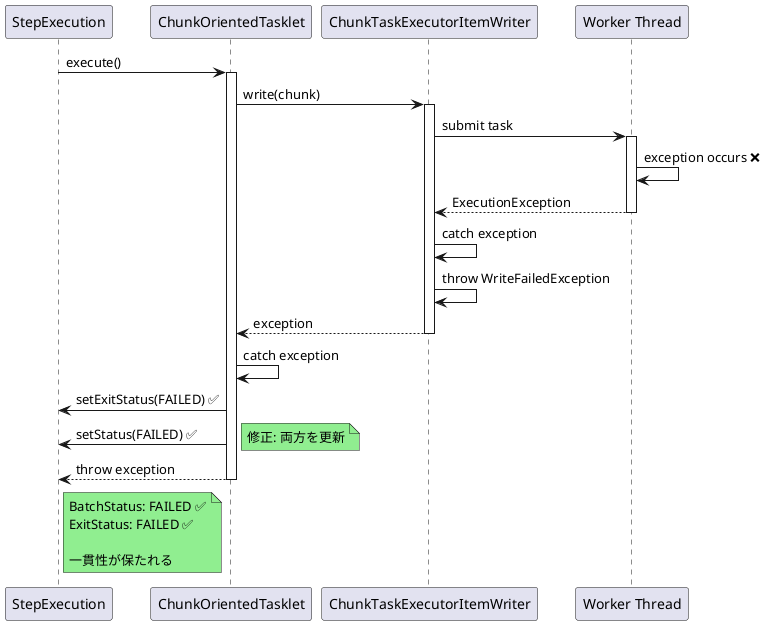

# Issue #5172: ChunkTaskExecutorItemWriterのステータス不整合

**Issue URL**: https://github.com/spring-projects/spring-batch/issues/5172

**関連PR**: [Pull Request #5173](https://github.com/spring-projects/spring-batch/pull/5173)

---

## 課題概要

### 問題の説明

`ChunkTaskExecutorItemWriter`を使用してワーカースレッドで例外が発生した場合、`StepExecutionListener#afterStep`で受け取る`StepExecution`の状態が不整合を起こします。

具体的には:
- `stepExecution.getStatus()` → **COMPLETED** ✅（正常終了扱い）
- `stepExecution.getExitStatus().getExitCode()` → **FAILED** ❌（失敗扱い）

この不整合により、リスナーで正しくエラーハンドリングできません。

### 背景知識の補足

**BatchStatusとExitStatusの違い**:

| 項目 | 説明 | 用途 |
|------|------|------|
| **BatchStatus** | ステップの実行状態（内部管理） | Spring Batchの内部制御 |
| **ExitStatus** | ステップの終了ステータス（外部向け） | Job Flow制御、ログ、通知 |

**期待される動作**:
```java
// 例外が発生した場合、両方がFAILEDになるべき
stepExecution.getStatus() == BatchStatus.FAILED
stepExecution.getExitStatus().getExitCode() == "FAILED"
```

### 影響範囲

| 項目 | 内容 |
|------|------|
| **影響するバージョン** | Spring Batch 6.0.0 |
| **影響する機能** | マルチスレッドChunk処理 |
| **重大度** | 中（ステータス不整合） |
| **回避策** | ExitStatusのみで判定 |

---

## 原因

### 根本原因の詳細

**問題のコード**:
```java
public class ChunkTaskExecutorItemWriter<T> implements ItemWriter<T> {
    
    @Override
    public void write(Chunk<? extends T> chunk) throws Exception {
        // ワーカースレッドでwrite処理
        List<Future<?>> futures = new ArrayList<>();
        for (T item : chunk.getItems()) {
            futures.add(taskExecutor.submit(() -> {
                delegate.write(Chunk.of(item));
            }));
        }
        
        // 結果を待つ
        for (Future<?> future : futures) {
            try {
                future.get();  // 例外がスローされる
            } catch (ExecutionException e) {
                // 問題: 例外をキャッチするがBatchStatusを更新しない
                throw new WriteFailedException("Write failed", e.getCause());
            }
        }
    }
}
```

**ステップ実行フロー**:


### 問題の再現コード

```java
@Configuration
public class MultithreadedJobConfig {
    
    @Bean
    public Step multithreadedStep(
            StepBuilderFactory stepBuilderFactory,
            ItemReader<Customer> reader,
            ItemWriter<Customer> writer,
            TaskExecutor taskExecutor) {
        
        return stepBuilderFactory.get("multithreadedStep")
            .chunk(10)
            .reader(reader)
            .writer(chunkTaskExecutorItemWriter(writer, taskExecutor))
            .listener(new StepExecutionListener() {
                @Override
                public ExitStatus afterStep(StepExecution stepExecution) {
                    // 問題: 不整合が発生
                    System.out.println("Status: " + stepExecution.getStatus());  
                    // → COMPLETED
                    
                    System.out.println("ExitStatus: " + stepExecution.getExitStatus());  
                    // → FAILED
                    
                    // ExitStatusだけ見ると失敗だが、Statusは成功
                    return stepExecution.getExitStatus();
                }
            })
            .build();
    }
    
    @Bean
    public ItemWriter<Customer> chunkTaskExecutorItemWriter(
            ItemWriter<Customer> delegate,
            TaskExecutor taskExecutor) {
        
        ChunkTaskExecutorItemWriter<Customer> writer = 
            new ChunkTaskExecutorItemWriter<>();
        writer.setDelegate(delegate);
        writer.setTaskExecutor(taskExecutor);
        return writer;
    }
    
    @Bean
    public ItemWriter<Customer> writer() {
        return chunk -> {
            for (Customer customer : chunk.getItems()) {
                // ランダムに例外をスロー
                if (customer.getId() % 5 == 0) {
                    throw new RuntimeException("Write failed for customer: " + customer.getId());
                }
            }
        };
    }
}
```

### 実行結果の例

```
2024-01-15 10:30:45 INFO  - Step: [multithreadedStep] executed in 2s
Status: COMPLETED
ExitStatus: FAILED

// データベースの状態
SELECT * FROM BATCH_STEP_EXECUTION WHERE STEP_EXECUTION_ID = 1;

| STATUS    | EXIT_CODE |
|-----------|-----------|
| COMPLETED | FAILED    |  ← 不整合
```

---

## 対応方針

### 修正内容

`ChunkOrientedTasklet#execute()`で例外をキャッチした際、`BatchStatus`も適切に更新するように修正しました。

**修正後のコード**:
```java
public class ChunkOrientedTasklet implements Tasklet {
    
    @Override
    public RepeatStatus execute(StepContribution contribution, ChunkContext chunkContext) 
            throws Exception {
        
        StepExecution stepExecution = chunkContext.getStepContext().getStepExecution();
        
        try {
            // チャンク処理
            Chunk<?> inputs = chunkProvider.provide(contribution);
            chunkProcessor.process(contribution, inputs);
            
            return RepeatStatus.FINISHED;
            
        } catch (Exception e) {
            // 修正: ExitStatusとBatchStatusの両方を更新
            contribution.setExitStatus(ExitStatus.FAILED);
            stepExecution.setStatus(BatchStatus.FAILED);  // ← 追加
            
            throw e;
        }
    }
}
```

### 修正前後の比較

| 処理 | 修正前 | 修正後 |
|------|-------|-------|
| **正常終了時** | | |
| BatchStatus | COMPLETED ✅ | COMPLETED ✅ |
| ExitStatus | COMPLETED ✅ | COMPLETED ✅ |
| **例外発生時** | | |
| BatchStatus | COMPLETED ❌ | FAILED ✅ |
| ExitStatus | FAILED ✅ | FAILED ✅ |

### 修正後のフロー



### 修正後の動作確認

**テストコード**:
```java
@SpringBootTest
class ChunkTaskExecutorItemWriterTest {
    
    @Autowired
    private Job job;
    
    @Autowired
    private JobLauncher jobLauncher;
    
    @Test
    void testStatusConsistencyOnFailure() throws Exception {
        // 例外を発生させる
        JobParameters params = new JobParametersBuilder()
            .addLong("time", System.currentTimeMillis())
            .toJobParameters();
        
        JobExecution execution = jobLauncher.run(job, params);
        
        // 修正後: 両方がFAILED
        StepExecution stepExecution = execution.getStepExecutions().iterator().next();
        
        assertEquals(BatchStatus.FAILED, stepExecution.getStatus());
        assertEquals("FAILED", stepExecution.getExitStatus().getExitCode());
    }
}
```

### StepExecutionListenerでの使用例

**修正後の正しいハンドリング**:
```java
@Component
public class CustomStepListener implements StepExecutionListener {
    
    @Override
    public ExitStatus afterStep(StepExecution stepExecution) {
        // 修正後: BatchStatusとExitStatusが一貫している
        
        if (stepExecution.getStatus() == BatchStatus.FAILED) {
            logger.error("Step failed: {}", stepExecution.getStepName());
            
            // 失敗通知を送信
            notificationService.sendFailureAlert(
                stepExecution.getStepName(),
                stepExecution.getExitStatus().getExitDescription()
            );
            
            // カスタムExitStatusを返す
            return new ExitStatus("FAILED_WITH_NOTIFICATION");
        }
        
        return stepExecution.getExitStatus();
    }
}
```

### Job Flowでの条件分岐

**修正後: 正しく動作する**:
```java
@Bean
public Job job(JobBuilderFactory jobBuilderFactory, Step step1, Step step2) {
    return jobBuilderFactory.get("myJob")
        .start(step1)
            .on("FAILED").to(errorHandlingStep())
            .from(step1).on("*").to(step2)
        .end()
        .build();
}

// 修正後: step1で例外が発生すると正しくerrorHandlingStepに遷移する
```

### 変更の影響

| 項目 | 内容 |
|------|------|
| **互換性** | 後方互換性あり（動作修正） |
| **パフォーマンス** | 影響なし |
| **既存コード** | 修正不要 |
| **リリース** | Spring Batch 6.0.1 |

### まとめ

この修正により、マルチスレッド環境でも`BatchStatus`と`ExitStatus`が一貫性を保つようになりました。リスナーやJob Flowでステータスを判定する際、どちらを使用しても正しく動作します。
