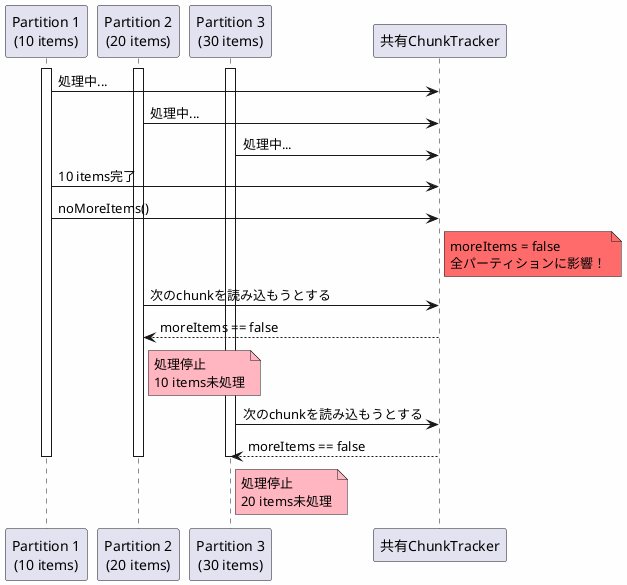
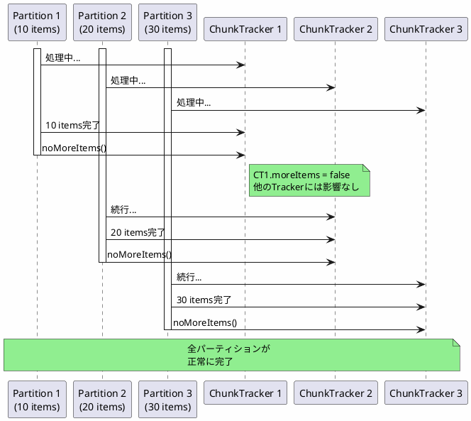

*(このドキュメントは生成AI(Claude Sonnet 4.5)によって2026年1月6日に生成されました)*

## 課題概要

新しいチャンク処理実装において、ローカルパーティション実行時に`ChunkTracker`インスタンスがステップごとではなくスレッドごとに管理されていなかったため、最初のパーティションが完了すると処理全体が停止してしまう問題を修正しました。

**パーティショニングとは**: 大量データを複数のパーティション（分割）に分けて並列処理する機能です。各パーティションを異なるスレッドで処理することで、処理時間を短縮します。

### 問題の発生条件

1. ローカルパーティション機能を使用
2. 各パーティションのアイテム数が異なる
3. 最初のパーティションの処理が他より早く完了

## 原因

### 1. ChunkTrackerのスコープ問題

Spring Batch 6.0.0では、`ChunkTracker`が`ChunkOrientedStep`のインスタンスフィールドとして定義されていました。

```java
// v6.0.0（問題のあるコード）
public class ChunkOrientedStep extends AbstractStep {
    private final ChunkTracker chunkTracker = new ChunkTracker();  // インスタンスごと
    
    protected void doExecute(StepExecution stepExecution) {
        // 各パーティションで同じchunkTrackerを共有してしまう
    }
}
```

### 問題のシーケンス



### 2. ResourcelessJobRepositoryの制約

`ResourcelessJobRepository`は実行コンテキストを永続化しないため、ローカルパーティショニング（実行コンテキストに依存）との組み合わせでは使用できません。

## 対応方針

**コミット**: [a2d61f8](https://github.com/spring-projects/spring-batch/commit/a2d61f8ffa33da7680b9ca0d3f8b8195d90fab69)

`ChunkTracker`を`ThreadLocal`として管理し、各スレッド（パーティション）が独自のインスタンスを持つように修正しました。

### 修正内容

```java
// v6.0.1（修正後）
public class ChunkOrientedStep extends AbstractStep {
    // ThreadLocalで各スレッド専用のインスタンスを管理
    private final ThreadLocal<ChunkTracker> chunkTracker = ThreadLocal.withInitial(ChunkTracker::new);
    
    protected void doExecute(StepExecution stepExecution) {
        ChunkTracker tracker = chunkTracker.get();  // スレッド固有のインスタンス
        // ...
    }
    
    @Override
    protected void close(ExecutionContext executionContext) throws Exception {
        this.chunkTracker.remove();  // リーク防止
        this.compositeItemStream.close();
    }
}
```

### 修正後の動作



### メリット

| 項目 | v6.0.0 | v6.0.1 |
|------|--------|--------|
| ChunkTrackerのスコープ | インスタンスごと | スレッドごと |
| パーティション間の独立性 | なし | あり |
| 並列処理の正確性 | 不正確 | 正確 |
| メモリリーク対策 | なし | あり（close時にremove） |

この修正により、ローカルパーティショニングが正しく動作するようになりました。
