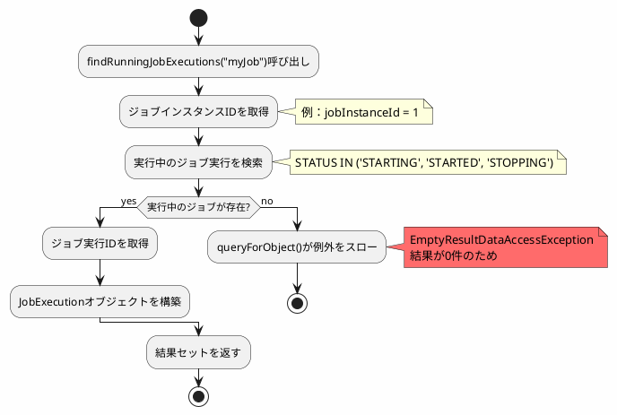
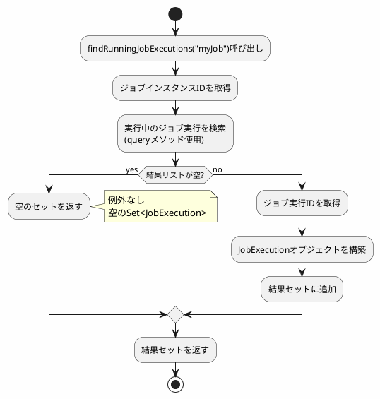

*(このドキュメントは生成AI(Claude Sonnet 4.5)によって2026年1月6日に生成されました)*

## 課題概要

`JobRepository.findRunningJobExecutions(String jobName)`メソッドが、指定されたジョブに実行中のジョブ実行がなく、完了または失敗したレコードのみが存在する場合に`EmptyResultDataAccessException`をスローする問題を修正しました。

### 問題の発生条件

1. `JdbcJobExecutionDao`を使用
2. 特定のジョブ名のジョブを実行し、完了させる（`STATUS=COMPLETED`）
3. `jobRepository.findRunningJobExecutions(jobName)`を呼び出す

**期待される動作**: 空のセットが返される
**実際の動作**: `EmptyResultDataAccessException`が発生

## 原因

`JdbcJobExecutionDao.findRunningJobExecutions(String jobName)`メソッドの実装に問題がありました。

### 問題のコード

```java
public Set<JobExecution> findRunningJobExecutions(String jobName) {
    final Set<JobExecution> result = new HashSet<>();
    List<Long> jobInstanceIds = this.jobInstanceDao.getJobInstanceIds(jobName);
    
    for (long jobInstanceId : jobInstanceIds) {
        // 問題：実行中のジョブがない場合、queryForObjectが例外をスロー
        long runningJobExecutionId = getJdbcTemplate().queryForObject(
            getQuery(GET_RUNNING_EXECUTION_FOR_INSTANCE),
            Long.class, 
            jobInstanceId  // この条件で結果がないと例外
        );
        
        JobExecution runningJobExecution = getJobExecution(runningJobExecutionId);
        result.add(runningJobExecution);
    }
    return result;
}
```

### SQLクエリ

```sql
SELECT E.JOB_EXECUTION_ID
FROM BATCH_JOB_EXECUTION E, BATCH_JOB_INSTANCE I
WHERE E.JOB_INSTANCE_ID=I.JOB_INSTANCE_ID 
  AND I.JOB_INSTANCE_ID=? 
  AND E.STATUS IN ('STARTING', 'STARTED', 'STOPPING')
```

このクエリは、実行中のジョブがない場合に0件を返しますが、`queryForObject`は結果が0件の場合に`EmptyResultDataAccessException`をスローします。

### エラーフロー



## 対応方針

**コミット**: [5750492](https://github.com/spring-projects/spring-batch/commit/57504927d912947ad1d15079b00d0969060db664)

`queryForObject`の代わりに、結果が0件でも例外をスローしない`query`メソッドを使用するように修正しました。

### 修正内容

```java
// v6.0.0（問題のあるコード）
long runningJobExecutionId = getJdbcTemplate().queryForObject(
    getQuery(GET_RUNNING_EXECUTION_FOR_INSTANCE),
    Long.class, 
    jobInstanceId
);  // 0件で例外発生

// v6.0.1（修正後）
List<Long> runningJobExecutionIds = getJdbcTemplate().query(
    getQuery(GET_RUNNING_EXECUTION_FOR_INSTANCE),
    (rs, rowNum) -> rs.getLong("JOB_EXECUTION_ID"),
    jobInstanceId
);  // 0件でも空のリストを返す

if (!runningJobExecutionIds.isEmpty()) {
    long runningJobExecutionId = runningJobExecutionIds.get(0);
    JobExecution runningJobExecution = getJobExecution(runningJobExecutionId);
    result.add(runningJobExecution);
}
```

### 修正後の動作



### メリット

| 項目 | v6.0.0 | v6.0.1 |
|------|--------|--------|
| 実行中ジョブなし時 | 例外発生 | 空セット返却 |
| API動作 | 予期しない動作 | 期待通りの動作 |
| コードの堅牢性 | 低い | 高い |
| スケジューラ等での使用 | エラー処理が必要 | そのまま使用可能 |

この修正により、`findRunningJobExecutions`メソッドが直感的で安全なAPIになりました。
