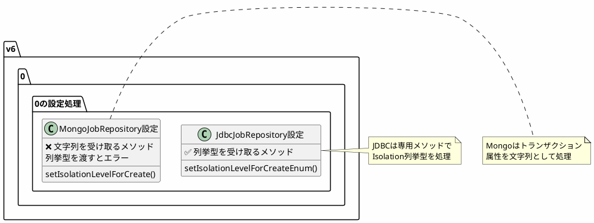
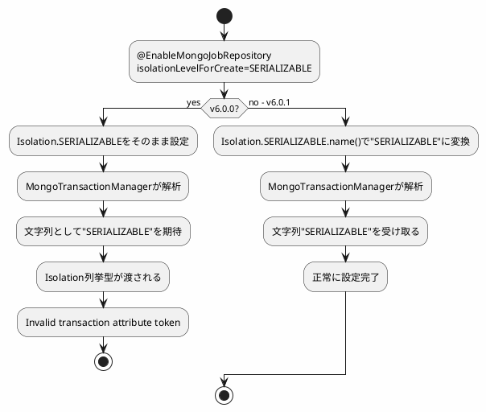

*(このドキュメントは生成AI(Claude Sonnet 4.5)によって2026年1月6日に生成されました)*

## 課題概要

`@EnableMongoJobRepository`と`@EnableBatchProcessing`を併用すると、「Invalid transaction attribute token: [SERIALIZABLE]」エラーが発生する問題を修正しました。

**MongoJobRepositoryとは**: Spring Batch 5.2で導入された、MongoDBをメタデータストアとして使用するジョブリポジトリ実装です。

### エラー内容

```
Invalid transaction attribute token: [SERIALIZABLE]
```

## 原因

`BatchRegistrar`が`MongoJobRepositoryFactoryBean`を設定する際に、`isolationLevelForCreate`プロパティに`Isolation`列挙型の値を直接設定していました。しかし、実際には文字列として渡す必要がありました。

### 問題のコード

```java
// BatchRegistrar内
Isolation isolationLevelForCreate = mongoJobRepositoryAnnotation.isolationLevelForCreate();
if (isolationLevelForCreate != null) {
    // ❌ Isolation列挙型を直接設定
    beanDefinitionBuilder.addPropertyValue("isolationLevelForCreate", isolationLevelForCreate);
}
```

### JDBCとMongoDBの違い



## 対応方針

JDBCジョブリポジトリと同様に、`Isolation`列挙型をその名前（文字列）に変換してから設定するように修正しました。

### 修正内容

```java
// v6.0.0（問題のあるコード）
Isolation isolationLevelForCreate = mongoJobRepositoryAnnotation.isolationLevelForCreate();
if (isolationLevelForCreate != null) {
    beanDefinitionBuilder.addPropertyValue("isolationLevelForCreate", isolationLevelForCreate);
}

// v6.0.1（修正後）
Isolation isolationLevelForCreate = mongoJobRepositoryAnnotation.isolationLevelForCreate();
if (isolationLevelForCreate != null) {
    // Isolation列挙型を文字列名に変換
    beanDefinitionBuilder.addPropertyValue("isolationLevelForCreate", isolationLevelForCreate.name());
}
```

### トランザクション分離レベルの設定



### 設定例

```java
@Configuration
@EnableBatchProcessing
@EnableMongoJobRepository(
    isolationLevelForCreate = Isolation.SERIALIZABLE
)
public class BatchConfig {
    
    @Bean
    public MongoTransactionManager transactionManager(MongoDatabaseFactory factory) {
        return new MongoTransactionManager(factory);
    }
    
    @Bean
    public Job myJob(JobRepository jobRepository, Step step) {
        return new JobBuilder(jobRepository)
            .start(step)
            .build();
    }
}
```

### メリット

| 項目 | v6.0.0 | v6.0.1 |
|------|--------|--------|
| MongoDBでの動作 | エラー発生 | 正常動作 |
| JDBCとの一貫性 | 不一致 | 一致 |
| トランザクション分離レベル設定 | 不可 | 可能 |

この修正により、MongoDBをジョブリポジトリとして使用する場合でも、トランザクション分離レベルを正しく設定できるようになりました。
