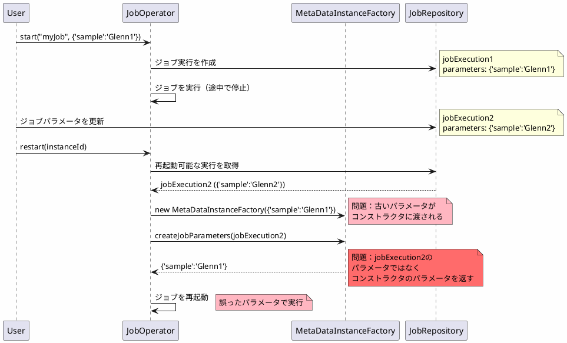
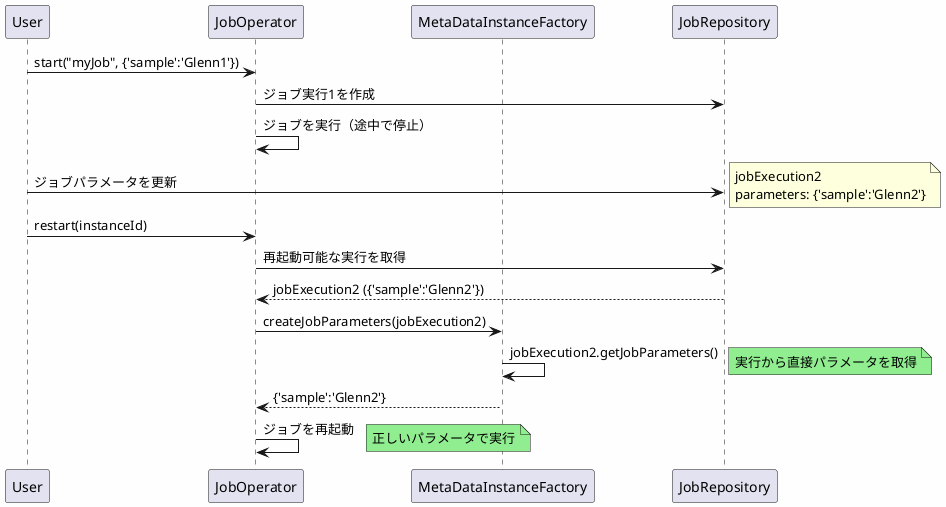

*(このドキュメントは生成AI(Claude Sonnet 4.5)によって2026年1月6日に生成されました)*

## 課題概要

`JobOperator.restart(long instanceId)`を実行すると、再起動されたジョブが最新のジョブ実行のパラメータではなく、`MetaDataInstanceFactory`のコンストラクタで渡された古いパラメータを使用してしまう問題を修正しました。

### 問題の発生条件

1. ジョブを実行し、途中で停止（例：`{'sample':'Glenn1'}`で実行）
2. ジョブパラメータを変更（例：`{'sample':'Glenn2'}`に更新）
3. `jobOperator.restart(instanceId)`を実行
4. 再起動されたジョブが古いパラメータ`{'sample':'Glenn1'}`で実行される

**期待される動作**: 最新のパラメータ`{'sample':'Glenn2'}`で再起動
**実際の動作**: 初回のパラメータ`{'sample':'Glenn1'}`で再起動

## 原因

`MetaDataInstanceFactory`の`createJobParameters()`メソッドが、再起動対象のジョブ実行のパラメータではなく、コンストラクタで渡されたパラメータを使用していました。

### 問題のコード

```java
public class MetaDataInstanceFactory {
    private final JobParameters jobParameters;  // コンストラクタで設定
    
    public MetaDataInstanceFactory(JobParameters jobParameters) {
        this.jobParameters = jobParameters;  // 古いパラメータを保持
    }
    
    public JobParameters createJobParameters(JobExecution jobExecution) {
        // ❌ jobExecutionのパラメータではなく、フィールドのパラメータを返す
        return this.jobParameters;
    }
}
```

### 問題のフロー



## 対応方針

**コミット**: [84e0afe](https://github.com/spring-projects/spring-batch/commit/84e0afe15da6f8ebfd0af8a38b4c6fa5fea30d08)

`createJobParameters()`メソッドを、`JobExecution`から直接パラメータを取得するように修正しました。

### 修正内容

```java
// v6.0.0（問題のあるコード）
public JobParameters createJobParameters(JobExecution jobExecution) {
    return this.jobParameters;  // ❌ フィールドのパラメータ
}

// v6.0.1（修正後）
public JobParameters createJobParameters(JobExecution jobExecution) {
    return jobExecution.getJobParameters();  // ✅ 実行のパラメータ
}
```

### 修正後のフロー



### 使用例

```java
// 初回実行
Properties params1 = new Properties();
params1.setProperty("sample", "Glenn1");
Long executionId1 = jobOperator.start("myJob", params1);
// ジョブが途中で停止

// パラメータを更新して再起動
Properties params2 = new Properties();
params2.setProperty("sample", "Glenn2");
Long executionId2 = jobOperator.restart(instanceId);
// v6.0.1では{'sample':'Glenn2'}で実行される
```

### メリット

| 項目 | v6.0.0 | v6.0.1 |
|------|--------|--------|
| 再起動時のパラメータ | 初回のパラメータ（誤） | 最新のパラメータ（正） |
| パラメータの更新 | 反映されない | 正しく反映 |
| 動作の予測可能性 | 低い | 高い |

この修正により、ジョブの再起動が期待通りに動作するようになりました。
