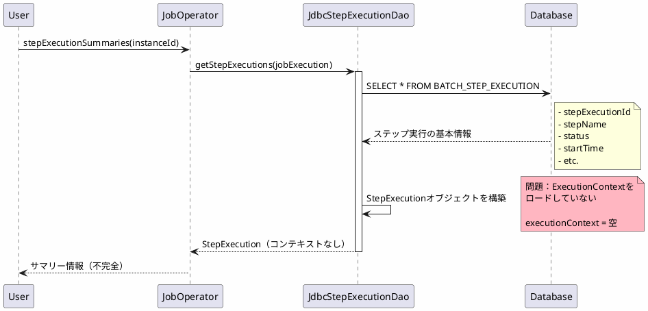
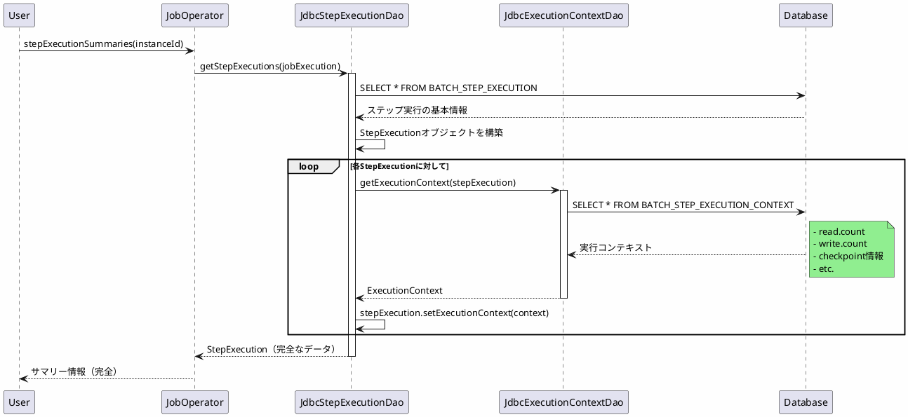

*(このドキュメントは生成AI(Claude Sonnet 4.5)によって2026年1月6日に生成されました)*

## 課題概要

`JobOperator.stepExecutionSummaries(long instanceId)`を呼び出した際、ステップ実行がデータベースから読み込まれても、実行コンテキストがロードされない問題を修正しました。

**実行コンテキスト（ExecutionContext）とは**: ステップやジョブの実行中に保持される状態情報（例：処理済みアイテム数、チェックポイント情報等）を格納するマップです。

## 原因

`JdbcExecutionContextDao`が、ステップ実行をロードする際に実行コンテキストを取得していませんでした。

### 問題のコード

```java
public class JdbcStepExecutionDao {
    public Collection<StepExecution> getStepExecutions(JobExecution jobExecution) {
        List<StepExecution> stepExecutions = jdbcTemplate.query(
            GET_STEP_EXECUTIONS,
            new StepExecutionRowMapper(jobExecution)
        );
        
        // ❌ 実行コンテキストをロードしていない
        return stepExecutions;
    }
}
```

### データ取得フロー



## 対応方針

**コミット**: [48e84cc](https://github.com/spring-projects/spring-batch/commit/48e84ccf044f85c88e6de16e18f6a78be4769ffd)

ステップ実行をロードする際に、`ExecutionContextDao`を使用して実行コンテキストも併せてロードするように修正しました。

### 修正内容

```java
// v6.0.1（修正後）
public class JdbcStepExecutionDao {
    private ExecutionContextDao executionContextDao;
    
    public Collection<StepExecution> getStepExecutions(JobExecution jobExecution) {
        List<StepExecution> stepExecutions = jdbcTemplate.query(
            GET_STEP_EXECUTIONS,
            new StepExecutionRowMapper(jobExecution)
        );
        
        // ✅ 各ステップ実行の実行コンテキストをロード
        for (StepExecution stepExecution : stepExecutions) {
            ExecutionContext context = executionContextDao.getExecutionContext(stepExecution);
            stepExecution.setExecutionContext(context);
        }
        
        return stepExecutions;
    }
}
```

### 修正後のフロー



### 実行コンテキストの内容例

```json
{
  "batch.stepType": "org.springframework.batch.core.step.item.SimpleChunkStep",
  "batch.taskletType": "org.springframework.batch.core.step.item.ChunkOrientedTasklet",
  "FlatFileItemReader.read.count": 100,
  "ItemWriter.write.count": 100,
  "checkpoint.position": 12345
}
```

### メリット

| 項目 | v6.0.0 | v6.0.1 |
|------|--------|--------|
| ExecutionContextの取得 | なし | あり |
| ステップ実行情報の完全性 | 不完全 | 完全 |
| チェックポイント情報 | 取得できない | 取得できる |
| リスタート時の状態復元 | 不正確 | 正確 |

### 使用例

```java
// ステップ実行のサマリーを取得
Collection<StepExecution> summaries = jobOperator.stepExecutionSummaries(jobInstanceId);

for (StepExecution stepExecution : summaries) {
    // v6.0.1では実行コンテキストが正しくロードされる
    ExecutionContext context = stepExecution.getExecutionContext();
    
    // チェックポイント情報等が取得可能
    int readCount = context.getInt("FlatFileItemReader.read.count", 0);
    int writeCount = context.getInt("ItemWriter.write.count", 0);
    
    System.out.println("Read: " + readCount + ", Write: " + writeCount);
}
```

この修正により、ステップ実行の完全な情報が取得できるようになりました。
