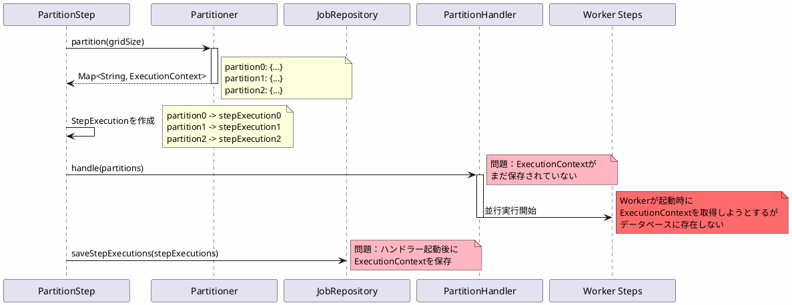
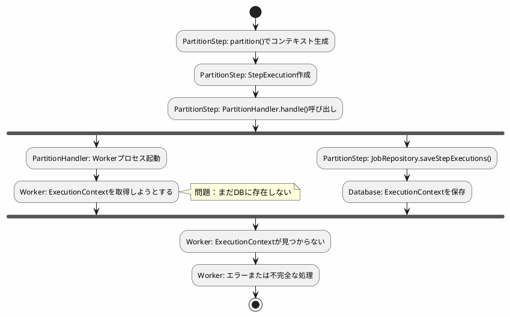
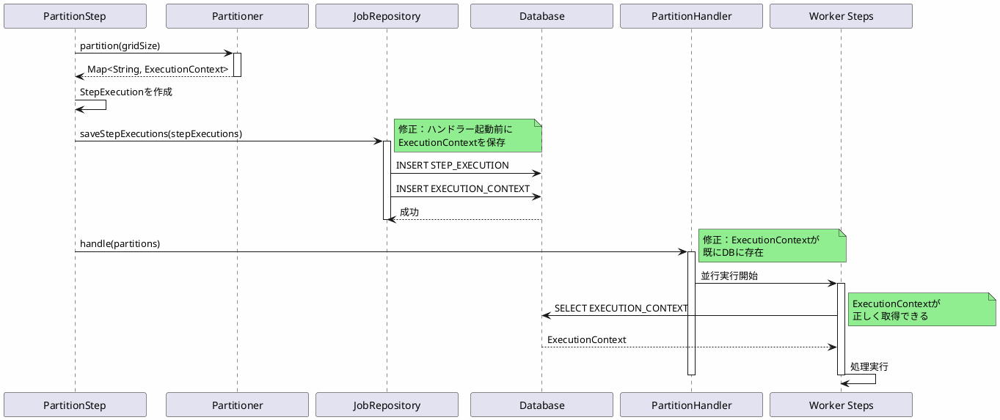
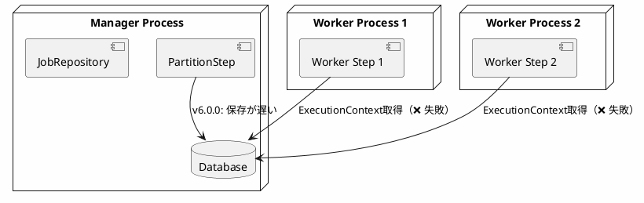

*(このドキュメントは生成AI(Claude Sonnet 4.5)によって2026年1月6日に生成されました)*

## 課題概要

パーティショナー（Partitioner）がステップ実行のメタデータを返しても、それらが`PartitionHandler`で処理される前にメタデータストアに永続化されない問題を修正しました。

**Partitionerとは**: 大量データを複数の小さなパーティションに分割し、並行処理するための機能です。各パーティションは独立したステップ実行として処理されます。

### 問題の発生条件

```java
@Bean
public Partitioner myPartitioner() {
    return gridSize -> {
        Map<String, ExecutionContext> partitions = new HashMap<>();
        for (int i = 0; i < gridSize; i++) {
            ExecutionContext context = new ExecutionContext();
            context.putString("partition", "partition-" + i);
            // パーティション固有のデータを設定
            partitions.put("partition" + i, context);
        }
        return partitions;
    };
}
```

**期待される動作**: パーティション情報がデータベースに保存されてから、`PartitionHandler`が処理を開始
**実際の動作**: パーティション情報がデータベースに保存される前に、`PartitionHandler`が処理を開始

## 原因

パーティショナーステップの実行フローにおいて、`ExecutionContext`の永続化タイミングが遅すぎました。

### 問題のシーケンス



### タイミング図



## 対応方針

**コミット**: [be464a6](https://github.com/spring-projects/spring-batch/commit/be464a6adfd655b4dbae0b798a3e9a2a4db43bc5)

`PartitionHandler.handle()`を呼び出す前に、パーティションのステップ実行とそのコンテキストをデータベースに保存するように修正しました。

### 修正内容

```java
// v6.0.0（問題のあるコード）
public class PartitionStep extends AbstractStep {
    @Override
    protected void doExecute(StepExecution stepExecution) {
        // 1. パーティション生成
        Map<String, ExecutionContext> partitions = partitioner.partition(gridSize);
        
        // 2. StepExecution作成
        Set<StepExecution> stepExecutions = createStepExecutions(partitions);
        
        // 3. ハンドラーで処理（❌ 保存前に実行）
        partitionHandler.handle(stepExecutions);
        
        // 4. StepExecutionを保存（❌ タイミングが遅い）
        jobRepository.saveStepExecutions(stepExecutions);
    }
}

// v6.0.1（修正後）
public class PartitionStep extends AbstractStep {
    @Override
    protected void doExecute(StepExecution stepExecution) {
        // 1. パーティション生成
        Map<String, ExecutionContext> partitions = partitioner.partition(gridSize);
        
        // 2. StepExecution作成
        Set<StepExecution> stepExecutions = createStepExecutions(partitions);
        
        // 3. StepExecutionを保存（✅ ハンドラー起動前に保存）
        jobRepository.saveStepExecutions(stepExecutions);
        
        // 4. ハンドラーで処理（✅ 保存後に実行）
        partitionHandler.handle(stepExecutions);
    }
}
```

### 修正後のシーケンス



### 使用例

```java
@Configuration
public class PartitionJobConfig {
    @Bean
    public Partitioner rangePartitioner() {
        return gridSize -> {
            Map<String, ExecutionContext> result = new HashMap<>();
            int range = 1000;
            for (int i = 0; i < gridSize; i++) {
                ExecutionContext context = new ExecutionContext();
                context.putInt("minValue", i * range);
                context.putInt("maxValue", (i + 1) * range);
                context.putString("name", "partition-" + i);
                result.put("partition" + i, context);
            }
            return result;
        };
    }
    
    @Bean
    public Step managerStep(JobRepository jobRepository,
                           Partitioner partitioner,
                           PartitionHandler partitionHandler) {
        return new StepBuilder("managerStep", jobRepository)
            .partitioner("workerStep", partitioner)
            .partitionHandler(partitionHandler)
            .build();
    }
    
    @Bean
    public Step workerStep(JobRepository jobRepository,
                          PlatformTransactionManager transactionManager) {
        return new StepBuilder("workerStep", jobRepository)
            .<Integer, Integer>chunk(100, transactionManager)
            .reader(new ItemReader<Integer>() {
                @Autowired
                private StepExecution stepExecution;
                
                @Override
                public Integer read() {
                    // v6.0.1では正しくExecutionContextが取得できる
                    ExecutionContext context = stepExecution.getExecutionContext();
                    int minValue = context.getInt("minValue");
                    int maxValue = context.getInt("maxValue");
                    // パーティション固有の処理
                }
            })
            .processor(item -> item * 2)
            .writer(items -> System.out.println(items))
            .build();
    }
}
```

### メリット

| 項目 | v6.0.0 | v6.0.1 |
|------|--------|--------|
| ExecutionContextの永続化 | ハンドラー起動後 | ハンドラー起動前 |
| Workerの起動時エラー | あり | なし |
| リモートパーティション対応 | 不完全 | 完全 |
| データ整合性 | 低い | 高い |

### リモートパーティショニングへの影響

特に、リモートパーティショニング（各パーティションが別プロセスで実行される）環境では、この問題の影響が顕著でした：



v6.0.1では、Workerプロセスが起動する前に必ずExecutionContextがデータベースに保存されているため、リモート環境でも正しく動作します。

この修正により、パーティション処理の信頼性が向上しました。
