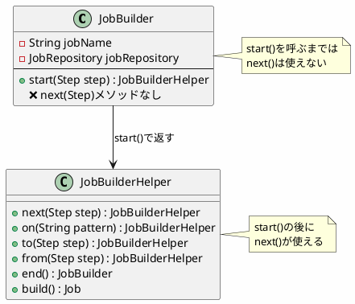
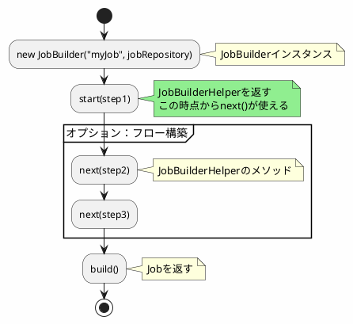
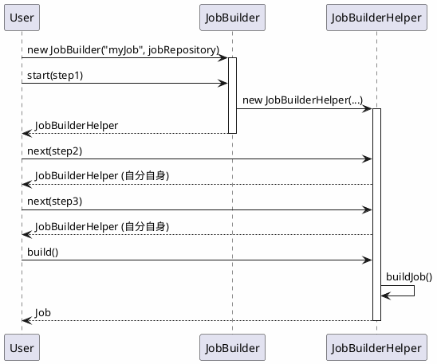

*(このドキュメントは生成AI(Claude Sonnet 4.5)によって2026年1月6日に生成されました)*

## 課題概要

Spring Batch 6.0の移行ガイドにおいて、`JobBuilder`の例に誤りがあったため、ドキュメントを修正しました。

**移行ガイドとは**: Spring Batch 5.xから6.0へのアップグレード方法を説明する公式ドキュメントです。

### 誤りの内容

移行ガイドに記載された`JobBuilder`の使用例が、実際のAPIと一致していませんでした。

```java
// ドキュメントの誤った例（v6.0.0）
Job job = new JobBuilder("myJob", jobRepository)
    .start(step)
    .next(step)  // ❌ このメソッドは存在しない
    .build();
```

**問題**: `JobBuilder`には`next()`メソッドが存在しないため、このコードはコンパイルエラーになります。

## 原因

ドキュメント作成時に、`JobBuilderHelper`（内部クラス）と`JobBuilder`（外部API）を混同していました。

### API構造



### 誤りのあるドキュメント

```markdown
# Migration Guide (v6.0.0の誤り)

## JobBuilder API Changes

In Spring Batch 6.0, the `JobRepository` is now required:

❌ **Incorrect Example:**
```java
Job job = new JobBuilder("myJob", jobRepository)
    .start(step1)
    .next(step2)  // コンパイルエラー
    .build();
```

## 対応方針

**コミット**: ドキュメント修正（コミットハッシュは記載なし）

正しい`JobBuilder`の使用方法にドキュメントを修正しました。

### 修正内容

```markdown
# Migration Guide (v6.0.1 修正後)

## JobBuilder API Changes

In Spring Batch 6.0, the `JobRepository` is now required:

✅ **Correct Example:**
```java
// シンプルなジョブ
Job job = new JobBuilder("myJob", jobRepository)
    .start(step1)
    .build();

// 複数ステップのジョブ
Job job = new JobBuilder("myJob", jobRepository)
    .start(step1)  // JobBuilderHelperを返す
    .next(step2)   // ✅ JobBuilderHelperのメソッド
    .next(step3)
    .build();
```

### 正しいAPI使用パターン



### 使用例の比較

#### ❌ 誤った使用例（v6.0.0のドキュメント）

```java
// コンパイルエラー
Job job = new JobBuilder("myJob", jobRepository)
    .next(step2)  // ❌ JobBuilderにはnext()メソッドがない
    .build();
```

#### ✅ 正しい使用例（v6.0.1のドキュメント）

```java
// パターン1: シンプルなジョブ
Job simpleJob = new JobBuilder("simpleJob", jobRepository)
    .start(step1)
    .build();

// パターン2: 順次実行
Job sequentialJob = new JobBuilder("sequentialJob", jobRepository)
    .start(step1)
    .next(step2)
    .next(step3)
    .build();

// パターン3: 条件分岐
Job conditionalJob = new JobBuilder("conditionalJob", jobRepository)
    .start(step1)
    .on("FAILED").to(step2)  // step1が失敗した場合
    .from(step1).on("*").to(step3)  // それ以外の場合
    .end()
    .build();

// パターン4: 並行実行（Flow）
Flow flow1 = new FlowBuilder<Flow>("flow1")
    .start(step2)
    .build();

Flow flow2 = new FlowBuilder<Flow>("flow2")
    .start(step3)
    .build();

Job parallelJob = new JobBuilder("parallelJob", jobRepository)
    .start(step1)
    .next(flow1)
    .split(new SimpleAsyncTaskExecutor())
    .add(flow2)
    .end()
    .build();
```

### API呼び出しフロー



### メソッドチェーンの型

| 呼び出し | 返り値の型 | 次に呼べるメソッド |
|---------|-----------|------------------|
| `new JobBuilder(...)` | `JobBuilder` | `start()` |
| `.start(step)` | `JobBuilderHelper` | `next()`, `on()`, `to()`, `from()`, `build()` |
| `.next(step)` | `JobBuilderHelper` | `next()`, `on()`, `to()`, `from()`, `build()` |
| `.build()` | `Job` | - |

### ドキュメント修正の重要性

| 項目 | v6.0.0（誤） | v6.0.1（正） |
|------|------------|------------|
| コード例の正確性 | コンパイルエラー | 正しく動作 |
| ユーザーの混乱 | あり | なし |
| 移行の難易度 | 高い | 低い |
| API理解 | 困難 | 容易 |

### 移行時の注意点

Spring Batch 5.xから6.0への移行時に、以下の変更が必須です：

```java
// Spring Batch 5.x
Job job = new JobBuilder("myJob")  // ❌ 6.0では使えない
    .start(step1)
    .build();

// Spring Batch 6.0+
Job job = new JobBuilder("myJob", jobRepository)  // ✅ jobRepositoryが必須
    .start(step1)
    .build();
```

この修正により、ユーザーが正しいAPIの使い方を理解し、スムーズに移行できるようになりました。
