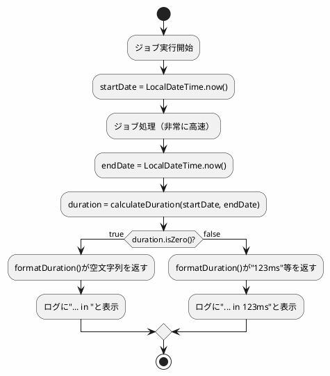

*(このドキュメントは生成AI(Claude Sonnet 4.5)によって2026年1月6日に生成されました)*

## 課題概要

ジョブやステップが瞬時に完了した場合、実行時間の計算結果がゼロになり、ログに処理時間が表示されない問題を修正しました。

**問題となるログ**:
```
Job: [FlowJob: [name=...]] completed with the following parameters: [...] 
and the following status: [FAILED] in 
```
→ `in` の後に処理時間が表示されない

### 発生条件

高速に完了するバッチジョブを大量に起動すると、開始日時と終了日時が実質的に同じになり、`Duration.isZero()`が`true`となるケースが発生します。

## 原因

`BatchMetrics.formatDuration(Duration duration)`メソッドが、`duration.isZero()`の場合に空文字列を返す実装になっていました。

```java
public static String formatDuration(Duration duration) {
    if (duration.isZero()) {
        return "";  // 空文字列を返してしまう
    }
    // ...
}
```

### 処理フロー



## 対応方針

**コミット**: [249330b](https://github.com/spring-projects/spring-batch/commit/249330b2718492424c2df9b452279c9601c2802e), [f3ccc74](https://github.com/spring-projects/spring-batch/commit/f3ccc7405c9d8f1c1f8a33fdfbbcbe143799e8f7), [1d50d82](https://github.com/spring-projects/spring-batch/commit/1d50d829907a580fe3aea5b6a17859a418e478b9)

`duration.isZero()`の場合でも`"0ms"`を返すように修正しました。

### 修正内容

```java
// v6.0.0（修正前）
public static String formatDuration(Duration duration) {
    if (duration.isZero()) {
        return "";  // ❌ 空文字列
    }
    // ...
}

// v6.0.1（修正後）
public static String formatDuration(Duration duration) {
    if (duration.isZero()) {
        return "0ms";  // ✅ "0ms"を返す
    }
    // ...
}
```

### 修正後のログ

```
Job: [FlowJob: [name=...]] completed with the following parameters: [...] 
and the following status: [FAILED] in 0ms
```

### メリット

| 項目 | v6.0.0 | v6.0.1 |
|------|--------|--------|
| ゼロ秒完了時のログ | `in ` で終わる | `in 0ms` と表示 |
| ログの可読性 | 低い（不完全） | 高い（明示的） |
| デバッグのしやすさ | 困難 | 容易 |

この修正により、高速に完了するジョブでもログが正しく表示されるようになりました。
