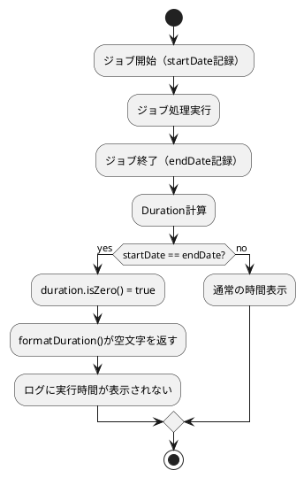

*（このドキュメントは生成AI(Claude Opus 4.5)によって2026年1月9日に生成されました）*

## 課題概要

Spring Batchにおいて、ジョブやステップが非常に短時間（ほぼ瞬時）に完了した場合、ログに実行時間が表示されないという軽微なログ出力の問題です。

**Spring Batchとは**: Javaでバッチ処理を実装するためのフレームワークで、大量データの一括処理を効率的に行うための機能を提供します。

### 問題の詳細

ジョブ完了時のログメッセージが以下のように不完全な形で出力されます：

```
Job: [FlowJob: [name=...]] completed with the following parameters: [...] and the following status: [FAILED] in 
```

末尾の "in " の後に実行時間が表示されるべきですが、空白になってしまいます。

### 処理フローと問題発生箇所



| 状態 | 開始時刻 | 終了時刻 | Duration | formatDuration()の戻り値 |
|------|----------|----------|----------|--------------------------|
| 正常 | 12:00:00.000 | 12:00:00.050 | 50ms | "50ms" |
| **問題発生** | 12:00:00.000 | 12:00:00.000 | 0ms | "" (空文字) |

## 原因

`BatchMetrics.formatDuration()` メソッドにおいて、`duration.isZero()` の場合に空文字列を返していたため。

**該当コード（修正前）**:
```java
public static String formatDuration(@Nullable Duration duration) {
    if (duration == null || duration.isZero() || duration.isNegative()) {
        return "";
    }
    // ...
}
```

`duration.isZero()`（実行時間が0）の場合も、`duration.isNegative()`（負の値）と同様に空文字を返す条件に含まれていたことが原因です。

## 対応方針

### 変更内容

`BatchMetrics.formatDuration()` メソッドを修正し、実行時間が0の場合は "0ms" を返すように変更しました。

**修正後のコード**:
```java
public static String formatDuration(@Nullable Duration duration) {
    if (duration == null || duration.isNegative()) {
        return "";
    }
    if (duration.isZero()) {
        return "0ms";
    }
    // ...
}
```

### テストの更新

テストケース `testFormatZeroDuration` も更新され、期待値が空文字列から "0ms" に変更されました。

```java
@Test
void testFormatZeroDuration() {
    String formattedDuration = BatchMetrics.formatDuration(Duration.ZERO);
    assertEquals("0ms", formattedDuration);  // 修正前: assertTrue(formattedDuration.isEmpty());
}
```

### 期待される結果

修正後のログ出力:
```
Job: [FlowJob: [name=...]] completed with the following parameters: [...] and the following status: [FAILED] in 0ms
```

---

**関連リンク**:
- [Issue #5037](https://github.com/spring-projects/spring-batch/issues/5037)
- [PR #5100](https://github.com/spring-projects/spring-batch/pull/5100)
