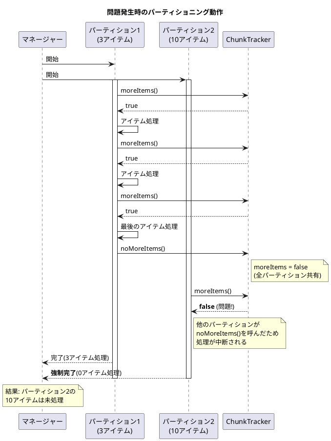
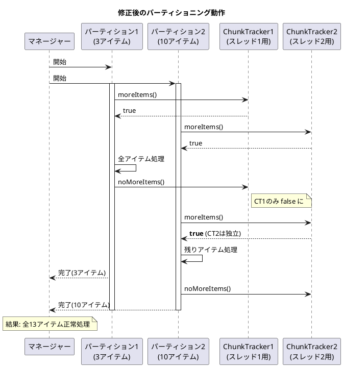

*（このドキュメントは生成AI(Claude Opus 4.5)によって2026年1月9日に生成されました）*

## 課題概要

Spring Batch 6.0において、ローカルパーティショニング（データを複数のパーティションに分割して並列処理する機能）を使用した場合、最初のパーティションが完了した時点でステップ全体が終了してしまい、他のパーティションのアイテムが処理されないという深刻なバグです。

**パーティショニングとは**: 大量のデータを複数の「パーティション」に分割し、それぞれを並列に処理することで処理時間を短縮する手法です。例えば、100万件のデータを10個のパーティションに分け、10スレッドで同時に処理することができます。

### 問題の状況



## 原因

`ChunkOrientedStep` クラス内の `ChunkTracker` がインスタンス変数として定義されていたため、すべてのパーティション（スレッド）で同じ `ChunkTracker` を共有してしまっていました。

**問題のコード（修正前）**:
```java
public class ChunkOrientedStep<I, O> extends AbstractStep {
    // 単一のインスタンスが全スレッドで共有されてしまう
    private final ChunkTracker chunkTracker = new ChunkTracker();
    
    // ...
}
```

1つのパーティションで `noMoreItems()` が呼ばれると、他のすべてのパーティションも処理を終了してしまいます。

## 対応方針

### 変更内容

`ChunkTracker` を `ThreadLocal` に変更し、各スレッド（パーティション）が独自の `ChunkTracker` インスタンスを持つように修正しました。

**修正後のコード**:
```java
public class ChunkOrientedStep<I, O> extends AbstractStep {
    // 各スレッドが独自のChunkTrackerを持つ
    private final ThreadLocal<ChunkTracker> chunkTracker = ThreadLocal.withInitial(ChunkTracker::new);
    
    @Override
    protected void doExecute(StepExecution stepExecution) throws Exception {
        // ThreadLocalからスレッド固有のChunkTrackerを取得
        while (this.chunkTracker.get().moreItems() && !interrupted(stepExecution)) {
            // チャンク処理...
        }
    }
    
    private I readItem(StepContribution contribution) throws Exception {
        I item = doRead();
        if (item == null) {
            this.chunkTracker.get().noMoreItems();  // スレッド固有のTrackerを更新
        }
        // ...
    }
}
```

### 追加されたテスト

JDBCを使用したパーティショニングのサンプルとテストが追加されました：

| ファイル | 説明 |
|---------|------|
| `PartitionJdbcJobConfiguration.java` | Javaベースのパーティショニング設定サンプル |
| `PartitionJdbcJobFunctionalTests.java` | 機能テスト（10件のレコードを2パーティションで処理） |

テストでは、2つのワーカーステップ + 1つのマネージャーステップで合計10件のreadCount/writeCountを検証しています。

### 修正後の動作



---

**関連リンク**:
- [Issue #5099](https://github.com/spring-projects/spring-batch/issues/5099)
- [Commit a2d61f8](https://github.com/spring-projects/spring-batch/commit/a2d61f8ffa33da7680b9ca0d3f8b8195d90fab69)

**注意**: このIssueの初期修正(ThreadLocal化)だけでは完全ではなく、後続の [#5126](https://github.com/spring-projects/spring-batch/issues/5126) で `ChunkTracker` のライフサイクル管理（`init()`/`reset()`）の追加修正が行われています。
