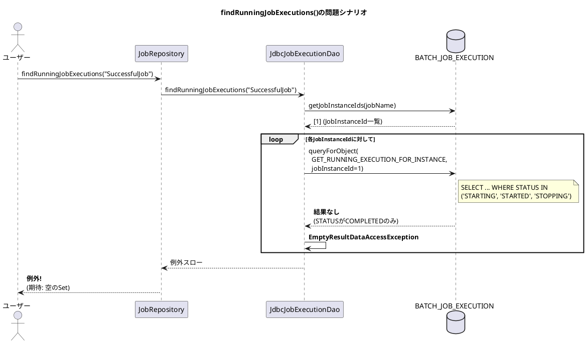

*（このドキュメントは生成AI(Claude Opus 4.5)によって2026年1月9日に生成されました）*

## 課題概要

`JobRepository.findRunningJobExecutions()` メソッドが、実行中のジョブ実行が存在しない場合に `EmptyResultDataAccessException` をスローしてしまうバグです。

**`JobRepository`とは**: Spring Batchにおいてジョブの実行状態やメタデータを永続化・管理するためのコンポーネントです。ジョブの開始、完了、失敗などの状態を追跡します。

### 問題の状況



### 期待される動作と実際の動作

| 状態 | BATCH_JOB_EXECUTIONのSTATUS | 期待される結果 | 実際の結果 |
|------|---------------------------|--------------|-----------|
| 実行中あり | STARTED | 該当JobExecutionを含むSet | ✓ 正常動作 |
| **実行中なし** | COMPLETED/FAILED | **空のSet** | ❌ EmptyResultDataAccessException |

## 原因

`JdbcJobExecutionDao.findRunningJobExecutions()` メソッド内で、`queryForObject()` を使用していたため、結果が見つからない場合に例外がスローされていました。

**問題のコード（修正前）**:
```java
public Set<JobExecution> findRunningJobExecutions(String jobName) {
    final Set<JobExecution> result = new HashSet<>();
    List<Long> jobInstanceIds = this.jobInstanceDao.getJobInstanceIds(jobName);
    for (long jobInstanceId : jobInstanceIds) {
        // queryForObjectは結果がない場合にEmptyResultDataAccessExceptionをスロー
        long runningJobExecutionId = getJdbcTemplate().queryForObject(
            getQuery(GET_RUNNING_EXECUTION_FOR_INSTANCE),
            Long.class, jobInstanceId);
        
        JobExecution runningJobExecution = getJobExecution(runningJobExecutionId);
        result.add(runningJobExecution);
    }
    return result;
}
```

## 対応方針

### 変更内容

`queryForObject()` を `queryForList()` に変更し、結果が空の場合は処理をスキップするように修正しました。

**修正後のコード**:
```java
public Set<JobExecution> findRunningJobExecutions(String jobName) {
    final Set<JobExecution> result = new HashSet<>();
    List<Long> jobInstanceIds = this.jobInstanceDao.getJobInstanceIds(jobName);
    for (long jobInstanceId : jobInstanceIds) {
        // queryForListは結果がない場合に空のリストを返す
        List<Long> runningJobExecutionIds = getJdbcTemplate()
            .queryForList(getQuery(GET_RUNNING_EXECUTION_FOR_INSTANCE), Long.class, jobInstanceId);
        
        if (runningJobExecutionIds.isEmpty()) {
            continue;  // 実行中がなければスキップ
        }
        
        // JobInstanceあたり実行中は1つのみ（起動時に強制）
        Long jobExecutionId = runningJobExecutionIds.get(0);
        JobExecution runningJobExecution = getJobExecution(jobExecutionId);
        result.add(runningJobExecution);
    }
    return result;
}
```

### 追加されたテスト

統合テスト `JobRepositoryIntegrationTests` が追加され、ジョブ完了後に `findRunningJobExecutions()` を呼び出しても空のSetが返されることを検証しています：

```java
@Test
void testFindRunningJobExecutions(@Autowired JobOperator jobOperator, 
                                   @Autowired JobRepository jobRepository,
                                   @Autowired Job job) throws Exception {
    // ジョブを開始して完了を待つ
    JobExecution jobExecution = jobOperator.start(job, new JobParameters());
    Assertions.assertEquals(ExitStatus.COMPLETED, jobExecution.getExitStatus());

    // 実行中のジョブ実行を検索（この時点では存在しない）
    Set<JobExecution> runningExecutions = jobRepository.findRunningJobExecutions(job.getName());

    // 空のSetが返されることを確認
    Assertions.assertTrue(runningExecutions.isEmpty());
}
```

---

**関連リンク**:
- [Issue #5104](https://github.com/spring-projects/spring-batch/issues/5104)
- [Commit 5750492](https://github.com/spring-projects/spring-batch/commit/57504927d912947ad1d15079b00d0969060db664)
