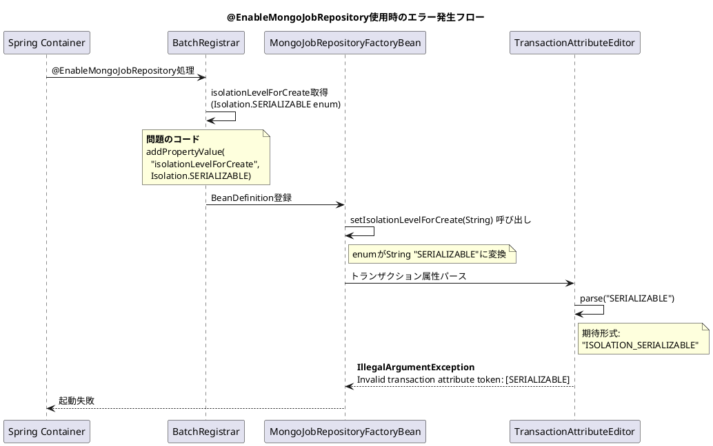

*（このドキュメントは生成AI(Claude Opus 4.5)によって2026年1月9日に生成されました）*

## 課題概要

`@EnableMongoJobRepository` アノテーションを使用してMongoDBベースのジョブリポジトリを設定すると、「Invalid transaction attribute token: [SERIALIZABLE]」というエラーが発生し、アプリケーションが起動できない問題です。

**`@EnableMongoJobRepository`とは**: Spring Batch 6.0で導入された、MongoDBをジョブメタデータの永続化先として使用するためのアノテーションです。RDBMSの代わりにNoSQLデータベースを使用したい場合に利用します。

### 問題の状況



### JDBCリポジトリとの比較

| 設定方式 | 使用するプロパティ | 設定値の型 | 結果 |
|---------|------------------|-----------|------|
| JDBC (`@EnableJdbcJobRepository`) | `isolationLevelForCreateEnum` | `Isolation` enum | ✓ 正常動作 |
| **MongoDB (`@EnableMongoJobRepository`)** | `isolationLevelForCreate` | String | ❌ エラー |

## 原因

`BatchRegistrar` クラスの `registerMongoJobRepository()` メソッドにおいて、`Isolation` enum を誤ったプロパティ名で設定していたため。

**問題のコード（修正前）**:
```java
Isolation isolationLevelForCreate = mongoJobRepositoryAnnotation.isolationLevelForCreate();
if (isolationLevelForCreate != null) {
    // "isolationLevelForCreate"（String用）を使用 → エラー
    beanDefinitionBuilder.addPropertyValue("isolationLevelForCreate", isolationLevelForCreate);
}
```

JDBCリポジトリでは正しく `isolationLevelForCreateEnum` を使用していました：
```java
// JDBC版（正しい実装）
beanDefinitionBuilder.addPropertyValue("isolationLevelForCreateEnum", isolationLevelForCreate);
```

## 対応方針

### 変更内容

`BatchRegistrar` の MongoDB リポジトリ登録部分で、プロパティ名を `isolationLevelForCreate` から `isolationLevelForCreateEnum` に修正しました。

**修正後のコード**:
```java
Isolation isolationLevelForCreate = mongoJobRepositoryAnnotation.isolationLevelForCreate();
if (isolationLevelForCreate != null) {
    // "isolationLevelForCreateEnum"（enum用）を使用 → 正常動作
    beanDefinitionBuilder.addPropertyValue("isolationLevelForCreateEnum", isolationLevelForCreate);
}
```

### 追加されたテスト

`BatchRegistrarTests` に MongoDB ジョブリポジトリの設定テストが追加されました：

```java
@Test
@DisplayName("Mongo job repository should be configured successfully with @EnableMongoJobRepository")
void testMongoJobRepositoryConfiguredWithEnableMongoJobRepository() {
    AnnotationConfigApplicationContext context =
            new AnnotationConfigApplicationContext(MongoJobConfiguration.class);

    JobRepository jobRepository = context.getBean(JobRepository.class);

    Assertions.assertNotNull(jobRepository);
}

@Configuration
@EnableBatchProcessing
@EnableMongoJobRepository
public static class MongoJobConfiguration {
    @Bean
    public MongoOperations mongoTemplate() {
        return Mockito.mock(MongoOperations.class);
    }

    @Bean
    public MongoTransactionManager transactionManager() {
        return Mockito.mock(MongoTransactionManager.class);
    }
}
```

---

**関連リンク**:
- [Issue #5105](https://github.com/spring-projects/spring-batch/issues/5105)
- [PR #5141](https://github.com/spring-projects/spring-batch/pull/5141)
