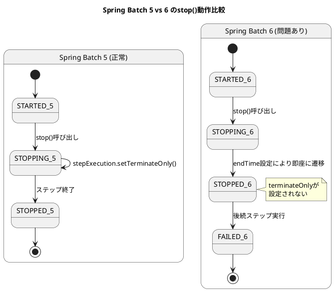
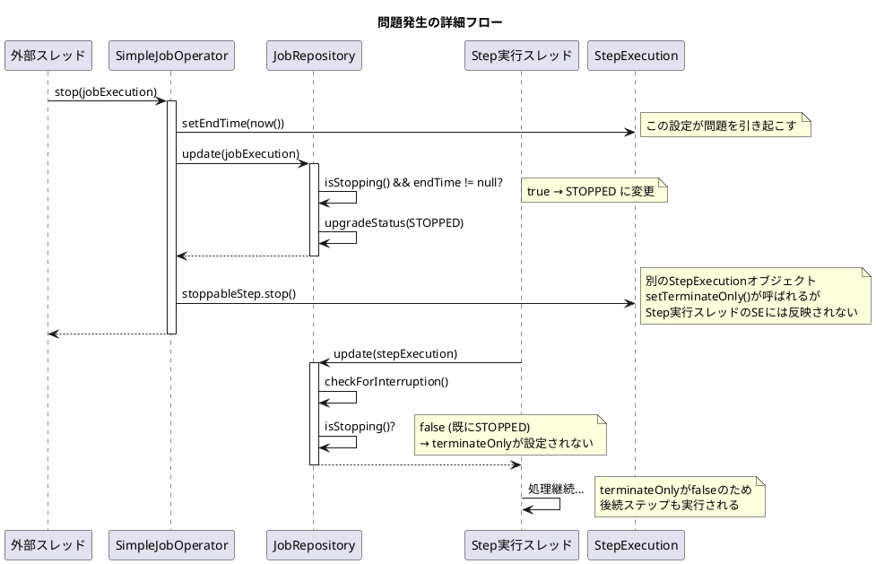

*（このドキュメントは生成AI(Claude Opus 4.5)によって2026年1月9日に生成されました）*

## 課題概要

Spring Batch 6.0で `JobOperator.stop()` を呼び出しても、実行中のジョブが正しく停止せず、後続のステップが実行されてしまうバグです。最終的にジョブは `FAILED` ステータスで終了します。

**`JobOperator.stop()`とは**: 実行中のジョブを安全に停止（グレースフルシャットダウン）するためのAPIです。現在処理中のチャンクを完了させた後、後続のステップを実行せずにジョブを終了させることを目的としています。

### 問題の状況



### 期待される動作と実際の動作

| バージョン | stop()呼び出し後の流れ | 最終ステータス |
|-----------|----------------------|--------------|
| Spring Batch 5 | STARTED → STOPPING → (terminateOnly設定) → STOPPED | STOPPED |
| **Spring Batch 6** | STARTED → STOPPING → STOPPED → 後続ステップ実行 → FAILED | FAILED |

## 原因

複数の問題が組み合わさっていました：

1. **`SimpleJobOperator.stop()`でendTimeを設定**: これにより、`JobRepository.update()` 内でステータスが即座に `STOPPING` から `STOPPED` に変更されてしまう

2. **`terminateOnly`フラグが設定されない**: ステータスが `STOPPED` になると、`checkForInterruption()` 内の `isStopping()` チェックが false になり、`terminateOnly` が設定されない

3. **`ChunkOrientedStep`が`JobRepository.update(stepExecution)`を呼び出さない**: `TaskletStep` にはあった呼び出しが、新しい `ChunkOrientedStep` には存在しなかった



## 対応方針

### 変更内容

PR #5165 で以下の修正が行われました：

#### 1. `JobExecution`に`isStopped()`メソッド追加
```java
public boolean isStopped() {
    return status == BatchStatus.STOPPED;
}
```

#### 2. `SimpleJobRepository.update(StepExecution)`の修正
`isStopping()` ではなく `isStopped()` をチェックし、バージョンを同期して `terminateOnly` を設定：

```java
@Override
public void update(StepExecution stepExecution) {
    stepExecution.setLastUpdated(LocalDateTime.now());

    // 最新のStepExecutionを取得
    StepExecution latestStepExecution = getStepExecution(stepExecution.getId());
    
    // 外部からSTOPPEDに設定されていた場合
    if (latestStepExecution.getJobExecution().isStopped()) {
        // バージョンを同期（OptimisticLockingException回避）
        Integer version = latestStepExecution.getVersion();
        if (version != null) {
            stepExecution.setVersion(version);
        }
        stepExecution.setTerminateOnly();
    }

    stepExecutionDao.updateStepExecution(stepExecution);
}
```

#### 3. `StoppableStep.stop()`から`setTerminateOnly()`を削除
```java
default void stop(StepExecution stepExecution) {
    // setTerminateOnly()は削除（JobRepository.update()で設定される）
    stepExecution.setStatus(BatchStatus.STOPPED);
    stepExecution.setExitStatus(ExitStatus.STOPPED);
    stepExecution.setEndTime(LocalDateTime.now());
}
```

#### 4. `ChunkOrientedStep`に`JobRepository.update()`呼び出しを追加
```java
@Override
protected void doExecute(StepExecution stepExecution) throws Exception {
    while (this.chunkTracker.get().moreItems() && !interrupted(stepExecution)) {
        this.transactionTemplate.executeWithoutResult(transactionStatus -> {
            // チャンク処理...
        });
        
        // 各チャンク後にStepExecutionを更新（停止チェックのため）
        getJobRepository().update(stepExecution);
    }
}
```

---

**関連リンク**:
- [Issue #5114](https://github.com/spring-projects/spring-batch/issues/5114)
- [PR #5165](https://github.com/spring-projects/spring-batch/pull/5165)
- 関連Issue: [#5120](https://github.com/spring-projects/spring-batch/issues/5120) (OptimisticLockingFailureException)
