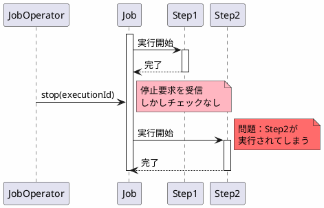
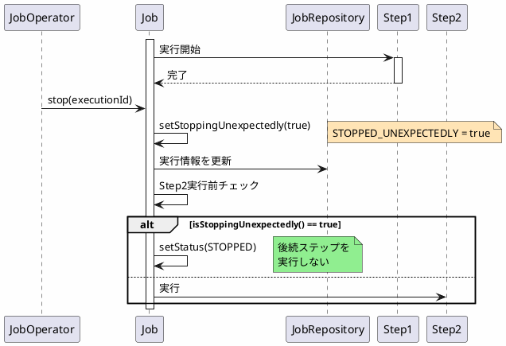

*(このドキュメントは生成AI(Claude Sonnet 4.5)によって2026年1月6日に生成されました)*

## 課題概要

`COMPLETED`状態のジョブに対して`JobOperator.stop(long executionId)`を呼び出しても、後続のステップが実行され続ける問題を修正しました。

### 問題の発生条件

1. 複数のステップを持つジョブを実行
2. 最初のステップが完了
3. `JobOperator.stop(executionId)`を呼び出す
4. 次のステップが実行されてしまう

**期待される動作**: ジョブが停止状態になり、後続のステップが実行されない
**実際の動作**: ジョブは`COMPLETED`状態のままで、後続のステップが実行される

## 原因

### 1. stop()呼び出し後のチェック不足

ジョブ実行の処理ロジックにおいて、各ステップを実行する前に「ジョブが予期せず停止されたか」をチェックしていませんでした。

```java
// v6.0.0（問題のあるコード）
public class AbstractJob {
    protected void doExecute(JobExecution execution) {
        for (Step step : steps) {
            // ❌ stop()が呼ばれたかチェックしない
            stepHandler.handleStep(step, execution);
        }
    }
}
```

### 2. リスタート不可フラグの未設定

`stop()`で停止されたジョブは、リスタート不可能としてマークされるべきですが、フラグが設定されていませんでした。

### 問題のシーケンス



## 対応方針

**コミット**: [acac0bc](https://github.com/spring-projects/spring-batch/commit/acac0bc0d52e3c3eebaefe39f1a7e3c2fa34e4c7)

以下の2つの対応を実施しました：

### 1. 各ステップ実行前に停止チェックを追加

```java
// v6.0.1（修正後）
public class AbstractJob {
    protected void doExecute(JobExecution execution) {
        for (Step step : steps) {
            // ✅ ステップ実行前にチェック
            if (execution.isStoppingUnexpectedly()) {
                execution.setStatus(BatchStatus.STOPPED);
                break;  // 後続ステップをスキップ
            }
            stepHandler.handleStep(step, execution);
        }
    }
}
```

### 2. stop()呼び出し時にフラグ設定

```java
public class SimpleJobOperator implements JobOperator {
    @Override
    public boolean stop(long executionId) {
        JobExecution execution = jobRepository.getJobExecution(executionId);
        // ✅ 予期せぬ停止フラグを設定
        execution.setStoppingUnexpectedly(true);
        jobRepository.update(execution);
        return true;
    }
}
```

### 修正後のシーケンス



### 実行コンテキストフラグ

| フラグ名 | 説明 | 設定タイミング |
|---------|------|--------------|
| `STOPPED_UNEXPECTEDLY` | 予期せず停止されたことを示す | `JobOperator.stop()`呼び出し時 |
| リスタート不可 | 停止されたジョブは再起動できない | ジョブが停止状態になった時 |

### メリット

| 項目 | v6.0.0 | v6.0.1 |
|------|--------|--------|
| stop()後の動作 | 後続ステップ実行 | 後続ステップスキップ |
| ジョブステータス | COMPLETED（誤） | STOPPED（正） |
| リスタート可否 | 可能（誤） | 不可（正） |
| 予測可能性 | 低い | 高い |

この修正により、`JobOperator.stop()`が期待通りに動作するようになりました。
