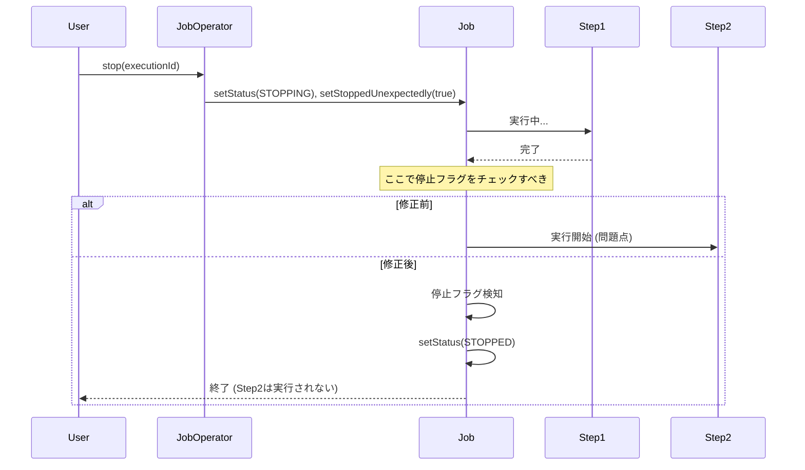

*(このドキュメントは生成AI(Claude Sonnet 4.5)によって2026年1月6日に生成されました)*

## 課題概要

ジョブの実行中に`JobOperator.stop()`を呼び出してジョブを停止しようとしても、即座に停止せず、後続のステップが実行されてしまう問題です。

**現状の動作**:
1. ユーザーが`JobOperator.stop()`を呼び出す
2. ジョブの状態は期待通り停止に向かうが...
3. 現在実行中のステップが完了した後、**次のステップ**が開始されてしまう
4. 最終的にジョブは`COMPLETED`などで終了してしまう場合がある

**期待される動作**:
- 停止リクエストがあった場合、現在のステップ完了後に、次のステップを開始せずにジョブを終了（状態は`STOPPED`）させるべきです。

## 原因

`AbstractJob`や`FlowJob`、`SimpleJob`の実行ループ（ステップを順次実行する処理）において、次のステップを実行する直前に「ジョブが停止されたか（予期せぬ停止リクエストがあったか）」のチェックが不足している、または適切に機能していません。

## 対応方針

ジョブ実行の各段階で、停止リクエスト（`stoppedUnexpectedly`フラグなど）をチェックするロジックを追加します。

1. **AbstractJob**: ジョブ全体の実行開始時および終了時にチェック
2. **SimpleJob / FlowJob**:
    - 各ステップ（またはフロー）を開始する**直前**に停止フラグを確認
    - 停止フラグが立っている場合、ステップ実行をスキップし、ジョブの状態を`STOPPED`に更新する

**修正イメージ (シーケンス)**:

また、`JobOperator.stop()`のJavaDocを更新し、停止されたジョブはリスタート不可であることを明記します。
