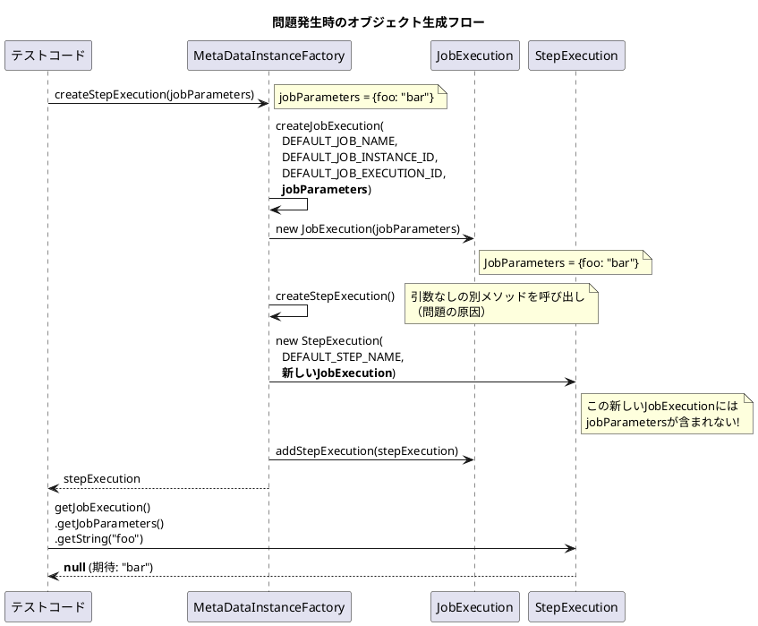
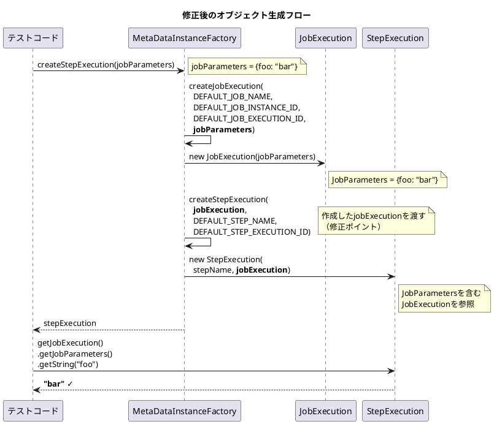

*（このドキュメントは生成AI(Claude Opus 4.5)によって2026年1月9日に生成されました）*

## 課題概要

Spring Batch Test の `MetaDataInstanceFactory.createStepExecution(JobParameters)` メソッドが、引数で渡された `JobParameters` を作成した `StepExecution` に正しく伝播しないバグです。

**`MetaDataInstanceFactory`とは**: Spring Batch のテストユーティリティクラスで、テスト用の `JobExecution` や `StepExecution` などのメタデータオブジェクトを簡単に作成するためのファクトリです。

### 問題の状況



### 期待される動作と実際の動作

| 呼び出し | 期待される結果 | 実際の結果 |
|---------|--------------|-----------|
| `stepExecution.getJobExecution().getJobParameters().getString("foo")` | "bar" | null |

## 原因

`createStepExecution(JobParameters)` メソッド内で、`JobParameters` を含む `JobExecution` を作成した後に、パラメータを無視した別のデフォルト `StepExecution` を作成していたため。

**問題のコード（修正前）**:
```java
public static StepExecution createStepExecution(JobParameters jobParameters) {
    // jobParametersを使ってJobExecutionを作成（正しい）
    JobExecution jobExecution = createJobExecution(DEFAULT_JOB_NAME, DEFAULT_JOB_INSTANCE_ID,
            DEFAULT_JOB_EXECUTION_ID, jobParameters);
    
    // 引数なしのcreateStepExecution()を呼び出し（問題！）
    // これは内部で新しいデフォルトJobExecutionを持つStepExecutionを作成する
    StepExecution stepExecution = createStepExecution();
    
    jobExecution.addStepExecution(stepExecution);
    return stepExecution;
}
```

## 対応方針

### 変更内容

`createStepExecution(JobParameters)` メソッドを修正し、作成した `JobExecution` を使って `StepExecution` を生成するように変更しました。

**修正後のコード**:
```java
public static StepExecution createStepExecution(JobParameters jobParameters) {
    // jobParametersを使ってJobExecutionを作成
    JobExecution jobExecution = createJobExecution(DEFAULT_JOB_NAME, DEFAULT_JOB_INSTANCE_ID,
            DEFAULT_JOB_EXECUTION_ID, jobParameters);
    
    // 作成したjobExecutionを使ってStepExecutionを作成（修正）
    StepExecution stepExecution = createStepExecution(jobExecution, DEFAULT_STEP_NAME, DEFAULT_STEP_EXECUTION_ID);
    
    jobExecution.addStepExecution(stepExecution);
    return stepExecution;
}
```

### 追加されたテスト

```java
@Test
void testCreateStepExecutionJobParameters() {
    JobParameters parameters = new JobParametersBuilder()
        .addString("foo", "bar")
        .toJobParameters();
    
    StepExecution stepExecution = MetaDataInstanceFactory.createStepExecution(parameters);
    String paramValue = stepExecution.getJobExecution().getJobParameters().getString("foo");
    
    assertEquals("bar", paramValue);  // 修正後は成功
}
```

### 修正後のオブジェクト生成フロー



---

**関連リンク**:
- [Issue #5115](https://github.com/spring-projects/spring-batch/issues/5115)
- [PR #5116](https://github.com/spring-projects/spring-batch/pull/5116)
