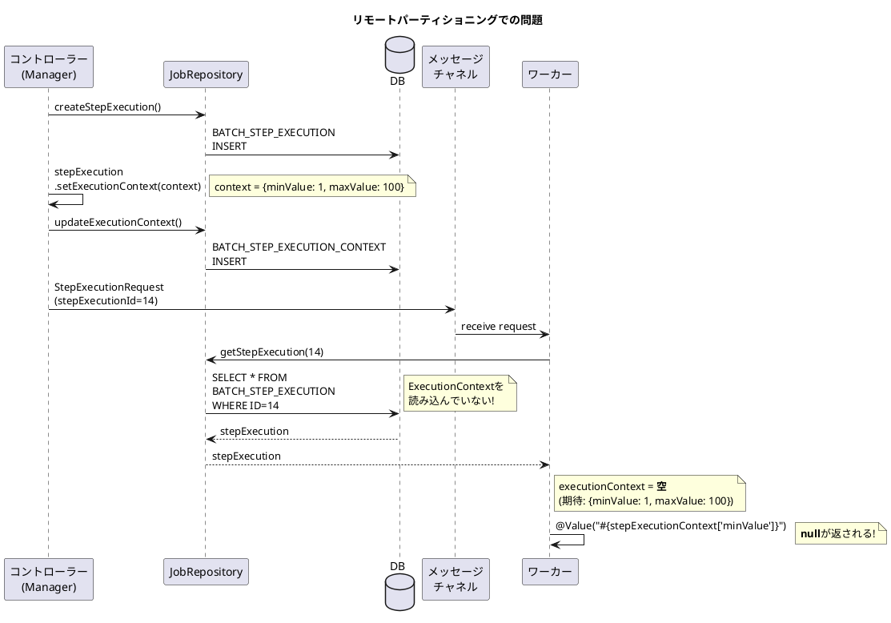
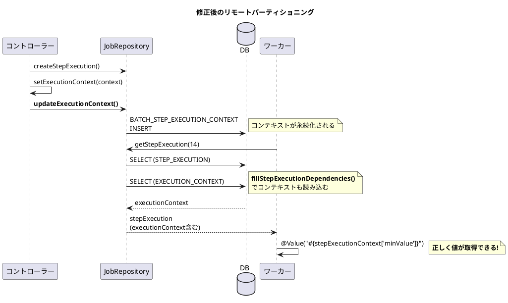

*（このドキュメントは生成AI(Claude Opus 4.5)によって2026年1月9日に生成されました）*

## 課題概要

Spring Batch 6.0で `JobRepository.getStepExecution()` を使用して `StepExecution` を取得した際に、`ExecutionContext` が読み込まれないバグです。リモートパーティショニング使用時に、ワーカー側でステップのコンテキスト情報が取得できなくなります。

**`ExecutionContext`とは**: Spring Batchにおいて、ジョブやステップの実行状態を保存するためのキー・バリューストアです。再起動時の状態復元や、ステップ間でのデータ共有に使用されます。

### 問題の状況

Spring Batch 5.2.x では `SimpleJobExplorer` が `StepExecution` の取得時に `ExecutionContext` も自動的に読み込んでいましたが、6.0.0 では `JobRepository` に移行した際にこの処理が欠落していました。



### 期待される動作と実際の動作

| 操作 | Spring Batch 5.2.x | Spring Batch 6.0.0 |
|------|-------------------|-------------------|
| `jobRepository.getStepExecution(id)` | `ExecutionContext` が読み込まれる | `ExecutionContext` が空 |
| `@Value("#{stepExecutionContext['key']}")` | 値が取得できる | null |

## 原因

`SimpleJobRepository.getStepExecution()` メソッドが、`StepExecution` の取得時に `ExecutionContext` を読み込む処理を行っていませんでした。

## 対応方針

### 変更内容

PR #5147 で以下の修正が行われました：

#### 1. `SimpleJobRepository.getStepExecution()` に `ExecutionContext` 読み込み処理を追加

```java
@Nullable
@Override
public StepExecution getStepExecution(long executionId) {
    StepExecution stepExecution = this.stepExecutionDao.getStepExecution(executionId);
    if (stepExecution != null) {
        // ExecutionContextを読み込む処理を追加
        fillStepExecutionDependencies(stepExecution);
        ExecutionContext jobExecutionContext = this.ecDao.getExecutionContext(stepExecution.getJobExecution());
        stepExecution.getJobExecution().setExecutionContext(jobExecutionContext);
    }
    return stepExecution;
}
```

#### 2. `SimpleStepExecutionSplitter.split()` でコンテキスト永続化を追加

パーティション作成時に、`ExecutionContext` を即座に永続化するように修正：

```java
@Override
public Set<StepExecution> split(StepExecution stepExecution, int gridSize) throws JobExecutionException {
    // ...
    for (Map.Entry<String, ExecutionContext> context : contexts.entrySet()) {
        if (lastStepExecution == null) { // 新規開始
            StepExecution currentStepExecution = jobRepository.createStepExecution(stepName, jobExecution);
            currentStepExecution.setExecutionContext(context.getValue());
            // ExecutionContextを即座に永続化（追加）
            jobRepository.updateExecutionContext(currentStepExecution);
            set.add(currentStepExecution);
        } else { // 再起動
            // ...
            jobRepository.updateExecutionContext(currentStepExecution);  // 追加
            // ...
        }
    }
    return set;
}
```

#### 3. `SimpleJobExplorer` のメソッド名リファクタリング

`getJobExecutionDependencies()` → `fillJobExecutionDependencies()` などに名前を変更し、メソッドの意図を明確化しました。

### 修正後のフロー



---

**関連リンク**:
- [Issue #5117](https://github.com/spring-projects/spring-batch/issues/5117)
- [PR #5147](https://github.com/spring-projects/spring-batch/pull/5147)
- 関連Issue: [#5138](https://github.com/spring-projects/spring-batch/issues/5138) (同じPRで修正)
