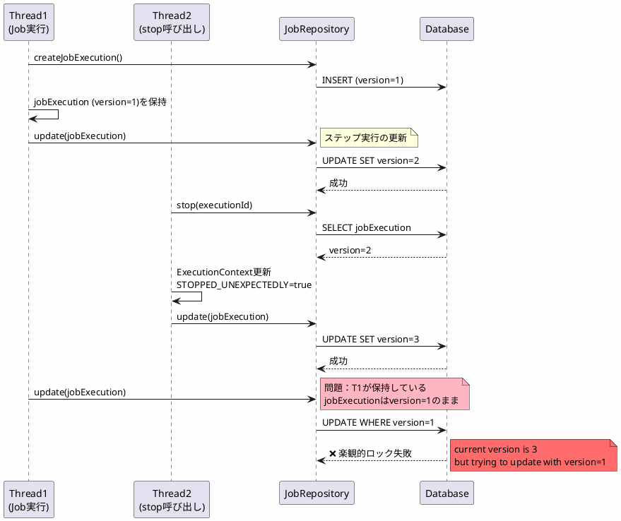
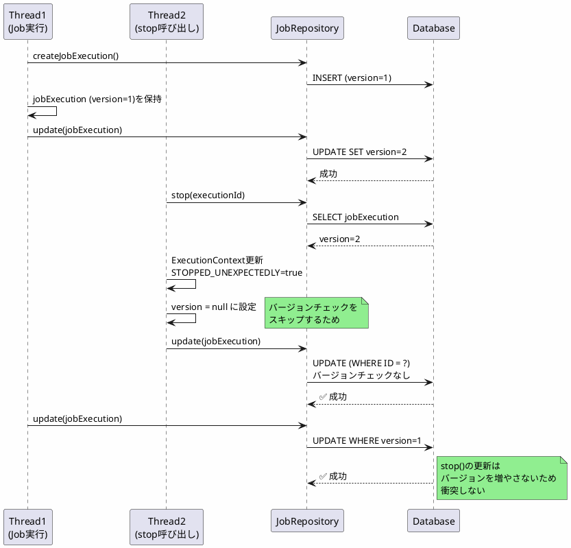

*(このドキュメントは生成AI(Claude Sonnet 4.5)によって2026年1月6日に生成されました)*

## 課題概要

`JobOperator.stop(long executionId)`を呼び出すと、楽観的ロック（Optimistic Locking）の失敗が発生する問題を修正しました。

**楽観的ロックとは**: データベースのレコードにバージョン番号を持たせ、更新時に他のトランザクションによって変更されていないかをチェックする並行制御の仕組みです。

### エラー内容

```
org.springframework.dao.OptimisticLockingFailureException: 
Attempt to update step execution id=1 with wrong version (2), 
where current version is 3
```

## 原因

`stop()`呼び出しの処理フローにおいて、ジョブ実行のバージョン番号が同期されていませんでした。

### 問題のシーケンス



### 根本原因

ジョブ実行のコア処理は、起動時に取得した`JobExecution`オブジェクトのコピーを保持しており、リポジトリと同期されていません。そのため、`stop()`によってバージョンが更新されても、実行中のスレッドは古いバージョン番号を持ったままになります。

## 対応方針

**コミット**: [9bcc1e9](https://github.com/spring-projects/spring-batch/commit/9bcc1e9f7e1adb5aaec36d91b3d2b1cf0ca8c0a3)

`stop()`でジョブ実行を更新する際に、バージョン番号を`null`に設定することで、バージョンチェックをスキップするように修正しました。

### 修正内容

```java
// v6.0.0（問題のあるコード）
public class SimpleJobOperator implements JobOperator {
    @Override
    public boolean stop(long executionId) {
        JobExecution execution = jobRepository.getJobExecution(executionId);
        execution.setStoppingUnexpectedly(true);
        
        // ❌ バージョン番号をそのまま使用
        jobRepository.update(execution);  // バージョンチェックで失敗
        return true;
    }
}

// v6.0.1（修正後）
public class SimpleJobOperator implements JobOperator {
    @Override
    public boolean stop(long executionId) {
        JobExecution execution = jobRepository.getJobExecution(executionId);
        execution.setStoppingUnexpectedly(true);
        
        // ✅ バージョンをnullに設定してバージョンチェックを回避
        execution.setVersion(null);
        jobRepository.update(execution);
        return true;
    }
}
```

### JdbcJobExecutionDaoの動作

```java
// version == nullの場合に使用されるSQL
private static final String UPDATE_JOB_EXECUTION_STATUS_ONLY = """
    UPDATE %PREFIX%JOB_EXECUTION 
    SET STATUS = ?, LAST_UPDATED = ?
    WHERE JOB_EXECUTION_ID = ?
    """;  // バージョンチェックなし

// version != nullの場合に使用されるSQL
private static final String SYNCHRONIZE_STATUS = """
    UPDATE %PREFIX%JOB_EXECUTION 
    SET STATUS = ?, LAST_UPDATED = ?, VERSION = VERSION + 1
    WHERE JOB_EXECUTION_ID = ? AND VERSION = ?
    """;  // バージョンチェックあり
```

### 修正後のシーケンス



### メリットと注意点

#### メリット

| 項目 | v6.0.0 | v6.0.1 |
|------|--------|--------|
| stop()時の動作 | 楽観的ロック失敗 | 正常動作 |
| 並行実行の安全性 | 低い | 高い |
| エラーの発生頻度 | 高い | なし |

#### 注意点

この対応は、`stop()`メソッド専用の解決策です。Spring Batchのコア実行ロジック全体を、ジョブ実行の更新前に毎回最新バージョンを取得するように変更すると、パフォーマンスへの影響が大きいため、限定的な対応としました。

### デザイン決定

課題 [#5120](https://github.com/spring-projects/spring-batch/issues/5120) のコメントで、以下の2つの選択肢が検討されました：

1. **採用**: `stop()`メソッド内でバージョンを`null`に設定
2. **不採用**: コア実行ロジック全体を変更し、毎回最新バージョンを取得

**選択理由**: 選択肢1は他の実行フローに影響せず、リポジトリへの問い合わせ増加も避けられるため採用されました。

この修正により、`JobOperator.stop()`が並行実行環境でも正しく動作するようになりました。
