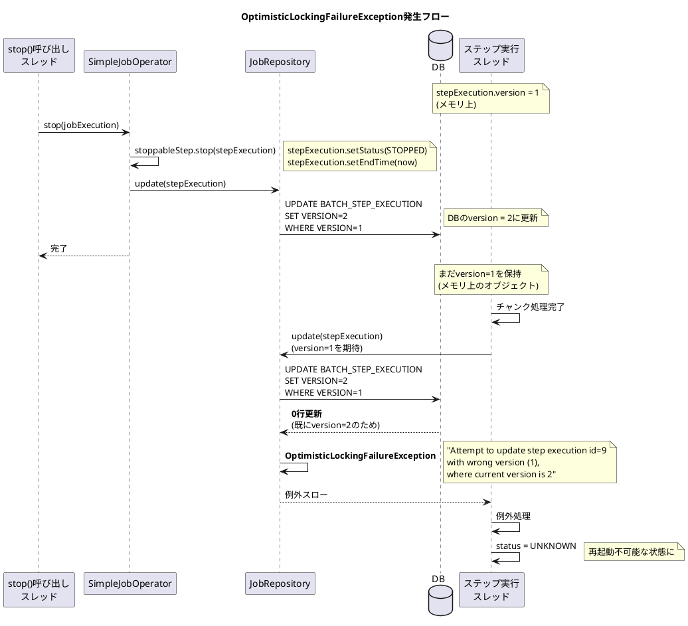
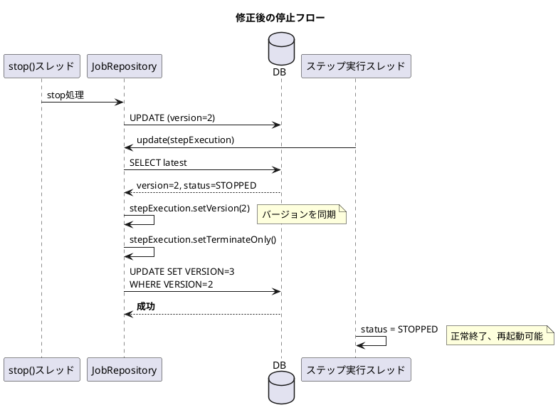

*（このドキュメントは生成AI(Claude Opus 4.5)によって2026年1月9日に生成されました）*

## 課題概要

Spring Batch 6.0で `JobOperator.stop()` を呼び出してジョブをグレースフルに停止しようとすると、`OptimisticLockingFailureException` が発生し、最終的に `JobExecution` の `BatchStatus` が `UNKNOWN` になってしまうバグです。これにより、ジョブの再起動ができなくなります。

**`OptimisticLockingFailureException`とは**: データベースの楽観的ロック機構において、更新しようとしたレコードのバージョンが既に他のトランザクションによって変更されていた場合にスローされる例外です。

### 問題の状況



### 期待される動作と実際の動作

| 状況 | 期待される結果 | 実際の結果 |
|-----|--------------|-----------|
| `stop()` 呼び出し後 | `BatchStatus.STOPPED` | `BatchStatus.UNKNOWN` |
| 再起動可能性 | 再起動可能 | 再起動不可 |

## 原因

`SimpleJobOperator.stop()` が `StepExecution` を更新する際に、ステップ実行スレッドが保持している `StepExecution` オブジェクトとは異なるオブジェクトを更新していました。これにより、バージョンの不整合が発生しました。

### 問題の詳細

1. **stop()スレッドでの更新**: `SteppableStep.stop()` で `StepExecution` のステータスを更新後、`JobRepository.update()` でDBに永続化（バージョン++）

2. **ステップ実行スレッドの更新**: メモリ上の古いバージョン番号を持つ `StepExecution` を更新しようとして失敗

## 対応方針

### 変更内容

PR #5165 で以下の修正が行われました：

#### 1. `SimpleJobRepository.update(StepExecution)` でバージョン同期を追加

```java
@Override
public void update(StepExecution stepExecution) {
    stepExecution.setLastUpdated(LocalDateTime.now());

    // DBから最新のStepExecutionを取得
    StepExecution latestStepExecution = getStepExecution(stepExecution.getId());
    Assert.state(latestStepExecution != null, "StepExecution not found");

    // 外部からSTOPPEDに設定されていた場合
    if (latestStepExecution.getJobExecution().isStopped()) {
        // 最新のバージョンを同期（OptimisticLocking回避）
        Integer version = latestStepExecution.getVersion();
        if (version != null) {
            stepExecution.setVersion(version);
        }
        stepExecution.setTerminateOnly();
    }

    stepExecutionDao.updateStepExecution(stepExecution);
}
```

#### 2. `StoppableStep.stop()` から `setTerminateOnly()` を削除

`terminateOnly` の設定は `JobRepository.update()` 内で行うように変更：

```java
default void stop(StepExecution stepExecution) {
    // setTerminateOnly() は削除（JobRepository.update()で設定）
    stepExecution.setStatus(BatchStatus.STOPPED);
    stepExecution.setExitStatus(ExitStatus.STOPPED);
    stepExecution.setEndTime(LocalDateTime.now());
}
```

### 修正後のフロー



---

**関連リンク**:
- [Issue #5120](https://github.com/spring-projects/spring-batch/issues/5120)
- [PR #5165](https://github.com/spring-projects/spring-batch/pull/5165)
- 関連Issue: [#5114](https://github.com/spring-projects/spring-batch/issues/5114) (stop()が機能しない問題、同じPRで修正)
