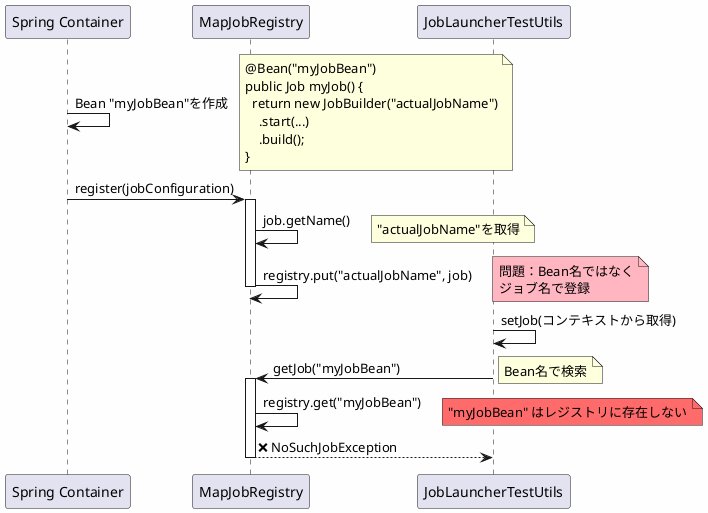
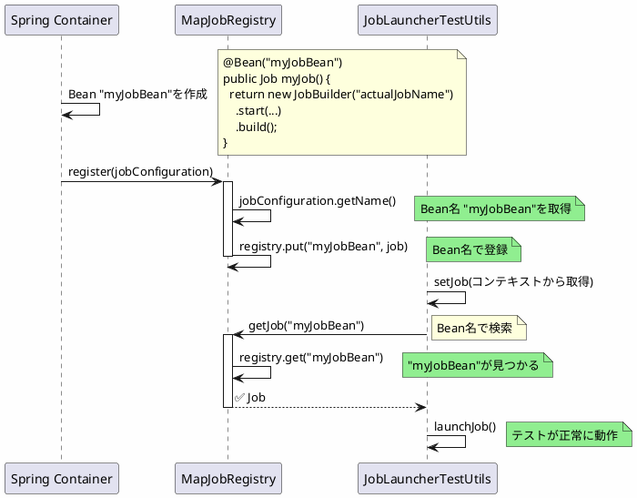

*(このドキュメントは生成AI(Claude Sonnet 4.5)によって2026年1月6日に生成されました)*

## 課題概要

`MapJobRegistry`がジョブをBean名ではなくジョブ名で登録していたため、`@SpringBatchTest`の`JobLauncherTestUtils`が正しく動作しない問題を修正しました。

### 問題の発生条件

```java
@Configuration
public class JobConfig {
    @Bean("myJobBean")  // Bean名: myJobBean
    public Job myJob() {
        return new JobBuilder("actualJobName")  // ジョブ名: actualJobName
            .start(...)
            .build();
    }
}

@SpringBatchTest
@SpringBootTest
public class JobTests {
    @Autowired
    private JobLauncherTestUtils jobLauncherTestUtils;
    
    @Test
    public void testJob() {
        // ❌ v6.0.0では動作しない
        jobLauncherTestUtils.launchJob();
    }
}
```

**問題**: `JobLauncherTestUtils`がBean名`myJobBean`で検索しようとするが、レジストリには`actualJobName`でしか登録されていないため、ジョブが見つからない。

## 原因

`MapJobRegistry`が、Beanとして登録されたジョブを追加する際に、Bean名ではなくジョブ名を使用していました。

### 問題のコード

```java
// v6.0.0（問題のあるコード）
public class MapJobRegistry implements JobRegistry {
    private final Map<String, Job> registry = new HashMap<>();
    
    public void register(JobConfiguration jobConfiguration) {
        Job job = jobConfiguration.getJob();
        
        // ❌ ジョブ名で登録
        String jobName = job.getName();
        registry.put(jobName, job);
    }
}
```

### 問題のフロー



## 対応方針

**コミット**: [ffc0e28](https://github.com/spring-projects/spring-batch/commit/ffc0e28fcdde6b57eb4ba9ba64e476ae4bf7c52e)

`MapJobRegistry`を、Bean名を使ってジョブを登録するように修正しました。

### 修正内容

```java
// v6.0.1（修正後）
public class MapJobRegistry implements JobRegistry {
    private final Map<String, Job> registry = new HashMap<>();
    
    public void register(JobConfiguration jobConfiguration) {
        Job job = jobConfiguration.getJob();
        
        // ✅ Bean名で登録（jobConfigurationから取得）
        String beanName = jobConfiguration.getName();
        registry.put(beanName, job);
    }
}
```

### 修正後のフロー



### 使用例

```java
@Configuration
public class JobConfig {
    // Bean名とジョブ名が異なる
    @Bean("importJobBean")
    public Job importJob(JobRepository jobRepository, Step step1) {
        return new JobBuilder("actualImportJob", jobRepository)
            .start(step1)
            .build();
    }
}

@SpringBatchTest
@SpringBootTest
public class ImportJobTests {
    @Autowired
    private JobLauncherTestUtils jobLauncherTestUtils;
    
    @Test
    public void testImportJob() {
        // v6.0.1では正常に動作
        // Bean名"importJobBean"でジョブを検索できる
        JobExecution jobExecution = jobLauncherTestUtils.launchJob();
        assertEquals(BatchStatus.COMPLETED, jobExecution.getStatus());
    }
}
```

### Bean名とジョブ名の関係

| 項目 | Bean名 | ジョブ名 | 用途 |
|------|--------|---------|------|
| Springコンテナ | `@Bean("importJobBean")` | - | DIやテストでの参照 |
| Spring Batchレジストリ | - | `JobBuilder("actualImportJob")` | 実行時のジョブ識別 |
| v6.0.0の登録 | ❌ 使用されない | ✅ レジストリキー | テストで問題 |
| v6.0.1の登録 | ✅ レジストリキー | - | テストで正常動作 |

### メリット

| 項目 | v6.0.0 | v6.0.1 |
|------|--------|--------|
| `@SpringBatchTest`の動作 | Bean名で検索できない | Bean名で検索可能 |
| ジョブ取得方法 | ジョブ名のみ | Bean名で取得可能 |
| Springの一貫性 | 不一致 | 一致（Bean名ベース） |

### 影響範囲

この変更により、以下の動作が可能になります：

```java
// ApplicationContextから直接取得
Job job = applicationContext.getBean("importJobBean", Job.class);

// JobRegistryから取得（v6.0.1で修正）
Job job = jobRegistry.getJob("importJobBean");
```

この修正により、Spring BatchとSpringコンテナの整合性が保たれ、テストユーティリティが正しく動作するようになりました。
