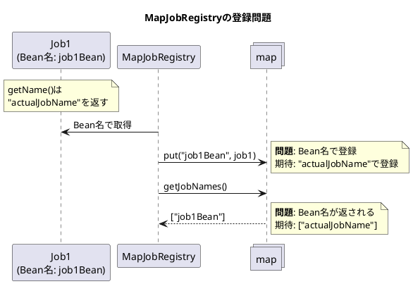
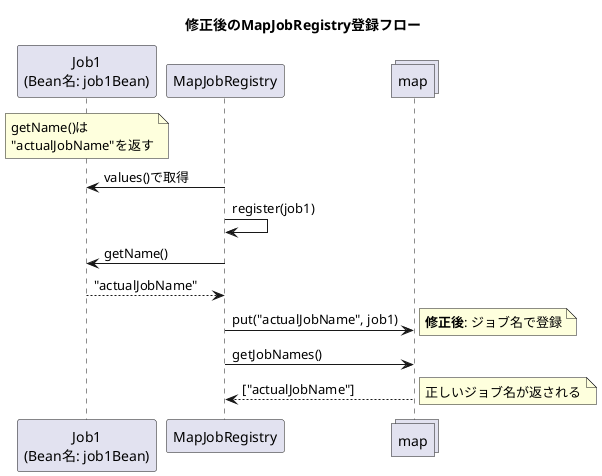

*（このドキュメントは生成AI(Claude Opus 4.5)によって2026年1月9日に生成されました）*

## 課題概要

`MapJobRegistry` がジョブを登録する際に、ジョブの名前（`Job.getName()`）ではなくBeanの名前で登録してしまうバグです。

**`JobRegistry`とは**: Spring Batchにおいて、複数のジョブを管理・検索するためのコンポーネントです。ジョブ名でジョブを取得したり、登録済みのジョブ一覧を取得したりする際に使用します。

### 問題の状況



### 期待される動作と実際の動作

| 操作 | 期待される結果 | 実際の結果 |
|------|--------------|-----------|
| `jobRegistry.getJobNames()` | `["actualJobName"]` | `["job1Bean"]` |
| `jobRegistry.getJob("actualJobName")` | ジョブを取得 | ジョブが見つからない |

## 原因

`MapJobRegistry.afterSingletonsInstantiated()` メソッドで、`getBeansOfType()` の結果（Bean名→Jobのマップ）をそのまま登録していたため。

**問題のコード（修正前）**:
```java
@Override
public void afterSingletonsInstantiated() {
    Map<String, Job> jobBeans = this.applicationContext.getBeansOfType(Job.class);
    // Bean名をキーとしてそのまま登録してしまう
    this.map.putAll(jobBeans);
}
```

## 対応方針

### 変更内容

`afterSingletonsInstantiated()` メソッドを修正し、`register()` メソッドを使用して各ジョブを正しい名前で登録するように変更しました。

**修正後のコード**:
```java
@Override
public void afterSingletonsInstantiated() {
    Map<String, Job> jobBeans = this.applicationContext.getBeansOfType(Job.class);
    // 各ジョブをJob.getName()の値で登録
    for (Job job : jobBeans.values()) {
        try {
            register(job);  // register()内部でjob.getName()を使用
        }
        catch (DuplicateJobException e) {
            throw new IllegalStateException("Unable to register job " + job.getName(), e);
        }
    }
}
```

### 追加されたテスト

重複したジョブ名での登録が適切に検出されることを確認するテストが追加されました：

```java
@Test
void testDuplicateJobRegistration() {
    assertThrows(IllegalStateException.class,
            () -> new AnnotationConfigApplicationContext(JobConfigurationWithDuplicateJobs.class));
}

@Configuration
@EnableBatchProcessing
static class JobConfigurationWithDuplicateJobs {

    @Bean
    Job job1() {
        return new JobSupport("sameJobNameOnPurpose");  // 同じジョブ名
    }

    @Bean
    Job job2() {
        return new JobSupport("sameJobNameOnPurpose");  // 同じジョブ名
    }

    @Bean
    public JobRegistry jobRegistry() {
        return new MapJobRegistry();
    }
}
```

### 修正後の動作



---

**関連リンク**:
- [Issue #5122](https://github.com/spring-projects/spring-batch/issues/5122)
- [Commit 184ac31](https://github.com/spring-projects/spring-batch/commit/184ac31f704935c6d49865839713cd3126ce7cd3)
