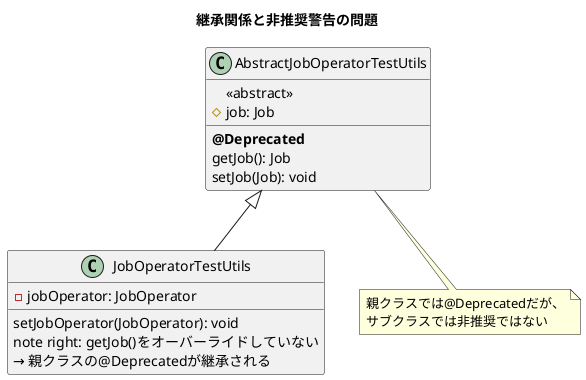
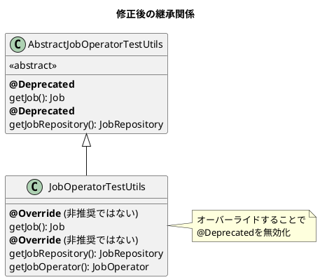

*（このドキュメントは生成AI(Claude Opus 4.5)によって2026年1月9日に生成されました）*

## 課題概要

`JobOperatorTestUtils.getJob()` メソッドに不正な非推奨警告が表示される問題です。親クラスで `@Deprecated` が付いているメソッドをオーバーライドしていなかったため、本来は非推奨ではないメソッドの使用時に警告が発生していました。

**`JobOperatorTestUtils`とは**: Spring Batch 6.0で導入された、ジョブのテストを行うためのユーティリティクラスです。ジョブの起動やステップの実行など、テスト時に便利な機能を提供します。

### 問題の状況



### 期待される動作と実際の動作

| 呼び出し | 期待される結果 | 実際の結果 |
|---------|--------------|-----------|
| `jobOperatorTestUtils.getJob()` | 警告なし | 非推奨警告が表示される |

## 原因

`JobOperatorTestUtils` が `AbstractJobOperatorTestUtils` を継承しているが、`getJob()` メソッドをオーバーライドしていなかったため、親クラスの `@Deprecated` アノテーションがそのまま適用されていました。

## 対応方針

### 変更内容

`JobOperatorTestUtils` に `getJob()` と `getJobRepository()` をオーバーライドして追加し、`@Deprecated` を付けずに公開しました。また、`getJobOperator()` も追加されました。

**修正後のコード**:
```java
public class JobOperatorTestUtils extends AbstractJobOperatorTestUtils {

    // 親クラスの@Deprecatedを上書きして、非推奨ではないことを明示
    @Override
    public Job getJob() {
        return super.getJob();
    }

    // 同様にgetJobRepository()もオーバーライド
    @Override
    public JobRepository getJobRepository() {
        return super.getJobRepository();
    }

    // 新規追加: JobOperatorのgetter
    public JobOperator getJobOperator() {
        return this.jobOperator;
    }
}
```

### 修正後の継承関係



---

**関連リンク**:
- [Issue #5123](https://github.com/spring-projects/spring-batch/issues/5123)
- [Commit 4216a0a](https://github.com/spring-projects/spring-batch/commit/4216a0a5834d90f0063cfe6ec32bc45c1e9d260b)
