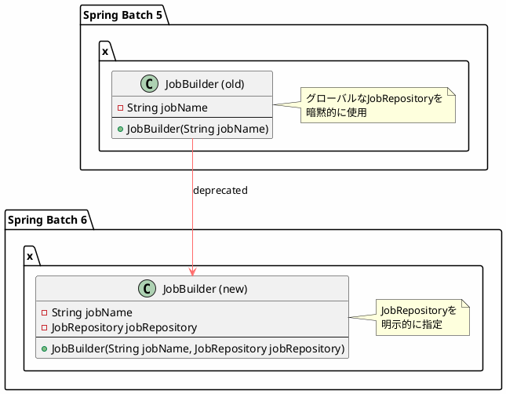
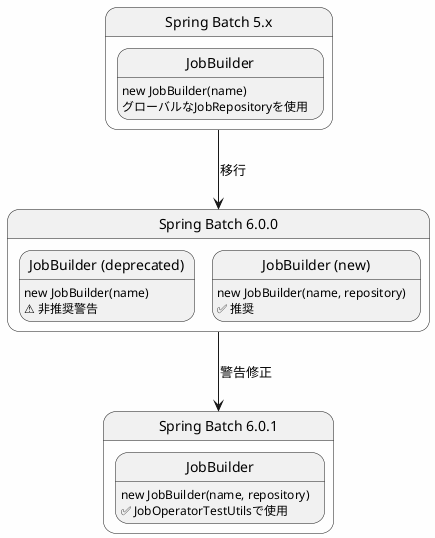

*(このドキュメントは生成AI(Claude Sonnet 4.5)によって2026年1月6日に生成されました)*

## 課題概要

`JobOperatorTestUtils`で非推奨（deprecated）の`JobBuilder`コンストラクタを使用していたため、警告が表示される問題を修正しました。

**非推奨APIとは**: 将来のバージョンで削除される予定のAPIで、使用すると警告が表示されます。

### 警告内容

```
warning: [deprecation] JobBuilder(String) in JobBuilder has been deprecated
```

## 原因

`JobOperatorTestUtils`が、Spring Batch 6.0で非推奨となった`JobBuilder`の古いコンストラクタを使用していました。

### 問題のコード

```java
// v6.0.0（問題のあるコード）
public class JobOperatorTestUtils {
    public Job createJob(String jobName) {
        // ❌ 非推奨のコンストラクタ
        return new JobBuilder(jobName)
            .start(...)
            .build();
    }
}
```

### 非推奨の理由

Spring Batch 6.0では、すべてのビルダーが`JobRepository`を明示的に必要とするように変更されました。これにより、グローバルな状態への依存がなくなり、テストがしやすくなります。



## 対応方針

**コミット**: [3a6e7a1](https://github.com/spring-projects/spring-batch/commit/3a6e7a103f38e5de3128e48f52b8e6c84e9fb5df)

`JobBuilder`の新しいコンストラクタ（`JobRepository`を受け取る）を使用するように修正しました。

### 修正内容

```java
// v6.0.0（問題のあるコード）
public class JobOperatorTestUtils {
    public Job createJob(String jobName) {
        return new JobBuilder(jobName)  // ❌ 非推奨
            .start(...)
            .build();
    }
}

// v6.0.1（修正後）
public class JobOperatorTestUtils {
    private JobRepository jobRepository;
    
    public JobOperatorTestUtils(JobRepository jobRepository) {
        this.jobRepository = jobRepository;
    }
    
    public Job createJob(String jobName) {
        return new JobBuilder(jobName, this.jobRepository)  // ✅ 新しいAPI
            .start(...)
            .build();
    }
}
```

### APIの変遷



### 使用例

```java
@Configuration
public class TestConfig {
    @Bean
    public JobOperatorTestUtils jobOperatorTestUtils(JobRepository jobRepository) {
        // v6.0.1ではJobRepositoryを渡す
        return new JobOperatorTestUtils(jobRepository);
    }
}

@SpringBatchTest
@SpringBootTest
public class JobOperatorTests {
    @Autowired
    private JobOperatorTestUtils testUtils;
    
    @Test
    public void testJobOperator() {
        // 警告なしでジョブを作成できる
        Job testJob = testUtils.createJob("testJob");
    }
}
```

### メリット

| 項目 | v6.0.0 | v6.0.1 |
|------|--------|--------|
| 非推奨警告 | あり | なし |
| APIの明確性 | 低い（暗黙的依存） | 高い（明示的依存） |
| テスト容易性 | 低い | 高い |
| 将来互換性 | リスクあり | 安全 |

### JobRepository明示化の利点

```java
// 複数のJobRepositoryを使い分けられる
public class MultiRepositoryTests {
    @Test
    public void testWithInMemoryRepository() {
        JobRepository inMemoryRepo = new MapJobRepository();
        Job job = new JobBuilder("job", inMemoryRepo)
            .start(...)
            .build();
    }
    
    @Test
    public void testWithDatabaseRepository() {
        JobRepository dbRepo = new JdbcJobRepository(...);
        Job job = new JobBuilder("job", dbRepo)
            .start(...)
            .build();
    }
}
```

この修正により、`JobOperatorTestUtils`が最新のAPIを使用するようになり、非推奨警告が解消されました。
