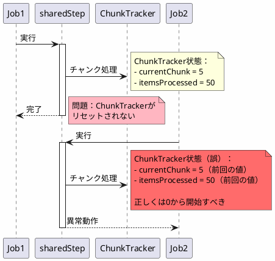
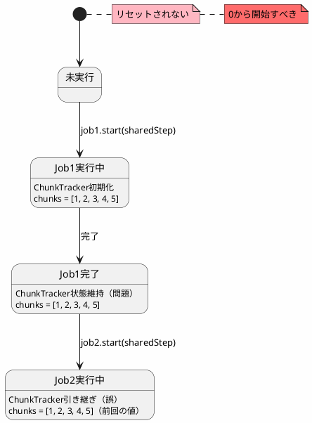
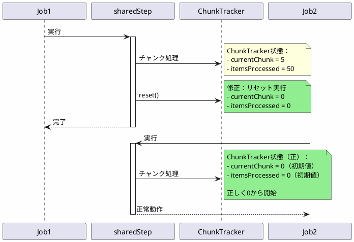

*(このドキュメントは生成AI(Claude Sonnet 4.5)によって2026年1月6日に生成されました)*

## 課題概要

同じステップを複数のジョブインスタンスで再利用する際、前回のジョブで使用された`ChunkTracker`がリセットされず、次のジョブが正しく動作しない問題を修正しました。

**関連Issue**: この問題は [#5099](https://github.com/spring-projects/spring-batch/issues/5099)（ChunkTrackerのスレッドローカル化）とは異なります。[#5099](https://github.com/spring-projects/spring-batch/issues/5099) は同一ジョブ内のパーティション並行処理の問題でしたが、本件は異なるジョブインスタンス間の問題です。

### 問題の発生条件

```java
// 同じステップを複数ジョブで使用
@Configuration
public class JobConfig {
    @Bean
    public Step sharedStep(JobRepository jobRepository) {
        return new StepBuilder("sharedStep", jobRepository)
            .chunk(10)
            .reader(...)
            .processor(...)
            .writer(...)
            .build();
    }
    
    @Bean
    public Job job1(JobRepository jobRepository, Step sharedStep) {
        return new JobBuilder("job1", jobRepository)
            .start(sharedStep)
            .build();
    }
    
    @Bean
    public Job job2(JobRepository jobRepository, Step sharedStep) {
        return new JobBuilder("job2", jobRepository)
            .start(sharedStep)
            .build();
    }
}

// 実行
jobLauncher.run(job1, params1);  // 正常終了
jobLauncher.run(job2, params2);  // ❌ job1のChunkTrackerが残っているため異常動作
```

## 原因

`ChunkTracker`がステップ実行完了後にリセットされず、次のジョブで再利用されていました。

### 問題の構造



### 状態遷移図



## 対応方針

**コミット**: [2faf66a](https://github.com/spring-projects/spring-batch/commit/2faf66a0ead5f3e28d165c48862b87fe81fbd03d)

ステップ実行完了後に、`ChunkTracker`をリセットするメソッドを追加しました。

### 修正内容

```java
// v6.0.0（問題のあるコード）
public class FaultTolerantChunkProcessor<I, O> {
    private ThreadLocal<ChunkTracker> chunkTrackers = new ThreadLocal<>();
    
    public void process(StepContribution contribution, Chunk<I> inputs) {
        ChunkTracker tracker = chunkTrackers.get();
        if (tracker == null) {
            tracker = new ChunkTracker();
            chunkTrackers.set(tracker);
        }
        // チャンク処理
    }
    
    // ❌ リセットメソッドなし
}

// v6.0.1（修正後）
public class FaultTolerantChunkProcessor<I, O> {
    private ThreadLocal<ChunkTracker> chunkTrackers = new ThreadLocal<>();
    
    public void process(StepContribution contribution, Chunk<I> inputs) {
        ChunkTracker tracker = chunkTrackers.get();
        if (tracker == null) {
            tracker = new ChunkTracker();
            chunkTrackers.set(tracker);
        }
        // チャンク処理
    }
    
    // ✅ リセットメソッドを追加
    public void reset() {
        chunkTrackers.remove();  // ThreadLocalをクリア
    }
}

// ステップ実行完了時に呼び出し
public class TaskletStep {
    @Override
    protected void doExecute(StepExecution stepExecution) {
        try {
            // ステップ実行
        } finally {
            // ✅ 実行完了後にリセット
            if (chunkProcessor instanceof FaultTolerantChunkProcessor) {
                ((FaultTolerantChunkProcessor) chunkProcessor).reset();
            }
        }
    }
}
```

### 修正後の動作



### ThreadLocalライフサイクル

| フェーズ | v6.0.0 | v6.0.1 |
|---------|--------|--------|
| ステップ開始 | ThreadLocal生成 | ThreadLocal生成 |
| チャンク処理 | 状態を蓄積 | 状態を蓄積 |
| ステップ完了 | ❌ 状態保持 | ✅ reset()でクリア |
| 次のジョブ開始 | ❌ 古い状態を使用 | ✅ 新しいTrackerを生成 |

### 使用例

```java
// 同じステップを複数ジョブで共有
@Configuration
public class JobConfig {
    @Bean
    public Step importStep(JobRepository jobRepository,
                          PlatformTransactionManager transactionManager) {
        return new StepBuilder("importStep", jobRepository)
            .<String, String>chunk(10, transactionManager)
            .reader(itemReader())
            .processor(itemProcessor())
            .writer(itemWriter())
            .faultTolerant()
            .build();
    }
    
    @Bean
    public Job dailyImportJob(JobRepository jobRepository, Step importStep) {
        return new JobBuilder("dailyImportJob", jobRepository)
            .start(importStep)
            .build();
    }
    
    @Bean
    public Job weeklyImportJob(JobRepository jobRepository, Step importStep) {
        return new JobBuilder("weeklyImportJob", jobRepository)
            .start(importStep)
            .build();
    }
}

// 実行
jobLauncher.run(dailyImportJob, new JobParametersBuilder()
    .addString("date", "2026-01-06")
    .toJobParameters());

// v6.0.1では正常動作
jobLauncher.run(weeklyImportJob, new JobParametersBuilder()
    .addString("date", "2026-01-06")
    .toJobParameters());
```

### メリット

| 項目 | v6.0.0 | v6.0.1 |
|------|--------|--------|
| ステップ再利用 | 異常動作 | 正常動作 |
| ChunkTrackerのリセット | なし | あり |
| メモリリーク | 可能性あり | なし |
| 予測可能性 | 低い | 高い |

この修正により、同じステップを複数のジョブで安全に再利用できるようになりました。
