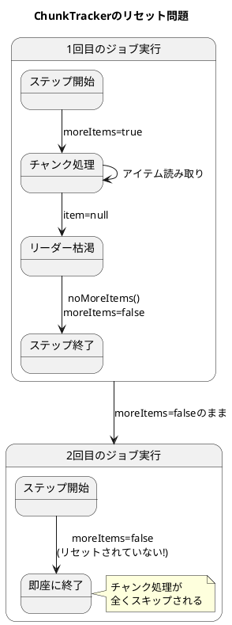
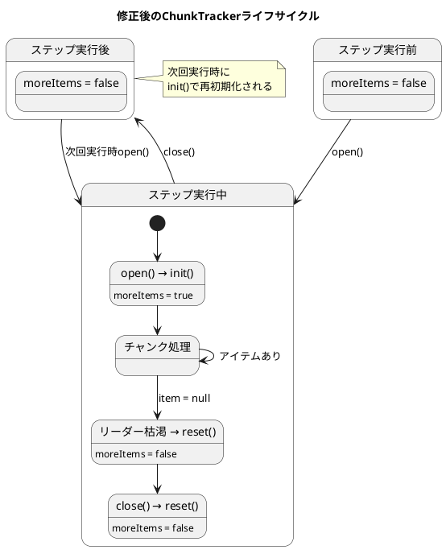

*（このドキュメントは生成AI(Claude Opus 4.5)によって2026年1月9日に生成されました）*

## 課題概要

`ChunkOrientedStep` の `ChunkTracker` がステップ実行後にリセットされないため、同じステップを2回以上実行すると、2回目以降の実行でチャンク処理が全くスキップされてしまうバグです。

**`ChunkTracker`とは**: Spring Batch 6.0で導入された内部クラスで、チャンク処理においてまだ読み取るアイテムがあるかどうかを追跡するためのフラグを管理します。

### 問題の状況



### ログ出力の比較

| 実行回数 | ログ出力 | 問題 |
|---------|---------|------|
| 1回目 | `Reader was called, returning item`<br/>`Reader was called, returning null`<br/>`Writing chunk...`<br/>`Step: [step] executed in 5ms` | 正常 |
| **2回目** | `Executing step: [step]`<br/>`Step: [step] executed in` | チャンク処理なし！ |
| **3回目** | `Executing step: [step]`<br/>`Step: [step] executed in` | チャンク処理なし！ |

## 原因

`ChunkTracker` クラスのフラグ `moreItems` が、ステップの終了時にリセットされていませんでした。Issue #5099 で ThreadLocal 化された際に、ライフサイクル管理が不完全でした。

**問題のコード（修正前）**:
```java
private static class ChunkTracker {
    private boolean moreItems = true;  // 初期値true
    
    void noMoreItems() {
        this.moreItems = false;  // 一度falseになると戻らない
    }
    
    boolean moreItems() {
        return this.moreItems;
    }
}
```

## 対応方針

### 変更内容

`ChunkTracker` に `init()` と `reset()` メソッドを追加し、ステップの開始時と終了時に適切にフラグを管理するように修正しました。

**修正後のコード**:
```java
private static class ChunkTracker {
    private boolean moreItems;  // デフォルトfalse
    
    void init() {
        this.moreItems = true;  // ステップ開始時にtrueに設定
    }
    
    void reset() {
        this.moreItems = false;  // リーダー枯渇時またはステップ終了時にfalseに設定
    }
    
    boolean moreItems() {
        return this.moreItems;
    }
}

// ChunkOrientedStep内での使用
@Override
protected void open(ExecutionContext executionContext) throws Exception {
    this.compositeItemStream.open(executionContext);
    this.chunkTracker.get().init();  // ステップ開始時に初期化
}

@Override
protected void close(ExecutionContext executionContext) throws Exception {
    this.chunkTracker.get().reset();  // ステップ終了時にリセット
    this.compositeItemStream.close();
}
```

### 追加されたテスト

同じジョブを複数回実行しても正しく動作することを確認するテスト：

```java
@Test
void testChunkOrientedStepReExecution() throws Exception {
    // given
    ApplicationContext context = new AnnotationConfigApplicationContext(StepConfiguration.class);
    JobOperator jobOperator = context.getBean(JobOperator.class);
    Job job = context.getBean(Job.class);

    // when - 2回実行
    jobOperator.start(job, new JobParametersBuilder().addLong("run.id", 1L).toJobParameters());
    jobOperator.start(job, new JobParametersBuilder().addLong("run.id", 2L).toJobParameters());

    // then - 両方とも書き込まれていることを確認
    ListItemWriter<String> itemWriter = context.getBean(ListItemWriter.class);
    Assertions.assertEquals(2, itemWriter.getWrittenItems().size());
}
```

### 修正後の状態遷移



---

**関連リンク**:
- [Issue #5126](https://github.com/spring-projects/spring-batch/issues/5126)
- [Commit 69665d8](https://github.com/spring-projects/spring-batch/commit/69665d83d8556d9c23a965ee553972a277221d83)
- 関連Issue: [#5099](https://github.com/spring-projects/spring-batch/issues/5099) (ChunkTrackerのThreadLocal化)
