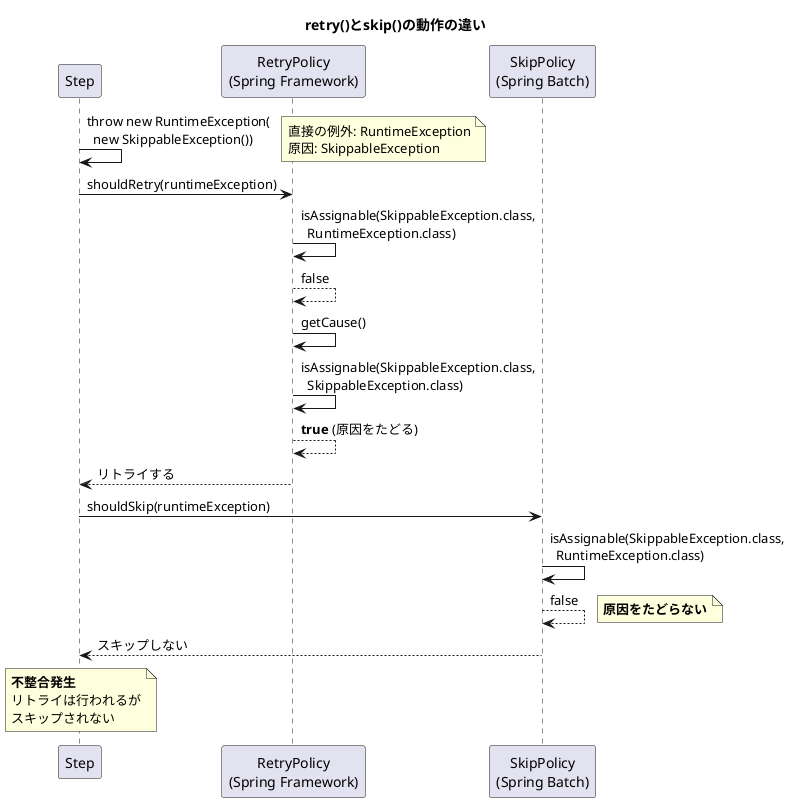
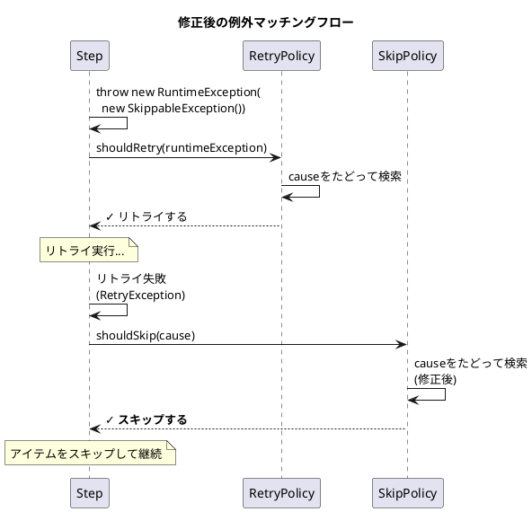

*（このドキュメントは生成AI(Claude Opus 4.5)によって2026年1月9日に生成されました）*

## 課題概要

フォールトトレラントなステップにおいて、`retry(Class)` と `skip(Class)` の例外マッチング動作が一貫していない問題です。`retry()` は例外の原因（cause）をたどって検索しますが、`skip()` は直接の例外クラスのみを確認します。

**フォールトトレラントとは**: Spring Batchにおいて、一部のアイテム処理が失敗しても全体のジョブを失敗させず、リトライやスキップで処理を継続させる機能です。

### 問題の状況



### 期待される動作と実際の動作

| 設定 | 例外 | `retry()` | `skip()` |
|------|------|----------|---------|
| `.retry(SkippableException.class)` | `SkippableException` | ✓ リトライ | ✓ スキップ |
| `.skip(SkippableException.class)` | `RuntimeException(new SkippableException())` | ✓ リトライ | ❌ **スキップされない** |

## 原因

### 1. `LimitCheckingExceptionHierarchySkipPolicy` の問題

例外の原因（cause）をたどって確認する処理がなく、直接の例外クラスのみを確認していました。

**問題のコード（修正前）**:
```java
private boolean isSkippable(Throwable t) {
    boolean isSkippable = false;
    for (Class<? extends Throwable> skippableException : this.skippableExceptions) {
        if (skippableException.isAssignableFrom(t.getClass())) {
            isSkippable = true;
            break;
        }
    }
    return isSkippable;
}
```

### 2. `ChunkOrientedStep` での論理反転

`shouldSkip()` の結果が誤って否定されていました。

**問題のコード（修正前）**:
```java
if (this.faultTolerant && exception instanceof RetryException retryException
        && !this.skipPolicy.shouldSkip(retryException.getCause(), -1)) {  // 否定が誤り
    // スキャン処理...
}
```

## 対応方針

### 変更内容

PR #5171 で以下の修正が行われました：

#### 1. `LimitCheckingExceptionHierarchySkipPolicy.isSkippable()` で原因をたどるように修正

```java
private boolean isSkippable(Throwable t) {
    Throwable current = t;
    while (current != null) {
        for (Class<? extends Throwable> skippableException : this.skippableExceptions) {
            if (skippableException.isInstance(current)) {
                return true;
            }
        }
        current = current.getCause();  // 原因をたどる
    }
    return false;
}
```

#### 2. `LimitCheckingExceptionHierarchySkipPolicy.shouldSkip()` のロジック修正

```java
@Override
public boolean shouldSkip(Throwable t, long skipCount) throws SkipLimitExceededException {
    boolean skippable = isSkippable(t);
    if (skipCount < 0) {
        return skippable;  // 修正: !isSkippable(t) から skippable に変更
    }
    if (!skippable) {
        return false;
    }
    if (skipCount >= this.skipLimit) {
        throw new SkipLimitExceededException(this.skipLimit, t);
    }
    return true;
}
```

#### 3. `ChunkOrientedStep` の論理反転を修正

```java
if (this.faultTolerant && exception instanceof RetryException retryException
        && this.skipPolicy.shouldSkip(retryException.getCause(), -1)) {  // 否定を削除
    logger.info("Retry exhausted while attempting to write items, scanning the chunk", retryException);
    // スキャン処理...
}
```

### 追加されたテスト

```java
@Test
void testSkippableExceptionsTraversal() throws Exception {
    class SkippableException extends RuntimeException {}
    
    ItemReader<String> reader = new ListItemReader<>(List.of("item1"));
    ItemWriter<String> writer = chunk -> {
        throw new RuntimeException(new SkippableException());  // 原因にスキップ可能例外
    };

    ChunkOrientedStep<String, String> step = new StepBuilder("step", jobRepository)
        .<String, String>chunk(1)
        .reader(reader)
        .writer(writer)
        .faultTolerant()
        .retry(SkippableException.class)
        .retryLimit(1)
        .skip(SkippableException.class)
        .skipLimit(1)
        .build();

    step.execute(stepExecution);

    assertEquals(ExitStatus.COMPLETED.getExitCode(), stepExecution.getExitStatus().getExitCode());
    assertEquals(1, stepExecution.getSkipCount());
}
```

### 修正後の例外処理フロー



---

**関連リンク**:
- [Issue #5127](https://github.com/spring-projects/spring-batch/issues/5127)
- [PR #5171](https://github.com/spring-projects/spring-batch/pull/5171)
