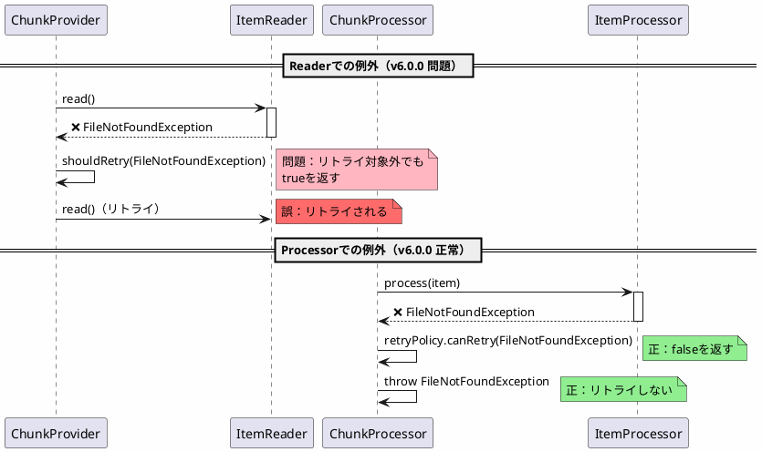
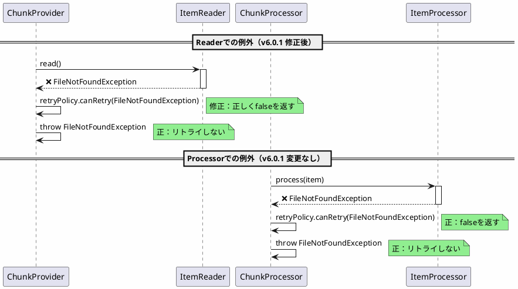

*(このドキュメントは生成AI(Claude Sonnet 4.5)によって2026年1月6日に生成されました)*

## 課題概要

フォールトトレラントステップ（fault-tolerant step）において、リトライ（retry）とスキップ（skip）の例外処理動作が、Readerとprocessorで一貫していない問題を修正しました。

**フォールトトレラントステップとは**: エラーが発生した際に、リトライやスキップを行うことでジョブを継続できるステップです。

### 不整合の内容

| 処理段階 | リトライ/スキップ対象外の例外 | v6.0.0の動作 |
|---------|---------------------------|-------------|
| Reader | `FileNotFoundException` | ❌ リトライされる（誤） |
| Processor | `FileNotFoundException` | ✅ リトライされない（正） |

**期待される動作**: 両方ともリトライされない
**実際の動作**: Readerだけリトライされてしまう

## 原因

Readerとprocessorの例外処理ロジックが異なっていました。

### Readerの問題（v6.0.0）

```java
// v6.0.0（問題のあるコード）
public class FaultTolerantChunkProvider<T> {
    protected Chunk<T> doRead() {
        while (true) {
            try {
                T item = itemReader.read();
                return new Chunk<>(item);
            } catch (Exception e) {
                // ❌ 例外が発生した場合、リトライポリシーをチェックせずリトライ
                if (shouldRetry(e)) {  // 常にtrue
                    continue;  // リトライ
                }
            }
        }
    }
    
    private boolean shouldRetry(Exception e) {
        // リトライ対象でない例外でもtrueを返してしまう
        return true;
    }
}
```

### Processorの動作（v6.0.0）

```java
// v6.0.0（正しい動作）
public class FaultTolerantChunkProcessor<I, O> {
    protected Chunk<O> doProcess(Chunk<I> inputs) {
        for (I item : inputs) {
            try {
                O result = itemProcessor.process(item);
                outputs.add(result);
            } catch (Exception e) {
                // ✅ リトライポリシーを正しくチェック
                if (retryPolicy.canRetry(e)) {
                    // リトライ
                } else {
                    throw e;  // リトライしない例外は即座にスロー
                }
            }
        }
    }
}
```

### 不整合のフロー



## 対応方針

**コミット**: [ec48b35](https://github.com/spring-projects/spring-batch/commit/ec48b35e00fbcd3b36cc5fc4afc8a41e0e2c7f97)

Readerの例外処理を、processorと同じロジックに統一しました。

### 修正内容

```java
// v6.0.1（修正後）
public class FaultTolerantChunkProvider<T> {
    private RetryPolicy retryPolicy;
    
    protected Chunk<T> doRead() {
        while (true) {
            try {
                T item = itemReader.read();
                return new Chunk<>(item);
            } catch (Exception e) {
                // ✅ リトライポリシーを正しくチェック
                if (retryPolicy.canRetry(e)) {
                    continue;  // リトライ
                } else {
                    throw e;  // リトライしない例外は即座にスロー
                }
            }
        }
    }
}
```

### 修正後のフロー



### 使用例

```java
@Configuration
public class JobConfig {
    @Bean
    public Step faultTolerantStep(JobRepository jobRepository,
                                  PlatformTransactionManager transactionManager) {
        return new StepBuilder("faultTolerantStep", jobRepository)
            .<String, String>chunk(10, transactionManager)
            .reader(itemReader())
            .processor(itemProcessor())
            .writer(itemWriter())
            .faultTolerant()
            .retryLimit(3)
            .retry(SQLException.class)  // SQLExceptionのみリトライ
            .noRetry(FileNotFoundException.class)  // FileNotFoundExceptionはリトライしない
            .skipLimit(10)
            .skip(ValidationException.class)
            .build();
    }
}

// v6.0.0の動作
// Reader: FileNotFoundException → ❌ リトライされる（誤）
// Processor: FileNotFoundException → ✅ リトライされない（正）

// v6.0.1の動作
// Reader: FileNotFoundException → ✅ リトライされない（正）
// Processor: FileNotFoundException → ✅ リトライされない（正）
```

### テストケースによる検証

Issue内で提供されたテストコード：

```java
@Test
public void testRetryPolicyConsistency() {
    Step step = new StepBuilder("testStep", jobRepository)
        .<String, String>chunk(1, transactionManager)
        .reader(new ItemReader<String>() {
            @Override
            public String read() throws FileNotFoundException {
                throw new FileNotFoundException("File not found");
            }
        })
        .processor(new ItemProcessor<String, String>() {
            @Override
            public String process(String item) throws FileNotFoundException {
                throw new FileNotFoundException("File not found");
            }
        })
        .writer(items -> {})
        .faultTolerant()
        .noRetry(FileNotFoundException.class)
        .build();
    
    JobExecution execution = jobLauncher.run(job, new JobParameters());
    
    // v6.0.0: ReaderでFileNotFoundExceptionがリトライされ、テスト失敗
    // v6.0.1: Readerでも即座にスローされ、テスト成功
    assertEquals(BatchStatus.FAILED, execution.getStatus());
}
```

### メリット

| 項目 | v6.0.0 | v6.0.1 |
|------|--------|--------|
| Reader/Processorの一貫性 | 不整合 | 一貫 |
| リトライポリシーの適用 | Reader: 不正確 | すべて正確 |
| 例外処理の予測可能性 | 低い | 高い |
| デバッグの容易性 | 困難 | 容易 |

### 例外処理の比較表

| 例外タイプ | リトライ設定 | v6.0.0 Reader | v6.0.0 Processor | v6.0.1 Reader | v6.0.1 Processor |
|-----------|------------|--------------|-----------------|--------------|-----------------|
| SQLException | retry(SQLException.class) | ✅ リトライ | ✅ リトライ | ✅ リトライ | ✅ リトライ |
| FileNotFoundException | noRetry(...) | ❌ リトライ（誤） | ✅ スロー | ✅ スロー | ✅ スロー |
| ValidationException | skip(...) | ❌ 不正確 | ✅ スキップ | ✅ スキップ | ✅ スキップ |

この修正により、フォールトトレラントステップの例外処理が一貫した動作になりました。
