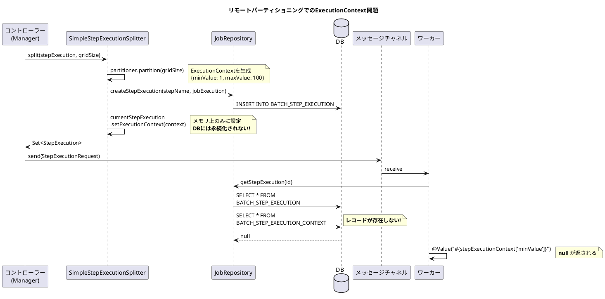
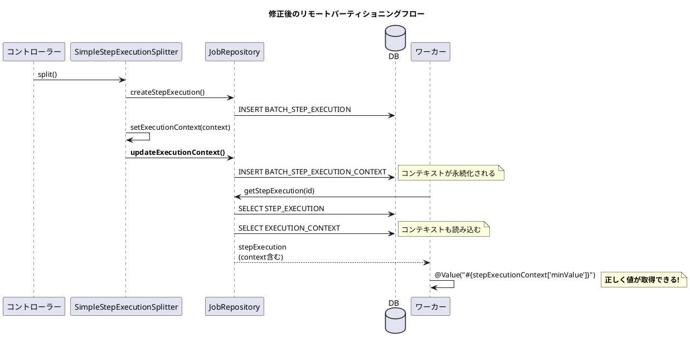

*（このドキュメントは生成AI(Claude Opus 4.5)によって2026年1月9日に生成されました）*

## 課題概要

パーティショナーが作成した `ExecutionContext` が永続化されなくなり、リモートパーティショニングにおいてワーカーがコンテキスト情報を取得できなくなるバグです。

**パーティショナーとは**: Spring Batchにおいて、データを複数のパーティションに分割するためのコンポーネントです。各パーティションには固有の `ExecutionContext`（例：処理対象の範囲情報）が設定されます。

### 問題の状況



### Spring Batch 5.x vs 6.0の比較

| バージョン | `ExecutionContext` の永続化 | ワーカーでの取得 |
|-----------|---------------------------|-----------------|
| Spring Batch 5.x | `jobRepository.addAll()` で永続化 | ✓ 正常に取得 |
| **Spring Batch 6.0** | 永続化処理がない | ❌ null |

## 原因

[コミット 90d8959](https://github.com/spring-projects/spring-batch/commit/90d895955d951156849ba6fa018676273fdbe2c4) での変更により、`SimpleStepExecutionSplitter.split()` メソッド内で `ExecutionContext` を設定した後の永続化処理が欠落していました。

## 対応方針

### 変更内容

PR #5147 で以下の修正が行われました：

#### 1. `SimpleStepExecutionSplitter.split()` でコンテキスト永続化を追加

```java
@Override
public Set<StepExecution> split(StepExecution stepExecution, int gridSize) throws JobExecutionException {
    // ...
    for (Map.Entry<String, ExecutionContext> context : contexts.entrySet()) {
        if (lastStepExecution == null) { // 新規開始
            StepExecution currentStepExecution = jobRepository.createStepExecution(stepName, jobExecution);
            currentStepExecution.setExecutionContext(context.getValue());
            // ExecutionContextを永続化（追加）
            jobRepository.updateExecutionContext(currentStepExecution);
            set.add(currentStepExecution);
        } else { // 再起動
            if (shouldStart(allowStartIfComplete, stepExecution, lastStepExecution)) {
                StepExecution currentStepExecution = jobRepository.createStepExecution(stepName, jobExecution);
                currentStepExecution.setExecutionContext(lastStepExecution.getExecutionContext());
                // ExecutionContextを永続化（追加）
                jobRepository.updateExecutionContext(currentStepExecution);
                set.add(currentStepExecution);
            }
        }
    }
    return set;
}
```

#### 2. `SimpleJobRepository.getStepExecution()` でコンテキスト読み込みを追加

Issue #5117と同じPRで修正：

```java
@Nullable
@Override
public StepExecution getStepExecution(long executionId) {
    StepExecution stepExecution = this.stepExecutionDao.getStepExecution(executionId);
    if (stepExecution != null) {
        // ExecutionContextの読み込みを追加
        fillStepExecutionDependencies(stepExecution);
        ExecutionContext jobExecutionContext = this.ecDao.getExecutionContext(stepExecution.getJobExecution());
        stepExecution.getJobExecution().setExecutionContext(jobExecutionContext);
    }
    return stepExecution;
}
```

### 追加されたテスト

パーティショニングテストが更新され、`ExecutionContext` の永続化と取得を検証：

```java
@Test
void testVanillaStepExecution() throws Exception {
    SimpleStepExecutionSplitter stepExecutionSplitter = new SimpleStepExecutionSplitter(jobRepository,
            step.getName(), gridSize -> {
                Map<String, ExecutionContext> map = new HashMap<>(gridSize);
                for (int i = 0; i < gridSize; i++) {
                    ExecutionContext context = new ExecutionContext();
                    context.putString("foo", "foo" + i);
                    map.put("partition" + i, context);
                }
                return map;
            });
    
    step.setPartitionHandler((stepSplitter, stepExecution) -> {
        Set<StepExecution> executions = stepSplitter.split(stepExecution, 2);
        for (StepExecution execution : executions) {
            // リポジトリから取得して永続化を確認
            ExecutionContext context = jobRepository.getStepExecution(execution.getId()).getExecutionContext();
            assertNotNull(context.getString("foo"));  // 正常に取得できることを確認
            // ...
        }
        return executions;
    });
}
```

### 修正後のフロー



---

**関連リンク**:
- [Issue #5138](https://github.com/spring-projects/spring-batch/issues/5138)
- [PR #5147](https://github.com/spring-projects/spring-batch/pull/5147)
- 関連Issue: [#5117](https://github.com/spring-projects/spring-batch/issues/5117) (同じPRで修正)
