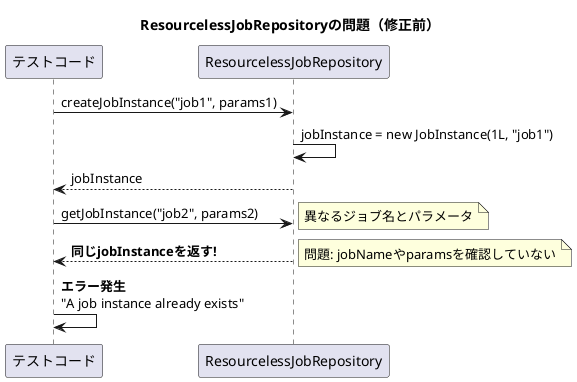

*（このドキュメントは生成AI(Claude Opus 4.5)によって2026年1月9日に生成されました）*

## 課題概要

`ResourcelessJobRepository` の実装を改善し、テスト用途での使い勝手を向上させる機能拡張です。同じアプリケーションコンテキスト内で同じジョブを複数回実行できない制限を緩和しました。

**`ResourcelessJobRepository`とは**: Spring Batch 5.2で導入された、データベースを使用せずにメモリ上でジョブのメタデータを管理するリポジトリ実装です。主にテスト用途や、永続化が不要な一時的なバッチ処理に使用されます。

### 問題の状況

Spring Batch 6.0にアップグレードすると、テストで以下のようなエラーが発生するケースがありました：

```
Message: A job instance already exists and is complete for identifying parameters={JobParameter{name='batch.random', value=4546055881725385948}
```

これは、異なるジョブやJobParametersでも、`ResourcelessJobRepository` が同じ `JobInstance` を返してしまうため発生していました。



## 対応方針

### 変更内容

PR #5140 で以下の改善が行われました：

#### 1. ジョブ名・ID・パラメータに基づくフィルタリングを追加

各メソッドで引数と内部の `JobInstance`/`JobExecution` を比較するように修正：

```java
@Override
@Nullable public JobInstance getJobInstance(String jobName, JobParameters jobParameters) {
    // ジョブ名が一致しない場合はnullを返す
    if (this.jobInstance == null || !this.jobInstance.getJobName().equals(jobName)) {
        return null;
    }
    // JobParametersのキーが一致しない場合もnullを返す
    if (!isJobKeyEquals(jobParameters)) {
        return null;
    }
    return this.jobInstance;
}

@Override
public long getJobInstanceCount(String jobName) {
    // ジョブ名が一致しない場合は0を返す
    if (this.jobInstance == null || !this.jobInstance.getJobName().equals(jobName)) {
        return 0;
    }
    return 1;
}
```

#### 2. `deleteJobInstance()` と `deleteJobExecution()` メソッドを実装

テストでジョブ実行後にインスタンスを削除し、同じリポジトリを再利用できるようになりました：

```java
@Override
public void deleteJobInstance(JobInstance jobInstance) {
    if (this.jobInstance != null && this.jobInstance.getId() == jobInstance.getId()) {
        this.jobInstance = null;
        this.jobExecution = null;
    }
}

@Override
public void deleteJobExecution(JobExecution jobExecution) {
    if (this.jobExecution != null && this.jobExecution.getId() == jobExecution.getId()) {
        this.jobExecution = null;
    }
}
```

### 使用例

```java
@Autowired
JobOperatorTestUtils testUtils;

@Autowired
JobRepository repository;

@Test
void startJob() throws Exception {
    JobParameters params = testUtils.getUniqueJobParametersBuilder()
        .addLocalDate("helloDate", LocalDate.of(2025, 7, 28))
        .toJobParameters();
    JobExecution execution = testUtils.startJob(params);
    assertThat(execution.getExitStatus()).isEqualTo(ExitStatus.COMPLETED);

    // 次のテスト用にJobInstanceを削除
    repository.deleteJobInstance(execution.getJobInstance());
}

@Test
void startJobAgain() throws Exception {
    // 同じリポジトリで別のジョブを実行可能
    JobParameters params = testUtils.getUniqueJobParametersBuilder()
        .addLocalDate("helloDate", LocalDate.of(2025, 7, 29))
        .toJobParameters();
    JobExecution execution = testUtils.startJob(params);
    assertThat(execution.getExitStatus()).isEqualTo(ExitStatus.COMPLETED);
}
```

### 改善されたメソッド一覧

| メソッド | 修正前の動作 | 修正後の動作 |
|---------|------------|------------|
| `getJobInstances(jobName, ...)` | 常に内部のjobInstanceを返す | jobNameが一致する場合のみ返す |
| `findJobInstances(jobName)` | 常に内部のjobInstanceを返す | jobNameが一致する場合のみ返す |
| `getJobInstance(instanceId)` | 常に内部のjobInstanceを返す | IDが一致する場合のみ返す |
| `getLastJobInstance(jobName)` | 常に内部のjobInstanceを返す | jobNameが一致する場合のみ返す |
| `getJobInstance(jobName, params)` | 常に内部のjobInstanceを返す | jobName・paramsが一致する場合のみ返す |
| `getJobInstanceCount(jobName)` | 常に1を返す | jobNameが一致する場合のみ1を返す |
| `getJobExecution(executionId)` | 常に内部のjobExecutionを返す | IDが一致する場合のみ返す |
| `getLastJobExecution(jobName, params)` | 常に内部のjobExecutionを返す | jobName・paramsが一致する場合のみ返す |
| `deleteJobInstance(...)` | UnsupportedOperationException | 実装済み（削除可能） |
| `deleteJobExecution(...)` | UnsupportedOperationException | 実装済み（削除可能） |

---

**関連リンク**:
- [Issue #5139](https://github.com/spring-projects/spring-batch/issues/5139)
- [PR #5140](https://github.com/spring-projects/spring-batch/pull/5140)
