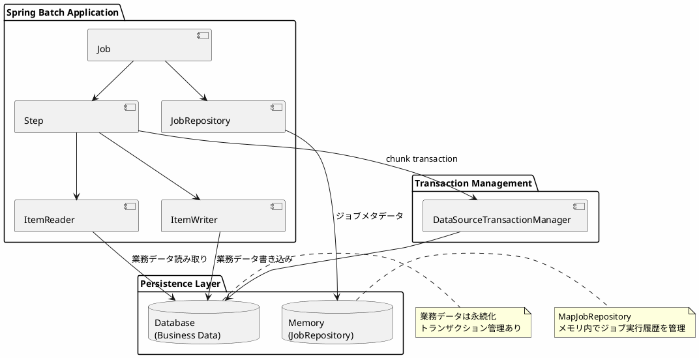
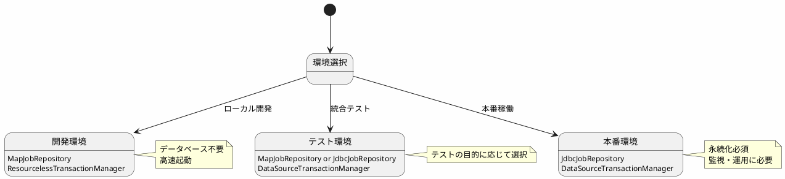

*(このドキュメントは生成AI(Claude Sonnet 4.5)によって2026年1月6日に生成されました)*

## 課題概要

データベースなしでジョブを実行できる「リソースレス（resourceless）な`JobRepository`」の実装を追加してほしいという機能追加要望です。この要望は、以下の経緯で議論された後、クローズされました：

- Issue [#3693](https://github.com/spring-projects/spring-batch/issues/3693) で最初に提案
- Spring Boot 3.4.0で`ResourcelessTransactionManager`の非推奨化により再注目
- Spring Batch 6.0.1では要望を却下

**リソースレスJobRepositoryとは**: データベースやファイルなどの永続化リソースを使用せず、メモリ内のみでジョブ実行履歴を管理する`JobRepository`実装です。

## 背景

### MapJobRepositoryの問題点

Spring Batchには既に`MapJobRepository`というメモリベースの実装がありますが、以下の制約がありました：

```java
// v6.0.0のMapJobRepository
public class MapJobRepository extends SimpleJobRepository {
    public MapJobRepository() {
        // ❌ ResourcelessTransactionManagerが必須
        super(jobInstanceDao, 
              jobExecutionDao, 
              stepExecutionDao, 
              executionContextDao,
              new ResourcelessTransactionManager());  // Spring Boot 3.4で非推奨
    }
}
```

**問題点**:
1. `ResourcelessTransactionManager`がSpring Boot 3.4で非推奨
2. トランザクション管理が必要な他のリソース（例：データベース、JMS）と共存できない

### ユーザーのユースケース

```java
@Configuration
public class JobConfig {
    @Bean
    public Job myJob(JobRepository jobRepository, 
                    PlatformTransactionManager transactionManager) {
        // ジョブメタデータはメモリに保存
        // しかし、業務データはデータベースに保存したい
        return new JobBuilder("myJob", jobRepository)
            .start(new StepBuilder("step1", jobRepository)
                .<String, String>chunk(10, transactionManager)  // DBのトランザクション
                .reader(jdbcItemReader())  // DBから読み取り
                .writer(jdbcItemWriter())  // DBに書き込み
                .build())
            .build();
    }
}
```

**要望**: ジョブメタデータはメモリ管理、業務データはデータベース管理という構成を可能にしたい。

## 議論された解決策

Issue内で3つの解決策が検討されました：

### 解決策1: MapJobRepositoryを修正（不採用）

```java
// 提案：コンストラクタでTransactionManagerを受け取る
public class MapJobRepository extends SimpleJobRepository {
    public MapJobRepository(PlatformTransactionManager transactionManager) {
        super(jobInstanceDao, jobExecutionDao, stepExecutionDao, executionContextDao, transactionManager);
    }
}
```

**不採用理由**: `MapJobRepository`はSpring Bootの自動設定で使用されており、変更の影響範囲が大きい。

### 解決策2: 新しいResourcelessJobRepository（不採用）

```java
// 提案：新しいクラスを作成
public class ResourcelessJobRepository extends SimpleJobRepository {
    public ResourcelessJobRepository(PlatformTransactionManager transactionManager) {
        super(new MapJobInstanceDao(), 
              new MapJobExecutionDao(), 
              new MapStepExecutionDao(), 
              new MapExecutionContextDao(), 
              transactionManager);
    }
}
```

**不採用理由**: Spring Boot側のサポートが必要で、複雑になる。

### 解決策3: Spring Bootで対応（採用）

Spring Boot側で、ユーザーが`MapJobRepository`にカスタムの`TransactionManager`を提供できるように自動設定を改善する。

```java
// Spring Bootの自動設定で対応
@Configuration
@ConditionalOnMissingBean(JobRepository.class)
public class BatchAutoConfiguration {
    
    @Bean
    public JobRepository jobRepository(
            @Qualifier("batchTransactionManager") PlatformTransactionManager transactionManager) {
        // ユーザーが提供したTransactionManagerを使用
        return new MapJobRepository(transactionManager);
    }
}
```

## 対応方針

**結論**: Spring Batch 6.0.1では、この機能を追加せず、Spring Boot側での対応を推奨することになりました。

### Spring Bootでの対応内容

Spring Boot 3.4+ では、以下のような設定が可能になりました：

```java
@Configuration
public class CustomBatchConfig {
    
    @Bean
    @Primary
    public PlatformTransactionManager batchTransactionManager(DataSource dataSource) {
        // 業務データ用のTransactionManager
        return new DataSourceTransactionManager(dataSource);
    }
    
    @Bean
    public JobRepository jobRepository(
            @Qualifier("batchTransactionManager") PlatformTransactionManager transactionManager) {
        // MapJobRepositoryにカスタムTransactionManagerを使用
        return new MapJobRepositoryFactoryBean()
            .setTransactionManager(transactionManager)
            .getObject();
    }
}
```

### アーキテクチャ図



### メリット・デメリット

#### MapJobRepositoryのメリット

| 項目 | 説明 |
|------|------|
| セットアップの簡単さ | データベース不要 |
| テストの高速化 | メモリ内で完結 |
| 開発効率 | ローカル開発での起動が速い |

#### MapJobRepositoryのデメリット

| 項目 | 説明 |
|------|------|
| ジョブ履歴の消失 | アプリ再起動で履歴が消える |
| クラスタリング不可 | 複数インスタンス間で状態共有できない |
| 本番環境非推奨 | 監視・運用に不向き |

### 推奨される使い分け



## まとめ

### Spring Batch 6.0.1での対応

- **実装追加**: なし
- **理由**: Spring Boot側での対応が適切
- **推奨事項**: Spring Boot 3.4+の自動設定を使用

### 今後の方針

Issue [#5139](https://github.com/spring-projects/spring-batch/issues/5139) では、`ResourcelessJobRepository`の追加は行わず、以下の方針が確定しました：

1. **短期対応**: Spring Bootの自動設定改善で対応
2. **長期方針**: `MapJobRepository`は開発・テスト用途に限定
3. **本番環境**: `JdbcJobRepository`の使用を推奨

### 参考リンク

- Issue [#3693](https://github.com/spring-projects/spring-batch/issues/3693): 最初の提案
- Issue [#5139](https://github.com/spring-projects/spring-batch/issues/5139): Spring Batch 6.0での再議論
- Spring Boot 3.4 Release Notes: `ResourcelessTransactionManager`の非推奨化

この決定により、Spring Batchの設計思想が明確になりました：

- **開発環境**: 簡単・高速（MapJobRepository）
- **本番環境**: 堅牢・監視可能（JdbcJobRepository）
