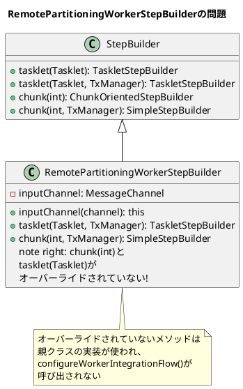

*（このドキュメントは生成AI(Claude Opus 4.5)によって2026年1月9日に生成されました）*

## 課題概要

`RemotePartitioningWorkerStepBuilder` が `StepBuilder` のすべての設定メソッドをオーバーライドしていなかったため、一部のメソッドチェーンを使用するとワーカー側の Integration Flow が設定されず、`MessageDispatchingException` が発生するバグです。

**`RemotePartitioningWorkerStepBuilder`とは**: Spring Batch Integrationで提供されるビルダークラスで、リモートパーティショニングのワーカー側ステップを構築する際に使用します。メッセージチャネルを通じてマネージャーからの指示を受け取り、処理を実行します。

### 問題の状況



### 問題が発生するコード

```java
// Spring Batch 5.x（正常動作）
stepBuilderFactory.get(stepName)
    .inputChannel(inputChannel)
    .chunk(CHUNK_SIZE, transactionManager)  // オーバーライド済み
    // ...

// Spring Batch 6.0での推奨コード（問題発生）
stepBuilderFactory.get(stepName)
    .inputChannel(inputChannel)
    .chunk(CHUNK_SIZE)                      // オーバーライドされていない!
    .transactionManager(transactionManager)
    // ...
```

### エラーメッセージ

```
org.springframework.integration.MessageDispatchingException: 
Dispatcher has no subscribers, 
failedMessage=GenericMessage [payload=StepExecutionRequest: [stepExecutionId=14, stepName=importCustomerWorkerStep], ...]
```

## 原因

`RemotePartitioningWorkerStepBuilder` は一部のメソッドのみをオーバーライドしていたため、オーバーライドされていないメソッドを使用すると `configureWorkerIntegrationFlow()` が呼び出されず、メッセージを受信するためのサブスクライバーが設定されませんでした。

## 対応方針

### 変更内容

PR #5151 で以下の修正が行われました：

#### 1. 不足していたメソッドのオーバーライドを追加

```java
@SuppressWarnings("removal")
public class RemotePartitioningWorkerStepBuilder extends StepBuilder {

    // 既存のオーバーライド（transactionManager付き）
    @Override
    public TaskletStepBuilder tasklet(Tasklet tasklet, PlatformTransactionManager transactionManager) {
        configureWorkerIntegrationFlow();
        return super.tasklet(tasklet, transactionManager);
    }

    // 新規追加: transactionManagerなしのtasklet()
    @Override
    public TaskletStepBuilder tasklet(Tasklet tasklet) {
        configureWorkerIntegrationFlow();
        return super.tasklet(tasklet);
    }

    // 新規追加: transactionManagerなしのchunk()
    @Override
    public <I, O> ChunkOrientedStepBuilder<I, O> chunk(int chunkSize) {
        configureWorkerIntegrationFlow();
        return super.chunk(chunkSize);
    }

    // 既存のオーバーライド（transactionManager付き）
    @Override
    public <I, O> SimpleStepBuilder<I, O> chunk(int chunkSize, PlatformTransactionManager transactionManager) {
        configureWorkerIntegrationFlow();
        return super.chunk(chunkSize, transactionManager);
    }
}
```

#### 2. 全メソッドのオーバーライドを検証するテストを追加

```java
@Test
void testAllMethodsAreOverridden() throws Exception {
    for (Method method : StepBuilder.class.getDeclaredMethods()) {
        if (!Modifier.isPublic(method.getModifiers())) {
            continue;
        }
        try {
            RemotePartitioningWorkerStepBuilder.class.getDeclaredMethod(
                method.getName(),
                method.getParameterTypes()
            );
        }
        catch (NoSuchMethodException ex) {
            fail(RemotePartitioningWorkerStepBuilder.class.getName() 
                + " should override method [" + method 
                + "] to configure worker integration flow.");
        }
    }
}
```

### 修正後のメソッド一覧

| メソッド | 修正前 | 修正後 |
|---------|--------|--------|
| `tasklet(Tasklet, TxManager)` | ✓ オーバーライド済み | ✓ |
| `tasklet(Tasklet)` | ❌ 未オーバーライド | ✓ 追加 |
| `chunk(int, TxManager)` | ✓ オーバーライド済み | ✓ |
| `chunk(int)` | ❌ 未オーバーライド | ✓ 追加 |

---

**関連リンク**:
- [Issue #5150](https://github.com/spring-projects/spring-batch/issues/5150)
- [PR #5151](https://github.com/spring-projects/spring-batch/pull/5151)
