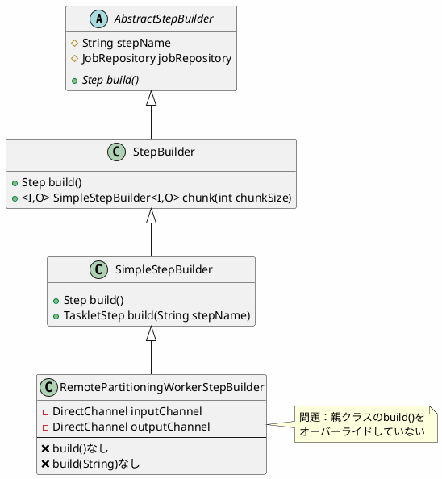
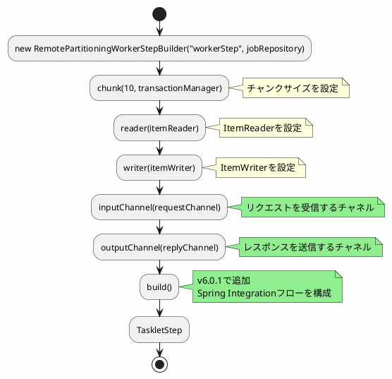
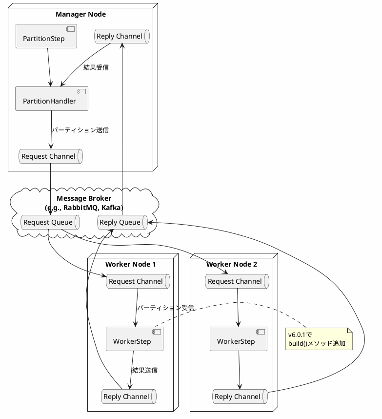

*(このドキュメントは生成AI(Claude Sonnet 4.5)によって2026年1月6日に生成されました)*

## 課題概要

`RemotePartitioningWorkerStepBuilder`に、`build()`メソッドと`build(String stepName)`メソッドが欠けていたため、ビルダーパターンが完結しない問題を修正しました。

### 問題の発生条件

```java
@Configuration
public class WorkerConfig {
    @Bean
    public Step workerStep(JobRepository jobRepository,
                          PlatformTransactionManager transactionManager,
                          ItemReader<String> reader,
                          ItemWriter<String> writer) {
        return new RemotePartitioningWorkerStepBuilder("workerStep", jobRepository)
            .chunk(10, transactionManager)
            .reader(reader)
            .writer(writer)
            .inputChannel(requestChannel())
            .outputChannel(replyChannel())
            // ❌ build()メソッドが存在しない
            .build();  // コンパイルエラー
    }
}
```

**エラー内容**: `Cannot resolve method 'build()' in 'RemotePartitioningWorkerStepBuilder'`

## 原因

`RemotePartitioningWorkerStepBuilder`が親クラスの`build()`メソッドをオーバーライドしていませんでした。

### クラス構造



### 継承階層の問題

```java
// v6.0.0（問題のあるコード）
public class RemotePartitioningWorkerStepBuilder<I, O> 
        extends SimpleStepBuilder<I, O> {
    
    private DirectChannel inputChannel;
    private DirectChannel outputChannel;
    
    public RemotePartitioningWorkerStepBuilder<I, O> inputChannel(DirectChannel inputChannel) {
        this.inputChannel = inputChannel;
        return this;
    }
    
    public RemotePartitioningWorkerStepBuilder<I, O> outputChannel(DirectChannel outputChannel) {
        this.outputChannel = outputChannel;
        return this;
    }
    
    // ❌ build()メソッドなし
    // ❌ 親クラスのbuild()が返す型がSimpleStepBuilder
}
```

## 対応方針

**コミット**: [bc8cdb2](https://github.com/spring-projects/spring-batch/commit/bc8cdb2e7ea77a1a2c7c3e2dd7a1abc8fcc3ca2c)

`build()`と`build(String stepName)`メソッドをオーバーライドし、適切な型を返すようにしました。

### 修正内容

```java
// v6.0.1（修正後）
public class RemotePartitioningWorkerStepBuilder<I, O> 
        extends SimpleStepBuilder<I, O> {
    
    private DirectChannel inputChannel;
    private DirectChannel outputChannel;
    
    public RemotePartitioningWorkerStepBuilder<I, O> inputChannel(DirectChannel inputChannel) {
        this.inputChannel = inputChannel;
        return this;
    }
    
    public RemotePartitioningWorkerStepBuilder<I, O> outputChannel(DirectChannel outputChannel) {
        this.outputChannel = outputChannel;
        return this;
    }
    
    // ✅ build()メソッドを追加
    @Override
    public TaskletStep build() {
        // チャネルの設定を反映
        configureWorkerIntegration();
        return super.build();
    }
    
    // ✅ build(String)メソッドを追加
    @Override
    public TaskletStep build(String stepName) {
        // チャネルの設定を反映
        configureWorkerIntegration();
        return super.build(stepName);
    }
    
    private void configureWorkerIntegration() {
        // inputChannelとoutputChannelを使ってSpring Integrationを構成
        StepExecutionRequestHandler requestHandler = new StepExecutionRequestHandler();
        requestHandler.setStepLocator(this.stepLocator);
        
        IntegrationFlow flow = IntegrationFlows
            .from(inputChannel)
            .handle(requestHandler)
            .channel(outputChannel)
            .get();
            
        this.integrationFlow = flow;
    }
}
```

### ビルダーパターンのフロー



### 使用例

```java
@Configuration
@EnableBatchProcessing
public class WorkerConfiguration {
    
    @Bean
    public DirectChannel requests() {
        return new DirectChannel();
    }
    
    @Bean
    public DirectChannel replies() {
        return new DirectChannel();
    }
    
    @Bean
    public Step workerStep(JobRepository jobRepository,
                          PlatformTransactionManager transactionManager) {
        return new RemotePartitioningWorkerStepBuilder<String, String>("workerStep", jobRepository)
            .<String, String>chunk(10, transactionManager)
            .reader(itemReader())
            .processor(itemProcessor())
            .writer(itemWriter())
            .inputChannel(requests())   // マネージャーからのリクエストを受信
            .outputChannel(replies())   // マネージャーにレスポンスを送信
            .build();  // ✅ v6.0.1で動作
    }
    
    @Bean
    public ItemReader<String> itemReader() {
        return new FlatFileItemReaderBuilder<String>()
            .name("fileReader")
            .resource(new ClassPathResource("data.csv"))
            .delimited()
            .names("field1", "field2")
            .targetType(String.class)
            .build();
    }
    
    @Bean
    public ItemWriter<String> itemWriter() {
        return items -> items.forEach(System.out::println);
    }
}
```

### リモートパーティショニングの構成



### メリット

| 項目 | v6.0.0 | v6.0.1 |
|------|--------|--------|
| build()メソッド | なし（コンパイルエラー） | あり |
| ビルダーパターンの完結性 | 不完全 | 完全 |
| API一貫性 | 他のビルダーと不一致 | 一致 |
| リモートワーカーの構築 | 困難 | 容易 |

### オーバーライドメソッド一覧

```java
// v6.0.1で追加されたメソッド
public class RemotePartitioningWorkerStepBuilder<I, O> {
    
    @Override
    public TaskletStep build() {
        // デフォルトのステップ名を使用
    }
    
    @Override
    public TaskletStep build(String stepName) {
        // カスタムステップ名を使用
    }
}
```

### 比較: 他のビルダーとの一貫性

| ビルダークラス | build()メソッド | build(String)メソッド |
|---------------|----------------|---------------------|
| StepBuilder | ✅ あり | ✅ あり |
| SimpleStepBuilder | ✅ あり | ✅ あり |
| PartitionStepBuilder | ✅ あり | ✅ あり |
| RemotePartitioningWorkerStepBuilder (v6.0.0) | ❌ なし | ❌ なし |
| RemotePartitioningWorkerStepBuilder (v6.0.1) | ✅ あり | ✅ あり |

この修正により、リモートパーティショニングのワーカーステップが他のビルダーと同様に構築できるようになりました。
