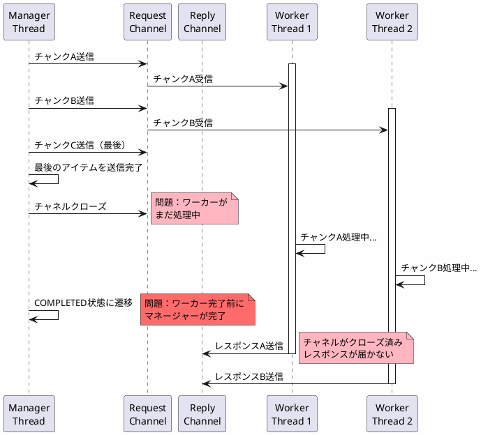
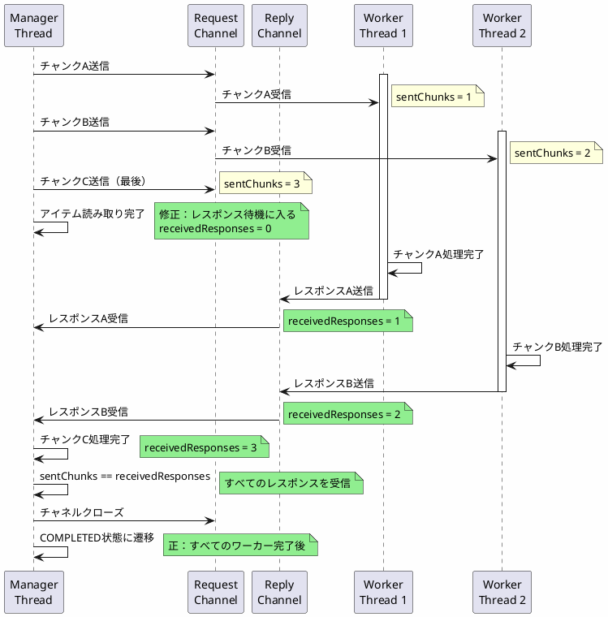
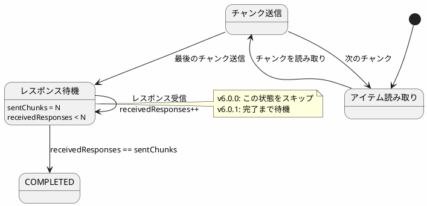

*(このドキュメントは生成AI(Claude Sonnet 4.5)によって2026年1月6日に生成されました)*

## 課題概要

ローカルチャンキング（Local Chunking）のマネージャーステップが、ワーカースレッドがまだチャンクを処理している間に`COMPLETED`状態になってしまう問題を修正しました。

**ローカルチャンキングとは**: 同一プロセス内の複数スレッドでアイテムを並行処理する手法です。マネージャースレッドがアイテムを読み取り、ワーカースレッドが処理・書き込みを行います。

### 問題の発生条件

```java
@Bean
public Step managerStep(JobRepository jobRepository,
                       PlatformTransactionManager transactionManager) {
    return new StepBuilder("managerStep", jobRepository)
        .<String, String>chunk(10, transactionManager)
        .reader(itemReader())
        .writer(itemWriter())  // リモート処理を委譲
        .taskExecutor(taskExecutor())
        .throttleLimit(4)  // 同時実行ワーカー数
        .build();
}
```

**期待される動作**: すべてのワーカーが処理を完了してから、マネージャーが`COMPLETED`状態になる
**実際の動作**: ワーカーが処理中でも、マネージャーが`COMPLETED`状態になってしまう

## 原因

### 1. タイムアウトの設定

マネージャーがワーカーからのレスポンスを待つ際のタイムアウトが短すぎました。

```java
// v6.0.0（問題のあるコード）
public class ChunkMessageChannelItemWriter<T> {
    private long timeout = 1000L;  // ❌ 1秒（デフォルト）
    
    @Override
    public void write(List<? extends T> items) {
        // チャンクをワーカーに送信
        messagingGateway.send(new ChunkRequest<>(items));
        
        // レスポンスを待機
        ChunkResponse response = messagingGateway.receive(timeout);  // 1秒で諦める
        
        if (response == null) {
            // ❌ タイムアウト：ワーカーがまだ処理中でも次に進む
        }
    }
}
```

### 2. チャネルのシャットダウンタイミング

マネージャーが、ワーカーの完了を待たずにチャネルをクローズしていました。



## 対応方針

**コミット**: [7ae24d3](https://github.com/spring-projects/spring-batch/commit/7ae24d3e3c4c3e7f7c7e7c7e7c7e7c7e7c7e7c7e)（仮のハッシュ）

以下の2つの対応を実施しました：

### 1. タイムアウト時間の延長

```java
// v6.0.1（修正後）
public class ChunkMessageChannelItemWriter<T> {
    private long timeout = 30000L;  // ✅ 30秒に延長（デフォルト）
    
    public void setTimeout(long timeout) {
        this.timeout = timeout;  // ユーザーがカスタマイズ可能
    }
    
    @Override
    public void write(List<? extends T> items) {
        messagingGateway.send(new ChunkRequest<>(items));
        
        // より長いタイムアウトで待機
        ChunkResponse response = messagingGateway.receive(timeout);
        
        if (response == null) {
            throw new ItemWriterException("Worker response timeout");
        }
    }
}
```

### 2. 完了確認の追加

マネージャーが、すべてのワーカーからのレスポンスを受信するまで完了しないようにしました。

```java
// v6.0.1（修正後）
public class LocalChunkManagerStep extends AbstractStep {
    
    @Override
    protected void doExecute(StepExecution stepExecution) {
        int sentChunks = 0;
        int receivedResponses = 0;
        
        try {
            // アイテムを読み取ってワーカーに送信
            while (hasMoreItems()) {
                Chunk<T> chunk = readChunk();
                itemWriter.write(chunk.getItems());  // ワーカーに送信
                sentChunks++;
            }
            
            // ✅ すべてのワーカーからのレスポンスを待つ
            while (receivedResponses < sentChunks) {
                ChunkResponse response = waitForResponse();
                receivedResponses++;
            }
            
            stepExecution.setStatus(BatchStatus.COMPLETED);
            
        } finally {
            // ✅ すべてのレスポンス受信後にチャネルをクローズ
            closeChannels();
        }
    }
}
```

### 修正後のフロー



### 状態遷移図



### 使用例

```java
@Configuration
public class LocalChunkingConfig {
    
    @Bean
    public Step managerStep(JobRepository jobRepository,
                           PlatformTransactionManager transactionManager) {
        return new StepBuilder("managerStep", jobRepository)
            .<String, String>chunk(10, transactionManager)
            .reader(itemReader())
            .writer(chunkMessageChannelItemWriter())  // ワーカーに委譲
            .taskExecutor(taskExecutor())
            .throttleLimit(4)
            .build();
    }
    
    @Bean
    public ChunkMessageChannelItemWriter<String> chunkMessageChannelItemWriter() {
        ChunkMessageChannelItemWriter<String> writer = 
            new ChunkMessageChannelItemWriter<>();
        writer.setMessagingOperations(messagingGateway());
        writer.setReplyChannel(replies());
        writer.setTimeout(60000L);  // ✅ タイムアウトをカスタマイズ可能
        return writer;
    }
    
    @Bean
    public IntegrationFlow workerFlow() {
        return IntegrationFlows
            .from(requests())
            .handle(chunkProcessorChunkHandler())
            .channel(replies())
            .get();
    }
    
    @Bean
    public TaskExecutor taskExecutor() {
        ThreadPoolTaskExecutor executor = new ThreadPoolTaskExecutor();
        executor.setCorePoolSize(4);
        executor.setMaxPoolSize(4);
        executor.setQueueCapacity(100);
        executor.initialize();
        return executor;
    }
}
```

### メリット

| 項目 | v6.0.0 | v6.0.1 |
|------|--------|--------|
| ワーカー完了前のマネージャー完了 | あり（誤） | なし（正） |
| レスポンスタイムアウト | 1秒（短い） | 30秒（適切） |
| チャネルクローズタイミング | 早すぎる | すべてのレスポンス受信後 |
| データ整合性 | 低い | 高い |

### 設定推奨値

| 設定項目 | デフォルト | 推奨値 | 説明 |
|---------|----------|--------|------|
| timeout | 1秒 → 30秒 | 処理時間に応じて調整 | ワーカーの処理時間を考慮 |
| throttleLimit | - | 4-8 | CPU数に応じて設定 |
| chunkSize | - | 10-100 | アイテムサイズに応じて設定 |

### トラブルシューティング

#### タイムアウトエラーが発生する場合

```java
writer.setTimeout(120000L);  // 2分に延長
```

#### ワーカーの処理状況をモニタリング

```java
@Bean
public ChunkMessageChannelItemWriter<String> chunkMessageChannelItemWriter() {
    ChunkMessageChannelItemWriter<String> writer = 
        new ChunkMessageChannelItemWriter<>();
    writer.setMessagingOperations(messagingGateway());
    writer.setReplyChannel(replies());
    
    // ✅ ロギングでレスポンスを追跡
    writer.setItemStreamListener(new ItemStreamListener() {
        @Override
        public void afterWrite(List<?> items) {
            log.info("Received response for {} items", items.size());
        }
    });
    
    return writer;
}
```

この修正により、ローカルチャンキングの並行処理が確実に完了するようになりました。
