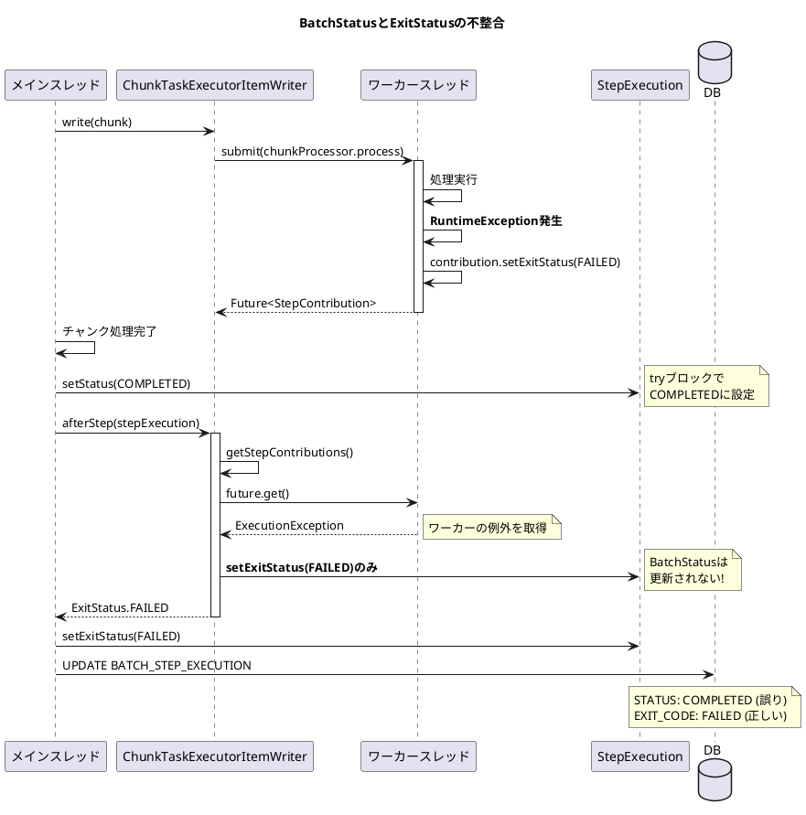
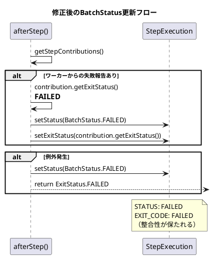

*（このドキュメントは生成AI(Claude Opus 4.5)によって2026年1月9日に生成されました）*

## 課題概要

ローカルチャンキングで `ChunkTaskExecutorItemWriter` を使用している際、ワーカースレッドでの書き込み処理が失敗しても、`BatchStatus` が `COMPLETED` のままになってしまうバグです。`ExitStatus` は正しく `FAILED` に設定されますが、`BatchStatus` との間で不整合が発生します。

**ローカルチャンキングとは**: Spring Batch 6.0で導入された機能で、チャンク内のアイテム処理を複数のスレッドで並列に実行する仕組みです。`ChunkTaskExecutorItemWriter` を使用して、書き込み処理を非同期で実行します。

### 問題の状況



### 期待される動作と実際の動作

| フィールド | 期待される値 | 実際の値 |
|-----------|------------|---------|
| `BatchStatus` | FAILED | COMPLETED |
| `ExitStatus.exitCode` | FAILED | FAILED |

この不整合により、ステップは失敗として扱われるべきですが、データベース上の `STATUS` が `COMPLETED` となるため、ジョブの状態管理に混乱が生じます。

## 原因

`ChunkTaskExecutorItemWriter.afterStep()` メソッドで、例外発生時に `ExitStatus` のみを設定し、`BatchStatus` を更新していませんでした。

**問題のコード（修正前）**:
```java
@Override
public ExitStatus afterStep(StepExecution stepExecution) {
    try {
        for (StepContribution contribution : getStepContributions()) {
            stepExecution.apply(contribution);
        }
    }
    catch (ExecutionException | InterruptedException e) {
        // BatchStatusは更新されない!
        return ExitStatus.FAILED.addExitDescription(e);
    }
    return ExitStatus.COMPLETED.addExitDescription("Waited for " + this.responses.size() + " results.");
}
```

## 対応方針

### 変更内容

`ChunkTaskExecutorItemWriter.afterStep()` メソッドを修正し、例外発生時やワーカーからの失敗報告時に `BatchStatus` も `FAILED` に設定するようにしました。

**修正後のコード**:
```java
@Override
public ExitStatus afterStep(StepExecution stepExecution) {
    try {
        ExitStatus exitStatus = ExitStatus.COMPLETED
            .addExitDescription("Waited for " + this.responses.size() + " results.");
        
        for (StepContribution contribution : getStepContributions()) {
            stepExecution.apply(contribution);
            // ワーカーからの失敗報告をチェック
            if (ExitStatus.FAILED.getExitCode().equals(contribution.getExitStatus().getExitCode())) {
                exitStatus = contribution.getExitStatus();
                stepExecution.setStatus(BatchStatus.FAILED);  // 追加
            }
        }
        return exitStatus;
    }
    catch (ExecutionException | InterruptedException e) {
        stepExecution.setStatus(BatchStatus.FAILED);  // 追加
        return ExitStatus.FAILED.addExitDescription(e);
    }
}
```

### 追加されたテスト

失敗データを含むCSVファイルを使用したテストが追加されました：

```java
@Test
public void testLaunchJobWithJavaConfigFailure() throws Exception {
    // given
    ApplicationContext context = new AnnotationConfigApplicationContext(LocalChunkingJobConfiguration.class);
    JobOperator jobOperator = context.getBean(JobOperator.class);
    Job job = context.getBean(Job.class);
    // 不正なデータを含むファイル（文字数制限超過など）
    JobParameters jobParameters = new JobParametersBuilder()
        .addString("inputFile", "org/springframework/batch/samples/chunking/local/data/vets-bad-data.csv")
        .toJobParameters();

    // when
    JobExecution jobExecution = jobOperator.start(job, jobParameters);

    // then
    assertEquals(BatchStatus.FAILED, jobExecution.getStatus());
    assertTrue(jobExecution.getExitStatus().getExitDescription().contains("size limit: 30"));
    // 成功したレコードのみDBに保存されていることを確認
    int vetsCount = JdbcTestUtils.countRowsInTable(jdbcTemplate, "vets");
    assertEquals(4, vetsCount);
}
```

### 修正後の状態遷移



---

**関連リンク**:
- [Issue #5172](https://github.com/spring-projects/spring-batch/issues/5172)
- [Commit 82121a5](https://github.com/spring-projects/spring-batch/commit/82121a59872e018b1c98cbe68345fde716cd2e60)
