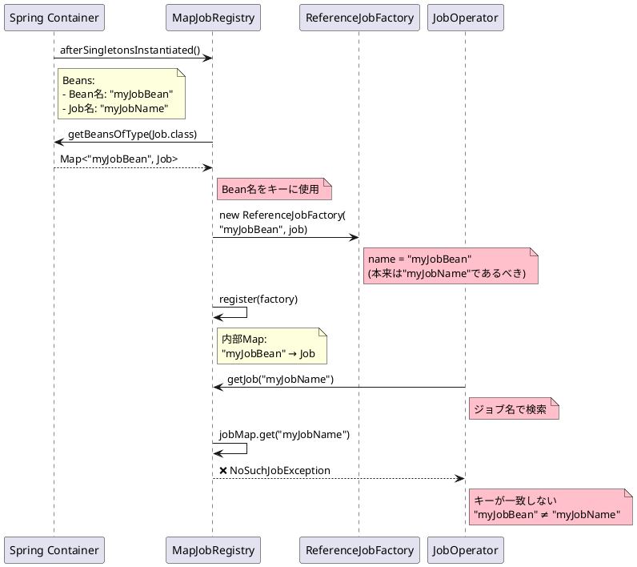
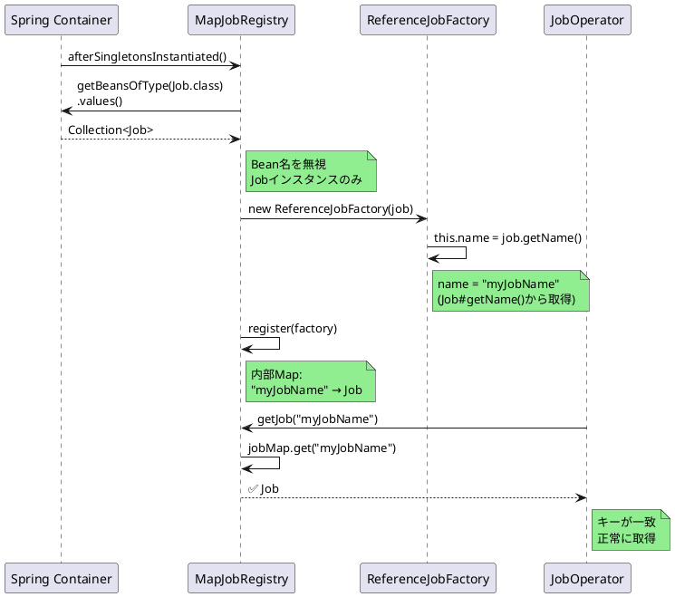

# Issue #5122: MapJobRegistryがジョブをBean名で登録

**Issue URL**: https://github.com/spring-projects/spring-batch/issues/5122

**関連コミット**:
- [184ac31](https://github.com/spring-projects/spring-batch/commit/184ac31f704935c6d49865839713cd3126ce7cd3)

---

## 課題概要

### 問題の説明

`MapJobRegistry`が発見した`Job`を登録する際に、**ジョブ名（`Job#getName()`）ではなく、Bean名**を使用して登録していました。

この問題により、`JobOperator`などでジョブ名を指定してジョブを取得しようとすると、登録されているキーと一致せず、ジョブが見つかりません。

### 背景知識の補足

**JobRegistryとは**:
- ジョブを名前で管理するレジストリ
- `JobOperator`や`JobLauncher`がジョブを検索するために使用
- キーとなる名前でジョブを登録・取得

**MapJobRegistryの役割**:
```java
// ジョブを名前で登録
jobRegistry.register(new ReferenceJobFactory(job));

// ジョブを名前で取得
Job job = jobRegistry.getJob("myJobName");
```

**ジョブ名とBean名の違い**:

| 項目 | ジョブ名 | Bean名 |
|------|---------|--------|
| 定義 | `Job#getName()` | `@Bean("beanName")` |
| 目的 | ジョブの実行時識別 | Springコンテナでの識別 |
| 用途 | JobOperatorでの操作 | DIコンテナでの注入 |

**設定例**:
```java
@Configuration
public class JobConfig {
    
    @Bean("myJobBean")  // ← Bean名
    public Job job(JobRepository jobRepository, Step step) {
        return new JobBuilder("myJobName", jobRepository)  // ← ジョブ名
                .start(step)
                .build();
    }
}
```

### 影響範囲

| 項目 | 内容 |
|------|------|
| **影響するバージョン** | Spring Batch 6.0.0 |
| **影響する機能** | JobRegistry、JobOperator |
| **重大度** | 中（ジョブ名での検索不可） |
| **原因コミット** | [#4855](https://github.com/spring-projects/spring-batch/issues/4855)の変更 |

---

## 原因

### 根本原因の詳細

Issue [#4855](https://github.com/spring-projects/spring-batch/issues/4855)の変更で、`afterSingletonsInstantiated()`メソッドの実装が変更されました。

**問題のコード（MapJobRegistry.java:63-67）**:
```java
public class MapJobRegistry implements JobRegistry, 
        SmartInitializingSingleton {
    
    @Override
    public void afterSingletonsInstantiated() {
        // Bean名をキーとして使用
        this.applicationContext.getBeansOfType(Job.class)
            .forEach((beanName, job) -> {  // ← beanNameを使用
                try {
                    // 問題: Bean名で登録している
                    register(new ReferenceJobFactory(beanName, job));
                } catch (DuplicateJobException e) {
                    throw new IllegalStateException(e);
                }
            });
    }
}
```

**ReferenceJobFactoryのコンストラクタ**:
```java
public class ReferenceJobFactory implements JobFactory {
    
    private final String name;
    private final Job job;
    
    public ReferenceJobFactory(String name, Job job) {
        this.name = name;  // ← これがレジストリのキーになる
        this.job = job;
    }
    
    @Override
    public String getJobName() {
        return this.name;  // ← Bean名が返される
    }
}
```

### 問題のシーケンス図



### 実際のエラー例

```java
@Configuration
public class JobConfig {
    
    @Bean("orderProcessingBean")
    public Job orderProcessingJob(JobRepository jobRepository, Step step) {
        return new JobBuilder("orderProcessing", jobRepository)
                .start(step)
                .build();
    }
}

// ジョブの実行
@Service
public class JobService {
    
    @Autowired
    private JobOperator jobOperator;
    
    public void runJob() throws Exception {
        // ジョブ名で起動しようとする
        jobOperator.start("orderProcessing", "");
        // ❌ NoSuchJobException: No job configuration with the name 
        //    [orderProcessing] was registered
    }
}
```

### 登録状況の比較

**問題のある状態**:
```
JobRegistry内部:
  "orderProcessingBean" → Job(name="orderProcessing")
  
検索: getJob("orderProcessing")
結果: ❌ 見つからない
```

**正しい状態**:
```
JobRegistry内部:
  "orderProcessing" → Job(name="orderProcessing")
  
検索: getJob("orderProcessing")
結果: ✅ 見つかる
```

---

## 対応方針

### 修正内容

`afterSingletonsInstantiated()`メソッドで、Bean名の代わりにジョブ名（`Job#getName()`）を使用するように修正しました。

**修正後のコード**:
```java
public class MapJobRegistry implements JobRegistry, 
        SmartInitializingSingleton {
    
    @Override
    public void afterSingletonsInstantiated() {
        // 修正: Bean名を無視し、Jobインスタンスのみを取得
        this.applicationContext.getBeansOfType(Job.class)
            .values()  // ← valuesのみを使用
            .forEach(job -> {
                try {
                    // register()内でJob#getName()が使用される
                    register(job);
                } catch (DuplicateJobException e) {
                    throw new IllegalStateException(e);
                }
            });
    }
}
```

**register(Job)メソッド**:
```java
public void register(Job job) throws DuplicateJobException {
    // ReferenceJobFactoryがJob#getName()をキーとして使用
    register(new ReferenceJobFactory(job));
}
```

**ReferenceJobFactory（単一引数コンストラクタ）**:
```java
public class ReferenceJobFactory implements JobFactory {
    
    public ReferenceJobFactory(Job job) {
        this.name = job.getName();  // ← ジョブ名を使用
        this.job = job;
    }
    
    @Override
    public String getJobName() {
        return this.name;  // ← ジョブ名が返される
    }
}
```

### 修正後の動作フロー



### 例外処理の調整

`forEach()`内で`DuplicateJobException`をスローするための調整:

**修正後の実装（実際のコード）**:
```java
@Override
public void afterSingletonsInstantiated() {
    Collection<Job> jobs = this.applicationContext
        .getBeansOfType(Job.class)
        .values();
    
    for (Job job : jobs) {
        try {
            register(job);
        } catch (DuplicateJobException e) {
            throw new IllegalStateException(
                "Duplicate job found: " + job.getName(), e
            );
        }
    }
}
```

### 回避策（修正前）

修正前の回避策として、カスタム`MapJobRegistry`を使用:

```java
@Bean
MapJobRegistry jobRegistry(ObjectProvider<Job> jobs) {
    return new MapJobRegistry() {
        
        @Override
        public void afterSingletonsInstantiated() {
            for (Job job : jobs) {
                try {
                    // Job#getName()を使用して登録
                    register(job);
                } catch (DuplicateJobException e) {
                    throw new IllegalStateException(e);
                }
            }
        }
    };
}
```

### 変更の影響

| 項目 | 内容 |
|------|------|
| **互換性** | 後方互換性あり（正しい動作に修正） |
| **パフォーマンス** | 影響なし |
| **既存コード** | ジョブ名での検索が正常動作 |
| **リリース** | Spring Batch 6.0.1 |

### 使用例

修正後は以下のコードが正常に動作します:

```java
@Configuration
public class JobConfig {
    
    @Bean("processingJobBean")  // Bean名
    public Job processingJob(JobRepository jobRepository, Step step) {
        // ジョブ名: "dataProcessing"
        return new JobBuilder("dataProcessing", jobRepository)
                .start(step)
                .build();
    }
}

@Service
public class JobExecutionService {
    
    @Autowired
    private JobOperator jobOperator;
    
    @Autowired
    private JobRegistry jobRegistry;
    
    public void executeJob() throws Exception {
        // ジョブ名で起動
        Long executionId = jobOperator.start("dataProcessing", "");
        
        // ✅ 正常に起動
    }
    
    public Job getRegisteredJob() throws NoSuchJobException {
        // ジョブ名で取得
        Job job = jobRegistry.getJob("dataProcessing");
        
        // ✅ 正常に取得
        return job;
    }
}
```

**JobOperatorでのジョブ操作**:
```java
@RestController
@RequestMapping("/api/jobs")
public class JobController {
    
    @Autowired
    private JobOperator jobOperator;
    
    @PostMapping("/{jobName}/start")
    public ResponseEntity<Long> startJob(@PathVariable String jobName) {
        try {
            // ジョブ名で起動
            Long executionId = jobOperator.start(jobName, "");
            return ResponseEntity.ok(executionId);
            
        } catch (NoSuchJobException e) {
            // 修正後: この例外は発生しない
            return ResponseEntity.notFound().build();
        }
    }
    
    @GetMapping("/{jobName}/executions")
    public Set<Long> getRunningExecutions(@PathVariable String jobName) {
        // ジョブ名で実行中のジョブを取得
        return jobOperator.getRunningExecutions(jobName);
    }
}
```
