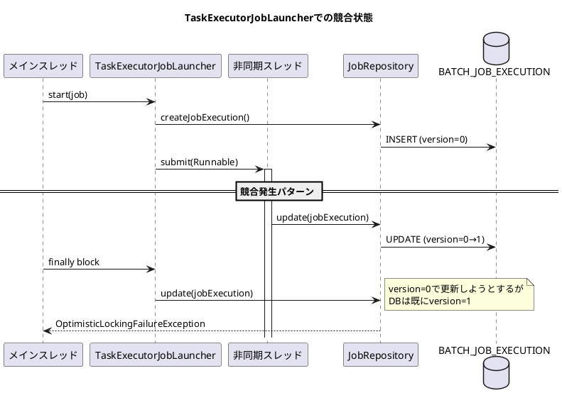

*（このドキュメントは生成AI(Claude Opus 4.5)によって2026年1月14日に生成されました）*

## 課題概要

Spring Batchにおいて、`JobOperator.start()`と非同期`TaskExecutor`を併用した場合に、断続的に`OptimisticLockingFailureException`が発生するバグです。

### Spring Batchの背景知識

| 用語 | 説明 |
|------|------|
| `JobOperator` | ジョブの起動・停止・再起動などを行うインターフェース |
| `TaskExecutorJobLauncher` | 非同期でジョブを実行するためのランチャー |
| `JobExecution` | ジョブの実行状態を表すオブジェクト（DBに永続化される） |
| `OptimisticLockingFailureException` | 楽観的ロックの競合時に発生する例外（同じレコードを複数スレッドが同時更新しようとした場合など） |

### 問題の発生状況



### 影響を受ける環境

- Spring Boot 4.0.0
- Spring Batch 6.0.0 / 6.0.1
- Java 21
- JDBC / MongoDB両方で発生

## 原因

Spring Batch 5.xから6.xへの移行時に導入された`finally`ブロック内の`jobRepository.update(jobExecution)`呼び出しが原因です（PR [#3637](https://github.com/spring-projects/spring-batch/pull/3637)で導入）。

**問題のコード** (`TaskExecutorJobLauncher.launchJobExecution()`):
- 非同期タスクが正常にサブミットされた後も、`finally`ブロックで無条件に`update()`を呼び出す
- 非同期スレッド側でも`JobExecution`を更新するため、バージョン競合が発生

## 対応方針

> **注**: このIssueにはdiffファイルがないため、以下はコメント内の提案に基づく内容です。

### 提案されている修正内容

タスクが正常に受け付けられた場合は`finally`ブロックでの`update()`を削除し、`TaskRejectedException`発生時のみ更新を行う：

```java
catch (TaskRejectedException e) {
    jobExecution.upgradeStatus(BatchStatus.FAILED);
    if (ExitStatus.UNKNOWN.equals(jobExecution.getExitStatus())) {
        jobExecution.setExitStatus(ExitStatus.FAILED.addExitDescription(e));
    }
    // タスクが拒否された場合のみ更新
    this.jobRepository.update(jobExecution);
}
// 正常受付時は非同期スレッドが更新するため、ここでの更新は不要
```

### 暫定的な回避策

`SyncTaskExecutor`を使用する（ただし非同期実行ができなくなるため本番環境には不向き）：

```java
@Bean
public JobOperatorFactoryBean jobOperator(JobRepository jobRepository) {
    var taskExecutor = new SyncTaskExecutor();
    var jobOperatorFactoryBean = new JobOperatorFactoryBean();
    jobOperatorFactoryBean.setJobRepository(jobRepository);
    jobOperatorFactoryBean.setTaskExecutor(taskExecutor);
    return jobOperatorFactoryBean;
}
```

### 関連リンク

- Issue: https://github.com/spring-projects/spring-batch/issues/5106
- 再現コード: https://github.com/phactum-mnestler/spring-batch-reproducer
- MongoDB再現コード: https://github.com/kizombaDev/spring-batch-async-bug-reproducer
