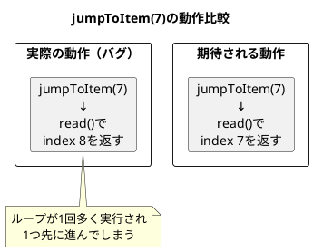
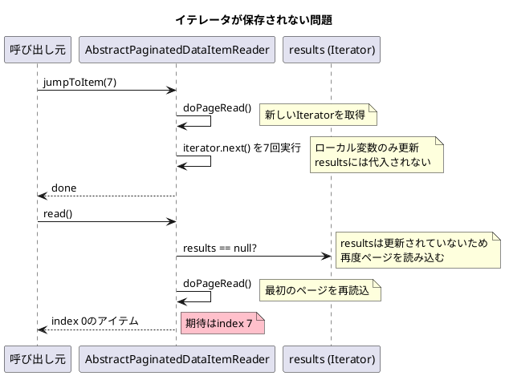

*（このドキュメントは生成AI(Claude Opus 4.5)によって2026年1月14日に生成されました）*

## 課題概要

`AbstractPaginatedDataItemReader`クラスの`jumpToItem(int itemLastIndex)`メソッドが、ステップ再起動時に正しくリーダー位置を復元できないバグです。

### Spring Batchの背景知識

| 用語 | 説明 |
|------|------|
| `AbstractPaginatedDataItemReader` | ページング方式でデータを読み取る抽象基底クラス |
| `jumpToItem(int)` | 再起動時に指定されたインデックス位置にリーダーを移動させるメソッド |
| `pageSize` | 1ページあたりの読み取りアイテム数 |
| `doPageRead()` | 現在のページのデータを読み取るメソッド |

### 問題点

2つの主要な問題があります：

#### 1. Off-by-one（1つずれ）エラー

ループ条件が `current >= 0` であるため、イテレータが1回多く進んでしまいます。



| 呼び出し | 期待値 | 実際の値 |
|---------|-------|---------|
| `jumpToItem(7)` → `read()` | 7 | 8 |
| `jumpToItem(0)` → `read()` | 0 | 1 |

#### 2. イテレータがリーダー状態に保存されない

`jumpToItem()`内で進めたイテレータが`results`フィールドに代入されないため、次の`read()`呼び出し時に新しいページが読み込まれ、位置調整が無効になります。



## 原因

1. ループ条件の境界値エラー（`current >= 0` → `current > 0` であるべき）
2. 進めたイテレータを`results`フィールドに代入していない

## 対応方針

### PR [#5137](https://github.com/spring-projects/spring-batch/pull/5137)での修正内容

#### AbstractPaginatedDataItemReader.java の変更

```diff
 @Override
 protected void jumpToItem(int itemLastIndex) throws Exception {
     this.lock.lock();
     try {
         page = itemLastIndex / pageSize;
         int current = itemLastIndex % pageSize;

         Iterator<T> initialPage = doPageRead();

-        for (; current >= 0; current--) {
+        for (; current > 0; current--) {
             initialPage.next();
         }
+        this.results = initialPage;
     }
     finally {
         this.lock.unlock();
     }
 }
```

### 修正のポイント

| 修正項目 | 変更前 | 変更後 |
|---------|--------|--------|
| ループ条件 | `current >= 0` | `current > 0` |
| イテレータ保存 | なし | `this.results = initialPage;` |

### 追加されたテストケース

- `jumpToItem_shouldReadExactItem_afterJump()` - 通常のジャンプ動作
- `jumpToItem_zeroIndex()` - インデックス0へのジャンプ
- `jumpToItem_lastItemInPage()` - ページ末尾へのジャンプ
- `jumpToItem_firstItemOfNextPage()` - 次ページ先頭へのジャンプ

### 関連リンク

- Issue: https://github.com/spring-projects/spring-batch/issues/5136
- PR: https://github.com/spring-projects/spring-batch/pull/5137
