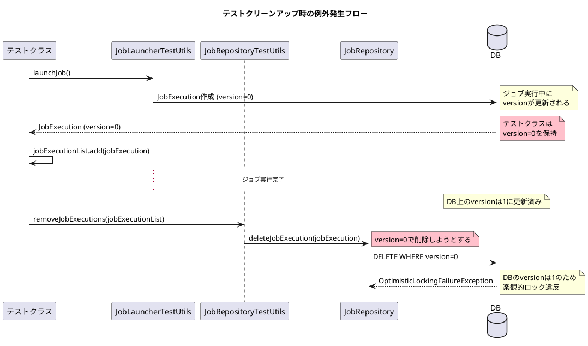
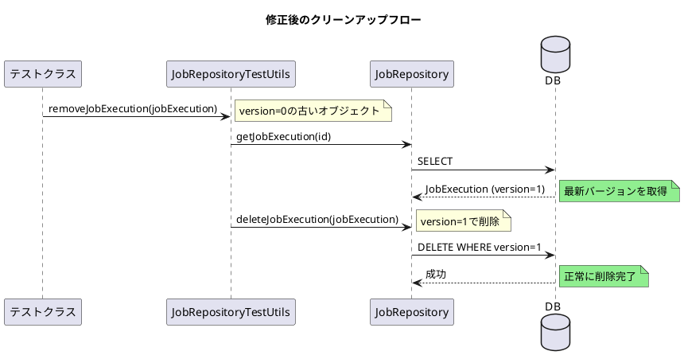

*（このドキュメントは生成AI(Claude Opus 4.5)によって2026年1月14日に生成されました）*

## 課題概要

Spring Batch 5.2.3以降、テストのクリーンアップ処理で`JobRepositoryTestUtils.removeJobExecutions()`を呼び出すと`OptimisticLockingFailureException`が発生するバグです。

### Spring Batchの背景知識

| 用語 | 説明 |
|------|------|
| `JobRepositoryTestUtils` | テスト用のユーティリティクラス。`JobExecution`の作成・削除などを行う |
| `JobExecution` | ジョブの実行インスタンス。バージョン番号で楽観的ロック制御される |
| `OptimisticLockingFailureException` | 楽観的ロックの競合時に発生する例外 |
| `StepExecution` | ステップの実行インスタンス。`JobExecution`に関連付けられる |

### 問題の発生状況



### 影響を受ける環境

- Spring Batch: 5.2.3, 5.2.4
- Spring Boot: 3.4.5, 3.5.8
- Java: 17
- Database: PostgreSQL

## 原因

PR [#4793](https://github.com/spring-projects/spring-batch/pull/4793)で導入された変更により、`JobExecution`の削除時にバージョンチェックが行われるようになりました。しかし、テストクラスが保持している`JobExecution`オブジェクトのバージョンは古い（ジョブ実行前の状態）ため、データベース上の最新バージョンと一致せず例外が発生します。

## 対応方針

### PR [#5173](https://github.com/spring-projects/spring-batch/pull/5173)での修正内容

削除前に最新の`JobExecution`をデータベースから取得するように変更：

#### JobRepositoryTestUtils.java の変更

```diff
 public void removeJobExecution(JobExecution jobExecution) {
-    this.jobRepository.deleteJobExecution(jobExecution);
+    // query latest version of JobExecution to avoid OptimisticLockingFailureException
+    jobExecution = this.jobRepository.getJobExecution(jobExecution.getId());
+    if (jobExecution != null) {
+        this.jobRepository.deleteJobExecution(jobExecution);
+    }
 }
```

また、`removeJobExecutions()`メソッド内の冗長なnullチェックも削除：

```diff
 for (JobInstance jobInstance : jobInstances) {
     List<JobExecution> jobExecutions = this.jobRepository.getJobExecutions(jobInstance);
-    if (jobExecutions != null && !jobExecutions.isEmpty()) {
+    if (!jobExecutions.isEmpty()) {
         removeJobExecutions(jobExecutions);
     }
 }
```

### 修正後の動作フロー



### 追加されたテストケース

`testRemoveJobExecution()` - 古いバージョン（stale version）の`JobExecution`を削除しても例外が発生しないことを確認

### 関連リンク

- Issue: https://github.com/spring-projects/spring-batch/issues/5161
- PR: https://github.com/spring-projects/spring-batch/pull/5173
- 関連コミット: [12b16b3](https://github.com/spring-projects/spring-batch/commit/12b16b32adbbf35ead57b5e3b8d0ec84c56789ec)
- 原因となったPR: [#4793](https://github.com/spring-projects/spring-batch/pull/4793)
