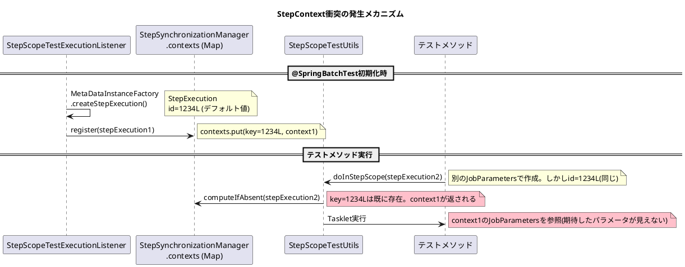

*（このドキュメントは生成AI(Claude Opus 4.5)によって2026年1月14日に生成されました）*

## 課題概要

`@SpringBatchTest`アノテーションが有効な環境で`StepScopeTestUtils`を使用した際、`MetaDataInstanceFactory`のデフォルト値が原因で`StepContext`の衝突が発生するバグです。

### Spring Batchの背景知識

| 用語 | 説明 |
|------|------|
| `@SpringBatchTest` | Spring Batchのテスト用アノテーション。`StepScopeTestExecutionListener`等を自動登録 |
| `StepScopeTestUtils` | テスト内でStep Scopeをシミュレートするユーティリティ |
| `MetaDataInstanceFactory` | テスト用の`JobExecution`や`StepExecution`を作成するファクトリ |
| `StepSynchronizationManager` | `StepExecution`と`StepContext`の関連を管理するクラス |

### 問題の発生状況

`StepExecution`の等価性は`stepName`、`jobExecutionId`、`id`で判定されます。`MetaDataInstanceFactory`がこれらに静的なデフォルト値を使用するため、複数インスタンスが同一キーとして扱われます。



### 具体的な問題

```java
// @SpringBatchTestにより、リスナーが事前にStepExecutionを登録（id=1234L）

// テストメソッド内で別のJobParametersでStepExecutionを作成
StepExecution stepExecution = MetaDataInstanceFactory.createStepExecution(jobParameters);
// ↑ id=1234Lで作成される

// StepScopeTestUtilsは既存のcontextを参照してしまう
StepScopeTestUtils.doInStepScope(stepExecution, () -> {
    // TaskletはjobParametersを取得できない（null）
    issueReproductionTasklet.execute(...);
});
```

## 原因

`MetaDataInstanceFactory.createStepExecution(JobParameters)`メソッドが固定のID（`DEFAULT_JOB_EXECUTION_ID = 4321L`、`DEFAULT_STEP_EXECUTION_ID = 1234L`）を使用するため、`@SpringBatchTest`で登録されたコンテキストとIDが衝突し、`computeIfAbsent`で既存コンテキストが返されます。

## 対応方針

### PR [#5208](https://github.com/spring-projects/spring-batch/pull/5208)での修正内容

`MetaDataInstanceFactory`に`AtomicLong`カウンターを導入し、呼び出しごとにユニークなIDを生成するよう変更：

#### MetaDataInstanceFactory.java の変更

```diff
 public class MetaDataInstanceFactory {
+    /**
+     * Atomic counter for generating unique job execution IDs in tests
+     */
+    private static final AtomicLong jobExecutionIdCounter = 
+        new AtomicLong(DEFAULT_JOB_EXECUTION_ID);
+
+    /**
+     * Atomic counter for generating unique step execution IDs in tests
+     */
+    private static final AtomicLong stepExecutionIdCounter = 
+        new AtomicLong(DEFAULT_STEP_EXECUTION_ID);

     public static StepExecution createStepExecution(JobParameters jobParameters) {
-        JobExecution jobExecution = createJobExecution(DEFAULT_JOB_NAME, 
-            DEFAULT_JOB_INSTANCE_ID, DEFAULT_JOB_EXECUTION_ID, jobParameters);
-        StepExecution stepExecution = createStepExecution(jobExecution, 
-            DEFAULT_STEP_NAME, DEFAULT_STEP_EXECUTION_ID);
+        Long jobExecutionId = jobExecutionIdCounter.incrementAndGet();
+        Long stepExecutionId = stepExecutionIdCounter.incrementAndGet();
+        JobExecution jobExecution = createJobExecution(DEFAULT_JOB_NAME, 
+            DEFAULT_JOB_INSTANCE_ID, jobExecutionId, jobParameters);
+        StepExecution stepExecution = createStepExecution(jobExecution, 
+            DEFAULT_STEP_NAME, stepExecutionId);
         jobExecution.addStepExecution(stepExecution);
         return stepExecution;
     }
 }
```

### 追加されたテストケース

```java
@Test
void testCreateStepExecutionWithJobParametersShouldGenerateUniqueIds() {
    JobParameters params1 = new JobParametersBuilder()
        .addString("key", "value1").toJobParameters();
    JobParameters params2 = new JobParametersBuilder()
        .addString("key", "value2").toJobParameters();

    StepExecution step1 = MetaDataInstanceFactory.createStepExecution(params1);
    StepExecution step2 = MetaDataInstanceFactory.createStepExecution(params2);

    assertNotEquals(step1.getId(), step2.getId());
    assertNotEquals(step1.getJobExecutionId(), step2.getJobExecutionId());
    assertNotEquals(step1, step2);
}
```

### 暫定的な回避策

テストクラスに`getStepExecution()`メソッドを定義し、ユニークなIDを指定：

```java
public StepExecution getStepExecution() {
    return MetaDataInstanceFactory.createStepExecution("uniqueStep", -1L);
}
```

### 関連リンク

- Issue: https://github.com/spring-projects/spring-batch/issues/5181
- PR: https://github.com/spring-projects/spring-batch/pull/5208
