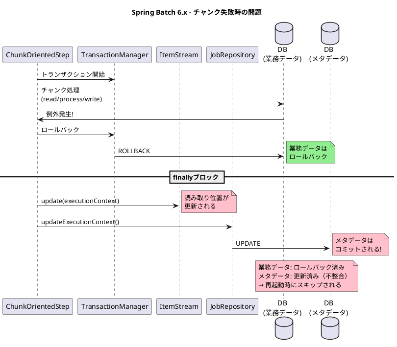
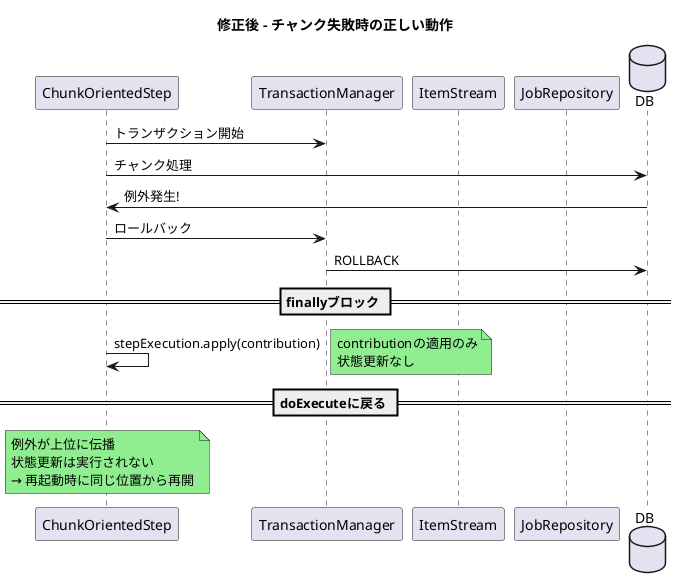

*（このドキュメントは生成AI(Claude Opus 4.5)によって2026年1月14日に生成されました）*

## 課題概要

Spring Batch 6.xの`ChunkOrientedStep`において、チャンク処理が失敗してロールバックした場合でも`ExecutionContext`が更新されてしまい、再起動時にデータ損失が発生するバグです。

### Spring Batchの背景知識

| 用語 | 説明 |
|------|------|
| `ChunkOrientedStep` | Spring Batch 6.xで導入されたチャンク指向ステップの実装 |
| `ExecutionContext` | ステップ/ジョブの実行状態を保持するオブジェクト。再起動時に復元される |
| `ItemStream` | 読み取り位置などの状態を管理するインターフェース |
| `compositeItemStream.update()` | ItemStreamの状態をExecutionContextに書き込むメソッド |

### 問題の発生状況



### コード比較

#### Spring Batch 5.x（TaskletStep.java）- 正しい動作

```java
// TaskletStep.java (Line 452)
// 成功時のみ状態を更新
stream.update(stepExecution.getExecutionContext());
getJobRepository().updateExecutionContext(stepExecution);
stepExecution.incrementCommitCount();
```

#### Spring Batch 6.x（ChunkOrientedStep.java）- 問題のあるコード

```java
private void processChunkSequentially(...) {
    try {
        // チャンク処理 (read/process/write)
    } catch (Exception e) {
        // 例外処理
        throw e;
    } finally {
        // BUG: ロールバック時も必ず実行される!
        this.compositeItemStream.update(stepExecution.getExecutionContext());
        getJobRepository().updateExecutionContext(stepExecution);
    }
}
```

### 影響

| 問題 | 説明 |
|------|------|
| トランザクション不整合 | 業務データはロールバック、メタデータはコミット |
| データ損失 | 再起動時、失敗したチャンクがスキップされる |

## 原因

`ChunkOrientedStep`の`processChunkSequentially`および`processChunkConcurrently`メソッド内で、`ItemStream`と`ExecutionContext`の更新処理が`finally`ブロックに配置されているため、トランザクションがロールバックされた場合でも状態が更新されてしまいます。

## 対応方針

### PR [#5195](https://github.com/spring-projects/spring-batch/pull/5195)での修正内容

状態更新処理を`finally`ブロックから`doExecute`メソッド（トランザクション成功後）に移動：

#### ChunkOrientedStep.java の変更

```diff
 @Override
 protected void doExecute(StepExecution stepExecution) throws Exception {
     stepExecution.getExecutionContext().put(STEP_TYPE_KEY, this.getClass().getName());
     
     while (this.chunkTracker.get().moreItems() && !interrupted(stepExecution)) {
        this.transactionTemplate.executeWithoutResult(transactionStatus -> {
           // チャンク処理
        });
 
        getJobRepository().update(stepExecution);
+       // FIX: トランザクション成功後にのみ状態を更新
+       this.compositeItemStream.update(stepExecution.getExecutionContext());
+       getJobRepository().updateExecutionContext(stepExecution);
     }
 }

 private void processChunkSequentially(...) {
     try {
         // チャンク処理
     } catch (Exception e) {
         throw new FatalStepExecutionException("Unable to process chunk", e);
     }
     finally {
-        // apply contribution and update streams
+        // apply contribution
         stepExecution.apply(contribution);
-        compositeItemStream.update(stepExecution.getExecutionContext());
-        getJobRepository().updateExecutionContext(stepExecution);
     }
 }
```

### 追加されたテストケース

```java
@Test
void testItemStreamUpdateStillOccursWhenChunkRollsBack_bugReproduction() throws Exception {
    TrackingItemStream trackingItemStream = new TrackingItemStream();
    ItemReader<String> reader = new ListItemReader<>(List.of("item1"));
    ItemWriter<String> writer = chunk -> {
        throw new RuntimeException("Simulated failure");
    };
    // ... step設定 ...
    
    step.execute(stepExecution);

    // チャンクがロールバックした場合、ItemStreamは更新されるべきではない
    assertEquals(0, trackingItemStream.getUpdateCount(),
        "ItemStream should not be updated when chunk transaction fails");
}
```

### 修正後の動作フロー



### 関連Issue

Issue [#5199](https://github.com/spring-projects/spring-batch/issues/5199)（`JobRepository.update(stepExecution)`のトランザクション境界に関する問題）と連携した修正が検討されています。

### 関連リンク

- Issue: https://github.com/spring-projects/spring-batch/issues/5182
- PR: https://github.com/spring-projects/spring-batch/pull/5195
