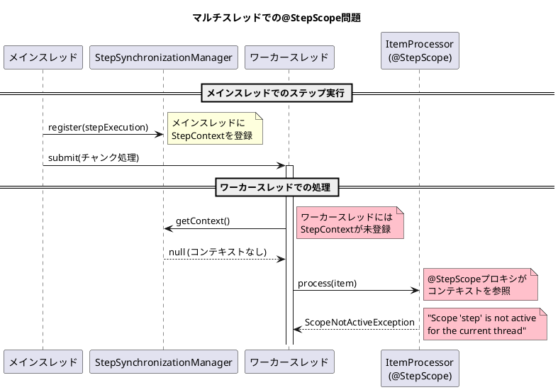
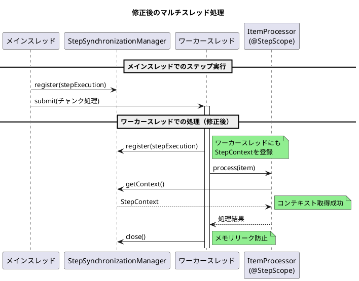

*（このドキュメントは生成AI(Claude Opus 4.5)によって2026年1月14日に生成されました）*

## 課題概要

Spring Batch 6.xの`ChunkOrientedStep`でマルチスレッド処理を有効にした場合、`@StepScope`を付与した`ItemProcessor`が`ScopeNotActiveException`をスローするバグです。

### Spring Batchの背景知識

| 用語 | 説明 |
|------|------|
| `ChunkOrientedStep` | Spring Batch 6.xで導入されたチャンク指向ステップの新実装 |
| `@StepScope` | ステップ実行ごとにBeanインスタンスを作成するスコープアノテーション |
| `StepSynchronizationManager` | スレッドローカルで`StepExecution`のコンテキストを管理するクラス |
| `TaskExecutor` | 非同期処理を実行するためのSpringのタスク実行インターフェース |

### 問題の発生状況



### 再現設定

```java
@Bean
public Step issueReproductionStep(
        JobRepository jobRepository,
        ItemReader<TestItem> reader,
        ItemProcessor<TestItem, TestItem> itemProcessor, // @StepScope Bean
        ItemWriter<TestItem> writer
) {
    return new StepBuilder(jobRepository)
            .<TestItem, TestItem>chunk(1)
            .reader(reader)
            .processor(itemProcessor)
            .writer(writer)
            .taskExecutor(new SimpleAsyncTaskExecutor()) // マルチスレッド有効
            .build();
}

@Bean
@StepScope
public ItemProcessor<TestItem, TestItem> issueReproductionProcessor() {
    return item -> {
        log.info("[Thread: {}] Processing: {}", 
            Thread.currentThread().getName(), item.getName());
        return item;
    };
}
```

### 発生するエラー

```
Caused by: org.springframework.beans.factory.support.ScopeNotActiveException: 
  Error creating bean with name 'scopedTarget.issueReproductionProcessor': 
  Scope 'step' is not active for the current thread
    ...
Caused by: java.lang.IllegalStateException: 
  No context holder available for step scope
    at org.springframework.batch.core.scope.StepScope.getContext(StepScope.java:167)
```

## 原因

`ChunkOrientedStep.processChunkConcurrently`メソッドでワーカースレッドを使用する際、`StepExecution`のコンテキストがワーカースレッドの`StepSynchronizationManager`に登録されていないため、`@StepScope`のプロキシがコンテキストを解決できません。

## 対応方針

> **注**: このIssueにはdiffファイルがないため、以下はIssue内で提案された修正内容です。

### 提案された修正内容

`processChunkConcurrently`メソッド内でワーカースレッドに`StepExecution`を登録：

```java
// processChunkConcurrentlyメソッド内
Future<O> itemProcessingFuture = this.taskExecutor.submit(() -> {
    try {
        // ワーカースレッドにStepExecutionを登録
        StepSynchronizationManager.register(stepExecution);
        return processItem(item, contribution);
    } finally {
        // メモリリーク防止のためコンテキストをクリア
        StepSynchronizationManager.close();
    }
});
```

### 修正後の動作フロー



### ステータス

メンテナー（@fmbenhassine）により、この問題は新実装の見落としであることが確認され、6.0.2での修正が予定されています。

### 関連リンク

- Issue: https://github.com/spring-projects/spring-batch/issues/5183
