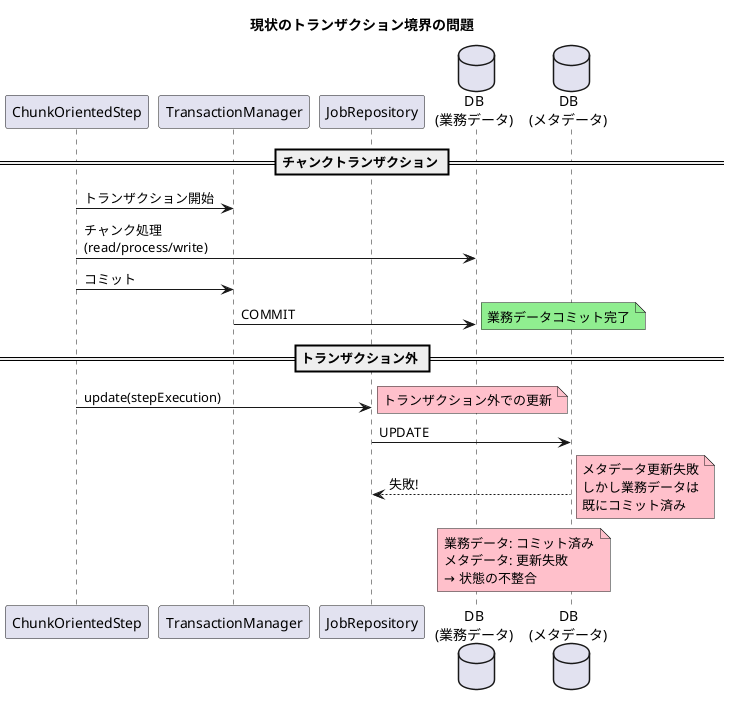

*（このドキュメントは生成AI(Claude Opus 4.5)によって2026年1月14日に生成されました）*

## 課題概要

`ChunkOrientedStep#doExecute`において、`StepExecution`の更新（`JobRepository.update(stepExecution)`）がチャンクトランザクションの外で実行されるため、メタデータと業務データの整合性が保証されない問題です。

### Spring Batchの背景知識

| 用語 | 説明 |
|------|------|
| `ChunkOrientedStep` | Spring Batch 6.xで導入されたチャンク指向ステップの新実装 |
| `StepExecution` | ステップの実行状態（コミット数、読み取り数など）を保持 |
| `JobRepository` | バッチメタデータの永続化を担当するリポジトリ |
| トランザクション境界 | データの整合性が保証される範囲 |

### 問題の発生状況



### 問題のあるコード

```java
// ChunkOrientedStep#doExecute()
this.transactionTemplate.executeWithoutResult(transactionStatus -> {
    processNextChunk(transactionStatus, contribution, stepExecution);
});

// トランザクション完了後に実行される！
getJobRepository().update(stepExecution);
```

### 従来の実装（TaskletStep）との比較

| 実装 | `JobRepository.update()`の位置 |
|------|------------------------------|
| TaskletStep（従来） | トランザクション内（コミット前） |
| ChunkOrientedStep（6.x） | トランザクション外（コミット後）|

## 原因

PR [#5165](https://github.com/spring-projects/spring-batch/pull/5165)での変更により、`JobRepository.update(stepExecution)`がトランザクション外に配置され、チャンク処理とメタデータ更新のアトミック性が失われています。

## 対応方針

### PR [#5195](https://github.com/spring-projects/spring-batch/pull/5195)での修正内容

`ItemStream.update()`と`JobRepository.updateExecutionContext()`をトランザクション完了後に移動し、失敗時に状態が更新されないよう修正：

#### ChunkOrientedStep.java の変更

```diff
 protected void doExecute(StepExecution stepExecution) throws Exception {
     stepExecution.getExecutionContext().put(STEP_TYPE_KEY, this.getClass().getName());
     
     while (this.chunkTracker.get().moreItems() && !interrupted(stepExecution)) {
        this.transactionTemplate.executeWithoutResult(transactionStatus -> {
            processNextChunk(transactionStatus, contribution, stepExecution);
        });
 
        getJobRepository().update(stepExecution);
+       // トランザクション成功後にのみ実行
+       this.compositeItemStream.update(stepExecution.getExecutionContext());
+       getJobRepository().updateExecutionContext(stepExecution);
     }
 }

 private void processChunkSequentially(...) {
     try {
         // チャンク処理
     } finally {
-        // apply contribution and update streams
+        // apply contribution
         stepExecution.apply(contribution);
-        compositeItemStream.update(stepExecution.getExecutionContext());
-        getJobRepository().updateExecutionContext(stepExecution);
     }
 }
```

### 関連Issue

Issue [#5182](https://github.com/spring-projects/spring-batch/issues/5182)（チャンク失敗時にもExecutionContextが更新される問題）と連携しており、同一のPRで修正が提案されています。

### 報告者からの追加提案

報告者は、`JobRepository.update(stepExecution)`自体もトランザクション内に移動することを提案しています：

```java
this.transactionTemplate.executeWithoutResult(transactionStatus -> {
    processNextChunk(transactionStatus, contribution, stepExecution);
    // すべての更新をトランザクション内に
    this.compositeItemStream.update(stepExecution.getExecutionContext());
    getJobRepository().updateExecutionContext(stepExecution);
    getJobRepository().update(stepExecution);
});
```

この提案により、チャンク処理・`ExecutionContext`更新・`StepExecution`更新がすべて同一トランザクション境界内で実行され、完全な整合性が保証されます。

### 関連リンク

- Issue: https://github.com/spring-projects/spring-batch/issues/5199
- 関連PR: https://github.com/spring-projects/spring-batch/pull/5195
- 関連Issue: [#5182](https://github.com/spring-projects/spring-batch/issues/5182)（ExecutionContext更新の問題）
- 原因となったPR: [#5165](https://github.com/spring-projects/spring-batch/pull/5165)
