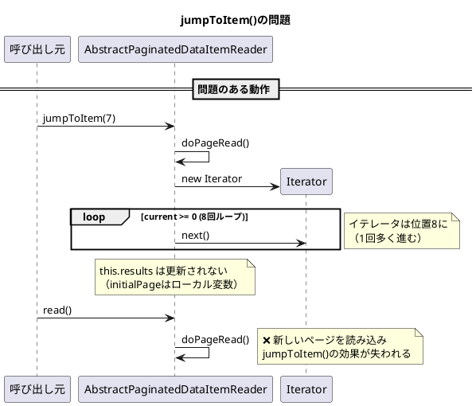

*（このドキュメントは生成AI(Claude Opus 4.5)によって2026年1月15日に生成されました）*

## 課題概要

`AbstractPaginatedDataItemReader`の`jumpToItem(int itemLastIndex)`メソッドが、ステップのリスタート時にリーダーの位置を正しく復元できない問題です。

**`AbstractPaginatedDataItemReader`とは**: Spring Batchでページング処理を行うデータリーダーの基底クラスです。大量データを一定のページサイズで分割して読み取る際に使用されます。

**`jumpToItem()`とは**: リスタート時に、前回の実行で処理した位置までリーダーをジャンプさせるためのメソッドです。

### 親クラスの期待される動作

```java
// AbstractItemCountingItemStreamItemReaderの実装
protected void jumpToItem(int itemIndex) throws Exception {
    for (int i = 0; i < itemIndex; i++) {
        read();
    }
}
```

この実装では、`jumpToItem(n)`を呼び出した後に`read()`を実行すると、**n番目のアイテム**が返されます。

### 現在の問題点

`AbstractPaginatedDataItemReader`のオーバーライド実装には2つの問題があります：

#### 問題1: Off-by-one（1つずれ）エラー

```java
// 問題のあるコード
for (; current >= 0; current--) {  // ❌ current >= 0
    initialPage.next();
}
```

ループ条件が`current >= 0`のため、イテレータが1回多く進んでしまいます。

| メソッド呼び出し | 期待値 | 実際の値 |
|----------------|--------|---------|
| `jumpToItem(7)` → `read()` | 7 | 8 |
| `jumpToItem(0)` → `read()` | 0 | 1 |

#### 問題2: イテレータがリーダー状態に反映されない

```java
Iterator<T> initialPage = doPageRead();
for (; current >= 0; current--) {
    initialPage.next();
}
// ❌ this.results = initialPage; が無い
```

`jumpToItem()`内で進めたイテレータが`results`フィールドに代入されないため、次の`read()`呼び出し時に新しいページがロードされ、位置決めが無効になります。



## 原因

1. **ループ条件の誤り**: `current >= 0`ではなく`current > 0`であるべき
2. **状態の未反映**: ローカル変数`initialPage`を`this.results`に代入していない

## 対応方針

### diffファイルの分析結果

[PR #5137](https://github.com/spring-projects/spring-batch/pull/5137)において、以下の修正が提案されています：

**AbstractPaginatedDataItemReader.java の修正**:

```java
// 変更前
@Override
protected void jumpToItem(int itemLastIndex) throws Exception {
    this.lock.lock();
    try {
        page = itemLastIndex / pageSize;
        int current = itemLastIndex % pageSize;

        Iterator<T> initialPage = doPageRead();

        for (; current >= 0; current--) {  // ❌
            initialPage.next();
        }
        // ❌ resultsへの代入なし
    }
    finally {
        this.lock.unlock();
    }
}

// 変更後
@Override
protected void jumpToItem(int itemLastIndex) throws Exception {
    this.lock.lock();
    try {
        page = itemLastIndex / pageSize;
        int current = itemLastIndex % pageSize;

        Iterator<T> initialPage = doPageRead();

        for (; current > 0; current--) {   // ✅ >= を > に修正
            initialPage.next();
        }
        this.results = initialPage;        // ✅ resultsに代入を追加
    }
    finally {
        this.lock.unlock();
    }
}
```

### 修正後の動作検証

修正後は以下のように正しく動作します：

| テストケース | `jumpToItem(n)` → `read()` | 期待値 | 結果 |
|-------------|---------------------------|-------|-----|
| 通常のインデックス | `jumpToItem(7)` | 7 | ✅ |
| ゼロインデックス | `jumpToItem(0)` | 0 | ✅ |
| ページ末尾 | `jumpToItem(9)` | 9 | ✅ |
| 次ページ先頭 | `jumpToItem(10)` | 10 | ✅ |

### 追加されたテストケース

PR #5137では、以下のテストクラスも追加されています：

1. `AbstractPaginatedDataItemReaderTests.java` - ページング処理のテスト
2. `AbstractPagingItemReaderTests.java` - ページングリーダーのテスト

これらのテストにより、リスタート時の位置復元が正しく動作することが検証されます。
