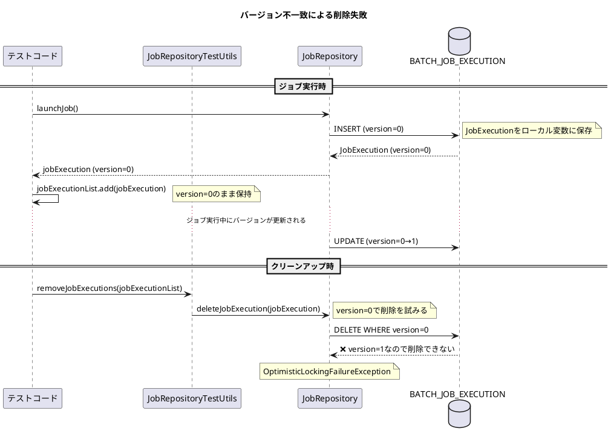
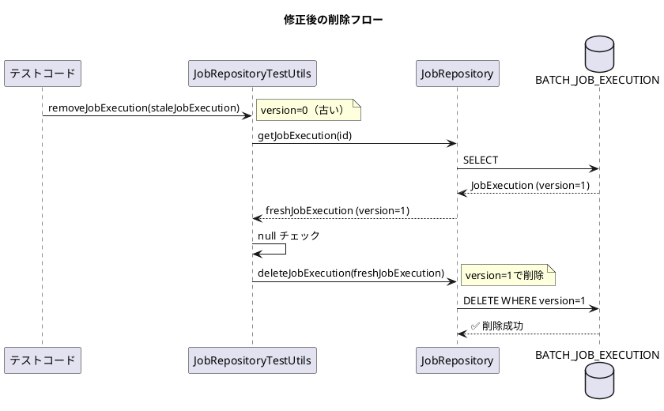

*（このドキュメントは生成AI(Claude Opus 4.5)によって2026年1月15日に生成されました）*

## 課題概要

Spring Batch 5.2.3以降で、`JobRepositoryTestUtils.removeJobExecutions()`メソッドをテストのクリーンアップで呼び出すと、`OptimisticLockingFailureException`がスローされる問題です。

**`JobRepositoryTestUtils`とは**: Spring Batchのテストユーティリティクラスで、テスト実行後にジョブ実行履歴をクリーンアップするための機能を提供します。

**楽観的ロック（Optimistic Locking）とは**: データベースの同時更新制御の手法で、更新時にバージョン番号をチェックし、不一致があれば例外をスローする仕組みです。

### 問題の発生メカニズム



### 影響を受ける環境

| 項目 | バージョン |
|------|-----------|
| Spring Batch | 5.2.3, 5.2.4, 6.0.x |
| Spring Boot | 3.4.5, 3.5.8 |
| Java | 17 |
| データベース | PostgreSQL |

## 原因

Issue [#4793](https://github.com/spring-projects/spring-batch/issues/4793) で導入された変更により、`deleteJobExecution()`メソッドがバージョンチェックを行うようになりました。

テストコードでは、ジョブ実行直後の`JobExecution`オブジェクト（古いバージョン番号）をリストに保存していますが、ジョブ実行中にバージョン番号が更新されるため、削除時にバージョンの不一致が発生します。

## 対応方針

### diffファイルの分析結果

[PR #5173](https://github.com/spring-projects/spring-batch/pull/5173)において、以下の修正が行われました：

**JobRepositoryTestUtils.java の修正**:

```java
// 変更前
public void removeJobExecution(JobExecution jobExecution) {
    this.jobRepository.deleteJobExecution(jobExecution);
}

// 変更後
public void removeJobExecution(JobExecution jobExecution) {
    // query latest version of JobExecution to avoid OptimisticLockingFailureException
    jobExecution = this.jobRepository.getJobExecution(jobExecution.getId());
    if (jobExecution != null) {
        this.jobRepository.deleteJobExecution(jobExecution);
    }
}
```

### 修正のポイント

1. **最新バージョンの取得**: 削除前に`jobRepository.getJobExecution()`で最新のバージョン番号を持つ`JobExecution`を取得
2. **null チェック**: 既に削除されている場合を考慮してnullチェックを追加
3. **不要なnullチェックの削除**: `removeJobExecutions()`内の冗長なnullチェックを削除



### 追加されたテストケース

PR #5173では、古いバージョンの`JobExecution`でも削除が成功することを確認するテストが追加されています：

```java
@Test
void testRemoveJobExecution() throws Exception {
    // given
    JobExecution jobExecution = utils.createJobExecutions(1).get(0);
    
    // when
    jobExecution.setVersion(-1); // simulate stale version
    utils.removeJobExecution(jobExecution);
    
    // then
    assertEquals(0, JdbcTestUtils.countRowsInTable(jdbcTemplate, "BATCH_JOB_EXECUTION"));
}
```

### 対象バージョン

- 6.0.2: 修正予定
- 5.2.5: バックポート予定
