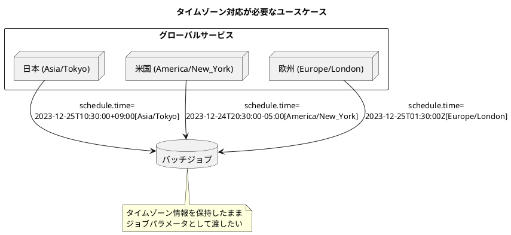
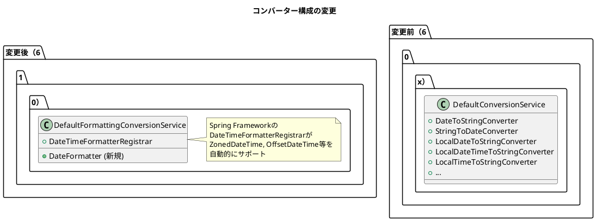

*（このドキュメントは生成AI(Claude Opus 4.5)によって2026年1月15日に生成されました）*

## 課題概要

Spring Batchの`JobParametersConverter`で、`ZonedDateTime`と`OffsetDateTime`をジョブパラメータとしてサポートしてほしいという機能要望です。

**`JobParametersConverter`とは**: Spring Batchでジョブパラメータを文字列から型付きの値に変換（またはその逆）するためのインターフェースです。

**`ZonedDateTime`と`OffsetDateTime`とは**: Java 8で導入された日時API（java.time）の一部で、タイムゾーン情報を含む日時を表現するクラスです。

### 現在サポートされている型

| 型 | フォーマット | タイムゾーン |
|----|------------|------------|
| `LocalDate` | ISO_LOCAL_DATE | なし |
| `LocalTime` | ISO_LOCAL_TIME | なし |
| `LocalDateTime` | ISO_LOCAL_DATE_TIME | なし |
| `Date` | ISO_INSTANT | UTC |

### 要望される追加サポート

| 型 | フォーマット | タイムゾーン |
|----|------------|------------|
| `ZonedDateTime` | ISO_ZONED_DATE_TIME | ✅ あり |
| `OffsetDateTime` | ISO_OFFSET_DATE_TIME | ✅ あり |

### ユースケース



**利用シーン**:
- グローバルサービスでタイムゾーンごとにバッチジョブを実行
- ログ分析でUTCとローカルタイムゾーンの両方が必要
- 複数国対応サービスで国ごとのタイムゾーン情報を含める

## 原因

Spring Batchの`DefaultJobParametersConverter`に`ZonedDateTime`と`OffsetDateTime`のコンバーターが登録されていないため。

## 対応方針

### diffファイルの分析結果

[PR #5186](https://github.com/spring-projects/spring-batch/pull/5186)において、アーキテクチャを改善する形で修正が行われています。

### 主な変更点

#### 1. ConversionServiceFactoryの導入

新しいファクトリクラス`ConversionServiceFactory`が追加され、コンバーターの登録を一元化：

```java
public final class ConversionServiceFactory {

    public static ConfigurableConversionService createConversionService() {
        FormattingConversionService conversionService = new DefaultFormattingConversionService();
        conversionService.addFormatterForFieldType(Date.class, new DateFormatter());

        DateTimeFormatterRegistrar dateTimeFormatterRegistrar = new DateTimeFormatterRegistrar();
        dateTimeFormatterRegistrar.setUseIsoFormat(true);
        dateTimeFormatterRegistrar.registerFormatters(conversionService);

        return conversionService;
    }
}
```

#### 2. Spring Frameworkのコンバーターを活用

`DefaultConversionService`から`DefaultFormattingConversionService`に変更し、Spring Framework側のフォーマッターを活用：



#### 3. 既存コンバーターの非推奨化

以下のクラスが`@Deprecated`としてマークされ、6.3以降で削除予定：

- `AbstractDateTimeConverter`
- `DateToStringConverter`
- `StringToDateConverter`
- `LocalDateToStringConverter`
- `LocalDateTimeToStringConverter`
- `LocalTimeToStringConverter`
- その他関連コンバーター

### サポートされる日時型（修正後）

| 型 | フォーマット | サポート状況 |
|----|------------|-------------|
| `Date` | ISO_INSTANT | ✅ |
| `LocalDate` | ISO_LOCAL_DATE | ✅ |
| `LocalTime` | ISO_LOCAL_TIME | ✅ |
| `LocalDateTime` | ISO_LOCAL_DATE_TIME | ✅ |
| `ZonedDateTime` | ISO_ZONED_DATE_TIME | ✅ **新規** |
| `OffsetDateTime` | ISO_OFFSET_DATE_TIME | ✅ **新規** |
| `OffsetTime` | ISO_OFFSET_TIME | ✅ **新規** |
| `Instant` | ISO_INSTANT | ✅ **新規** |

### 使用例

```java
// ZonedDateTimeの使用
ZonedDateTime scheduleTime = ZonedDateTime.of(
    2023, 12, 25, 10, 30, 0, 0, 
    ZoneId.of("Asia/Seoul")
);
JobParameters parameters = new JobParametersBuilder()
    .addJobParameter("schedule.time", scheduleTime, ZonedDateTime.class, true)
    .toJobParameters();

// OffsetDateTimeの使用
OffsetDateTime deadline = OffsetDateTime.of(
    2023, 12, 31, 23, 59, 59, 0,
    ZoneOffset.ofHours(9)
);
JobParameters params = new JobParametersBuilder()
    .addJobParameter("deadline", deadline, OffsetDateTime.class, true)
    .toJobParameters();
```

### ワークアラウンド（6.0.x向け）

修正版リリース前の暫定対応として、`DefaultFormattingConversionService` Beanを定義：

```java
@Bean
DefaultFormattingConversionService conversionService() {
    return new DefaultFormattingConversionService();
}
```

### リリース予定

- **6.0.2**: PR #5179（個別コンバーター追加）をマージ
- **6.1.0**: PR #5186（Spring Frameworkコンバーター活用）をマージ
