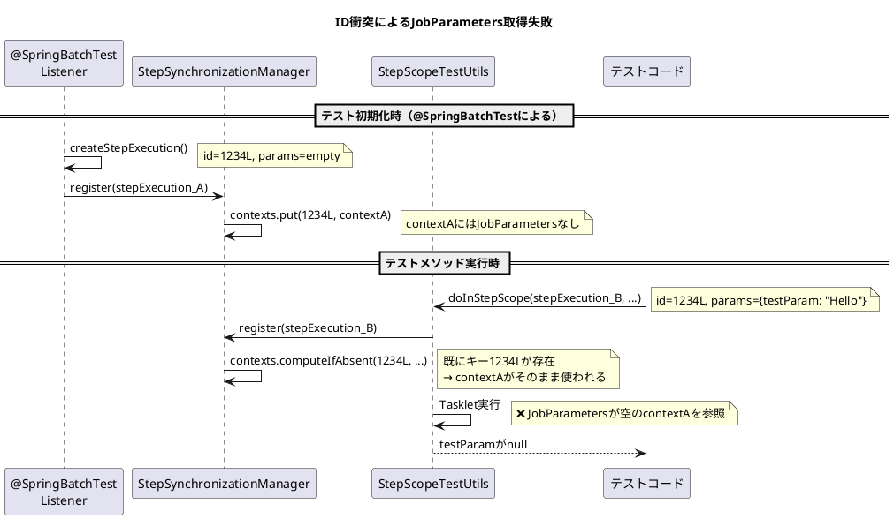

*（このドキュメントは生成AI(Claude Opus 4.5)によって2026年1月15日に生成されました）*

## 課題概要

`@SpringBatchTest`アノテーションを使用したテスト環境で、`StepScopeTestUtils`と`MetaDataInstanceFactory`を組み合わせて使用すると、`StepContext`の衝突が発生する問題です。

**`@SpringBatchTest`とは**: Spring Batchのテスト用アノテーションで、`StepScopeTestExecutionListener`等のリスナーを自動的に登録します。

**`StepScopeTestUtils`とは**: `@StepScope` Beanをテストするためのユーティリティクラスです。テスト用の`StepExecution`コンテキスト内でコードを実行できます。

**`MetaDataInstanceFactory`とは**: テスト用の`JobExecution`や`StepExecution`インスタンスを簡単に生成するファクトリクラスです。

### 問題の発生メカニズム

```plantuml
@startuml
title StepExecutionの等価性とID衝突

class StepExecution {
    - stepName: String
    - jobExecutionId: Long
    - id: Long
    + equals(): boolean
    + hashCode(): int
}

note right of StepExecution
equals/hashCode は以下で判定:
- stepName
- jobExecutionId  
- id (stepExecutionId)
end note

rectangle "MetaDataInstanceFactory のデフォルト値" {
    card "DEFAULT_STEP_NAME = 'step'" as name
    card "DEFAULT_JOB_EXECUTION_ID = 12L" as jobId
    card "DEFAULT_STEP_EXECUTION_ID = 1234L" as stepId
}

rectangle "StepSynchronizationManager.contexts" as Contexts {
    map "HashMap" as map {
        StepExecution(1234L) => StepContext(A)
    }
}

note bottom of Contexts
同じID(1234L)を持つStepExecutionは
同一キーとして扱われる
→ 新しいコンテキストが登録できない
end note

@enduml
```

### 衝突の流れ



## 原因

`MetaDataInstanceFactory`が全てのインスタンスに対して固定のデフォルトID（`DEFAULT_STEP_EXECUTION_ID = 1234L`）を使用するため、複数の`StepExecution`インスタンスが`equals()`メソッドで同一と判定されます。

`StepSynchronizationManager`は`computeIfAbsent`で新しいコンテキストを登録しようとしますが、既に同じキーが存在するため、リスナーが登録した空のコンテキストが返され、テストで指定した`JobParameters`にアクセスできません。

## 対応方針

### diffファイルの分析結果

[PR #5208](https://github.com/spring-projects/spring-batch/pull/5208)において、以下の修正が行われました：

**MetaDataInstanceFactory.java の修正**:

```java
// 変更前
public static StepExecution createStepExecution(JobParameters jobParameters) {
    JobExecution jobExecution = createJobExecution(DEFAULT_JOB_NAME, DEFAULT_JOB_INSTANCE_ID,
            DEFAULT_JOB_EXECUTION_ID, jobParameters);
    StepExecution stepExecution = createStepExecution(jobExecution, DEFAULT_STEP_NAME, DEFAULT_STEP_EXECUTION_ID);
    jobExecution.addStepExecution(stepExecution);
    return stepExecution;
}

// 変更後
private static final AtomicLong jobExecutionIdCounter = new AtomicLong(DEFAULT_JOB_EXECUTION_ID);
private static final AtomicLong stepExecutionIdCounter = new AtomicLong(DEFAULT_STEP_EXECUTION_ID);

public static StepExecution createStepExecution(JobParameters jobParameters) {
    Long jobExecutionId = jobExecutionIdCounter.incrementAndGet();
    Long stepExecutionId = stepExecutionIdCounter.incrementAndGet();
    JobExecution jobExecution = createJobExecution(DEFAULT_JOB_NAME, DEFAULT_JOB_INSTANCE_ID, jobExecutionId,
            jobParameters);
    StepExecution stepExecution = createStepExecution(jobExecution, DEFAULT_STEP_NAME, stepExecutionId);
    jobExecution.addStepExecution(stepExecution);
    return stepExecution;
}
```

### 修正のポイント

1. **AtomicLongカウンターの導入**: `jobExecutionIdCounter`と`stepExecutionIdCounter`を追加
2. **インクリメントによる一意性の保証**: `incrementAndGet()`で呼び出しごとに異なるIDを生成
3. **スレッドセーフ**: `AtomicLong`を使用しているため、並列テストでも安全

### 修正後の動作

| 呼び出し | jobExecutionId | stepExecutionId |
|---------|----------------|-----------------|
| 1回目 | 13 | 1235 |
| 2回目 | 14 | 1236 |
| 3回目 | 15 | 1237 |

### ワークアラウンド（修正版リリース前）

テストクラスに`getStepExecution()`メソッドを定義し、一意なID/名前を指定：

```java
public StepExecution getStepExecution() {
    return MetaDataInstanceFactory.createStepExecution("uniqueStep", -1L);
}
```

これにより、`StepScopeTestExecutionListener`がこのメソッドを使用し、デフォルトID(1234L)との衝突を回避できます。
