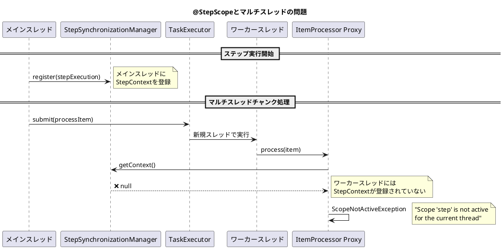
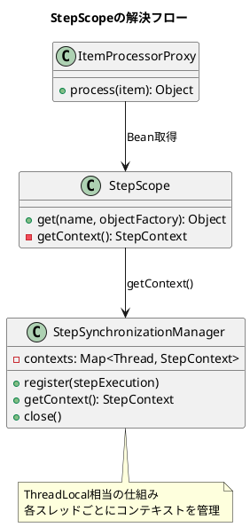
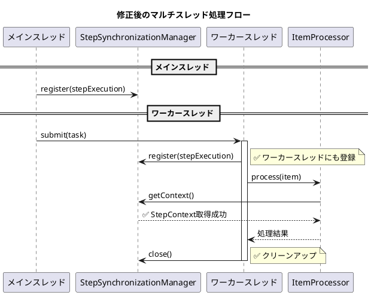

*（このドキュメントは生成AI(Claude Opus 4.5)によって2026年1月15日に生成されました）*

## 課題概要

Spring Batch 6.0で新しく導入された`ChunkOrientedStep`において、マルチスレッド処理を有効にした場合、`@StepScope`で定義された`ItemProcessor`がワーカースレッドで正しく解決できず、`ScopeNotActiveException`が発生する問題です。

**`@StepScope`とは**: Spring Batchのスコープアノテーションで、Beanのライフサイクルをステップ実行にバインドし、`JobParameters`や`StepExecution`へのアクセスを可能にします。

**`TaskExecutor`とは**: Spring Frameworkの非同期タスク実行インターフェースです。Spring Batchでは、チャンク処理を並列化するために使用されます。

### 問題の発生状況



### エラースタックトレース

```
Caused by: org.springframework.beans.factory.support.ScopeNotActiveException: 
    Error creating bean with name 'scopedTarget.issueReproductionProcessor': 
    Scope 'step' is not active for the current thread
    at org.springframework.beans.factory.support.AbstractBeanFactory.doGetBean(...)
    at jdk.proxy2/jdk.proxy2.$Proxy134.process(Unknown Source)
    at org.springframework.batch.core.step.item.ChunkOrientedStep.doProcess(...)
Caused by: java.lang.IllegalStateException: 
    No context holder available for step scope
    at org.springframework.batch.core.scope.StepScope.getContext(StepScope.java:167)
```

## 原因

`ChunkOrientedStep.processChunkConcurrently()`メソッドでは、`TaskExecutor`を使用して複数のアイテムを並列処理しますが、ワーカースレッドに`StepExecution`コンテキストが伝播されていません。

`@StepScope`のプロキシBeanは、`StepSynchronizationManager`から現在のスレッドの`StepContext`を取得しようとしますが、ワーカースレッドにはコンテキストが登録されていないため、`ScopeNotActiveException`がスローされます。

### スコープ解決の仕組み



## 対応方針

**注意**: このIssueにはdiffファイルが存在しませんが、Issue内で提案された修正方針があります。

### 提案された修正

`ChunkOrientedStep.processChunkConcurrently()`メソッドで、ワーカースレッドにも`StepExecution`を登録：

```java
// processChunkConcurrently メソッド内
Future<O> itemProcessingFuture = this.taskExecutor.submit(() -> {
    try {
        // ✅ ワーカースレッドにStepExecutionを登録
        StepSynchronizationManager.register(stepExecution);
        return processItem(item, contribution);
    } finally {
        // ✅ メモリリーク防止のためクローズ
        StepSynchronizationManager.close();
    }
});
```

### 修正後の動作フロー



### 対応状況

メンテナーの@fmbenhassineは、この問題を確認し、6.0.2での修正を予定しています。@LeeHyungGeolがPRの作成を担当する予定です。

### ワークアラウンド

修正版リリース前の暫定対応として、`@StepScope`を使用しないか、マルチスレッド処理を無効にする：

```java
// オプション1: @StepScopeを使用しない
@Bean
// @StepScope を削除
public ItemProcessor<TestItem, TestItem> processor() {
    return item -> {
        // JobParametersへのアクセスが必要な場合は別の方法で取得
        return item;
    };
}

// オプション2: シングルスレッドで実行
@Bean
public Step step(...) {
    return new StepBuilder(...)
            .<TestItem, TestItem>chunk(10)
            .reader(reader)
            .processor(processor)
            .writer(writer)
            // .taskExecutor(...) を削除してシングルスレッドで実行
            .build();
}
```
