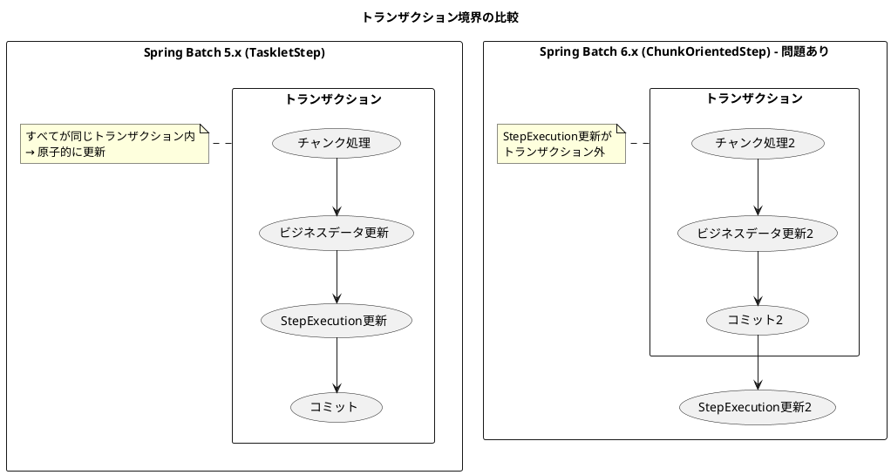
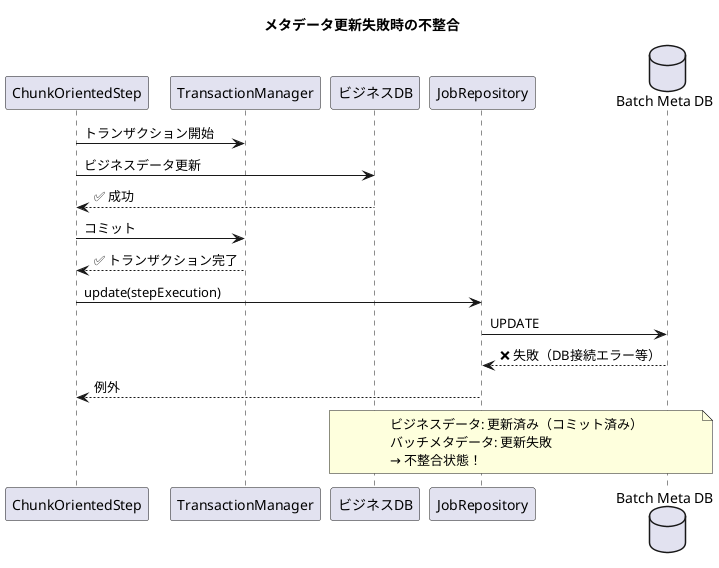
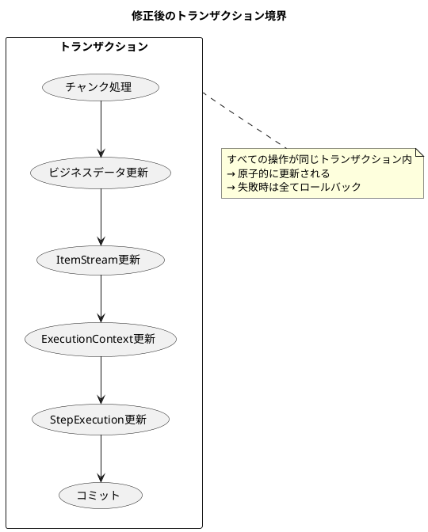

*（このドキュメントは生成AI(Claude Opus 4.5)によって2026年1月15日に生成されました）*

## 課題概要

Spring Batch 6.0の`ChunkOrientedStep`において、`JobRepository.update(stepExecution)`がチャンクのトランザクション境界の外で実行されている問題です。これにより、チャンク処理とバッチメタデータの更新が原子的（atomic）ではなくなり、不整合が発生する可能性があります。

**トランザクション境界とは**: データベース操作がコミットまたはロールバックされる範囲のことです。同じトランザクション内の操作は、すべて成功するかすべて失敗するかのどちらかになります。

**`JobRepository`とは**: Spring Batchのメタデータ（ジョブ/ステップの実行状態）を永続化するためのリポジトリです。

### Spring Batch 5.x（TaskletStep）との比較



### 問題のあるコード

```java
// ChunkOrientedStep#doExecute - 現在の実装
this.transactionTemplate.executeWithoutResult(transactionStatus -> {
    processNextChunk(transactionStatus, contribution, stepExecution);
});

// ❌ トランザクション完了後に実行される
getJobRepository().update(stepExecution);
```

### 発生しうる不整合シナリオ



## 原因

[PR #5165](https://github.com/spring-projects/spring-batch/pull/5165)での変更で、`JobRepository.update(stepExecution)`がトランザクションの外に配置されてしまいました。

Spring Batch 5.xの`TaskletStep`では、この更新はトランザクションコミット前に実行されていたため、チャンク処理とメタデータ更新が原子的でした。

## 対応方針

### diffファイルの分析結果

[PR #5195](https://github.com/spring-projects/spring-batch/pull/5195)において、関連する修正が行われています（Issue [#5182](https://github.com/spring-projects/spring-batch/issues/5182)との統合修正）。

**注意**: このIssue #5199自体のdiffは、PR #5195に含まれるより広範な修正の一部として対応されています。

### 提案された修正

```java
// 修正案: StepExecution更新をトランザクション内に移動
this.transactionTemplate.executeWithoutResult(transactionStatus -> {
    processNextChunk(transactionStatus, contribution, stepExecution);
    getJobRepository().update(stepExecution);  // ✅ トランザクション内
});
```

### Issue #5182との関連

報告者（KILL9-NO-MERCY）は、この問題がIssue [#5182](https://github.com/spring-projects/spring-batch/issues/5182)（ExecutionContext更新の問題）と関連していることを指摘しています。

両方の問題を一貫して修正するためには、以下のすべての操作を同じトランザクション内で実行する必要があります：

1. チャンク処理（読み込み/処理/書き込み）
2. `ItemStream.update(executionContext)`
3. `JobRepository.updateExecutionContext(stepExecution)`
4. `JobRepository.update(stepExecution)`

```java
// 統合修正案
this.transactionTemplate.executeWithoutResult(transactionStatus -> {
    processNextChunk(transactionStatus, contribution, stepExecution);
    this.compositeItemStream.update(stepExecution.getExecutionContext());
    getJobRepository().updateExecutionContext(stepExecution);
    getJobRepository().update(stepExecution);
});
```

### 修正後のトランザクション境界



これにより、チャンク処理とバッチメタデータの更新が完全に原子的になり、部分的な更新による不整合が防止されます。
